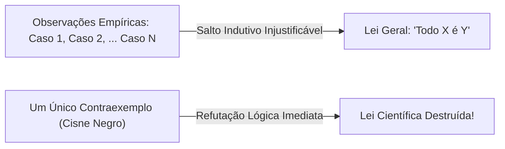

  
⬅️ <b><a href="/pt-br/resource/engenharia-de-computação/6-periodo/filosofia-da-ciencia-e-tecnologia/anotacoes/aula-03-a-condicao-humana-e-a-emergencia-da-tecnica">Aula Anterior</a></b>

  
🏠 <b><a href="/pt-br/resource/engenharia-de-computação/6-periodo/filosofia-da-ciencia-e-tecnologia">Hub da Disciplina</a></b>

  
➡️ <b><a href="/pt-br/resource/engenharia-de-computação/6-periodo/filosofia-da-ciencia-e-tecnologia/anotacoes/aula-05-karl-popper-falsificacionismo-e-o-racionalismo-critico">Próxima Aula</a></b>

> [!info] 📅 Informações da Aula
> - **Disciplina:** Filosofia da Ciência e Tecnologia (CSECBJI.43)
> - **Professor:** Hugo
> - **Data Realizada:** 23/09/2026
> - **Tópico Principal:** O Método Científico Clássico e o Indutivismo
> - **Status:** Concluída e Revisada

> [!note] 📂 Material Complementar & Slides
> - 📄 **Slides Oficiais:** [[slide-04-filosofia-da-ciencia-e-tecnologia|Acessar Apresentação em PDF]]
> - 🎥 **Short Lecture / Gravação:** [[video-04-filosofia-da-ciencia-e-tecnologia|Assistir Síntese da Aula (Vídeo)]]

---

### 📑 Resumo das Seções
- [📌 1. Anotações do Quadro: O Método Científico Clássico e o Indutivismo](#-anotações-do-quadro-o-método-científico-clássico-e-o-indutivismo)
- [🧮 2. Formulação & Exemplo Prático Resolvido](#-formulação--exemplo-prático-resolvido)
- [📊 3. Esquema Visual & Fluxograma (Mermaid)](#-esquema-visual--fluxograma-mermaid)
- [🧠 4. Resumo Pessoal & Macetes do Professor](#-resumo-pessoal--macetes-do-professor)
- [📝 5. Dúvidas & Exercícios Recomendados para Casa](#-dúvidas--exercícios-recomendados-para-casa)

---

## 📌 Anotações do Quadro: O Método Científico Clássico e o Indutivismo

### 4.1 O Método Científico Tradicional e o Positivismo Lógico
O Positivismo Lógico do **Círculo de Viena** (Carnap, Schlick, Neurath) no início do século XX defendeu uma visão empirista rigorosa da ciência:
- **Critério de Verificabilidade:** Uma proposição só tem sentido cognitivo se for tautológica (lógica/matemática) ou se puder ser empiricamente verificada por observação sensorial.
- **Unidade da Ciência:** Todas as ciências deveriam se apoiar em uma linguagem observacional neutra baseada na física.

### 4.2 O Raciocínio Indutivo
A **Indução** parte da observação repetida de casos particulares para derivar uma lei universal:
$$\text{Observação: } \text{Cisne } 1 \text{ é branco}, \; \text{Cisne } 2 \text{ é branco}, \dots, \text{Cisne } N \text{ é branco} \implies \text{Todos os cisnes são brancos}$$

### 4.3 O Problema da Indução de David Hume
No século XVIII, o filósofo escocês David Hume demonstrou que a indução é **logicamente injustificável**:
1. Não é uma verdade lógica necessária (a negação de uma lei empírica não gera contradição).
2. Tentar justificar a indução dizendo que *"ela sempre funcionou no passado"* é um raciocínio circular (uma petição de princípio que usa a própria indução para provar a indução!).
3. Não importa quantos milhões de cisnes brancos você observe: basta a aparição de um único cisne negro para destruir a lei universal.

---

## 🧮 Formulação & Exemplo Prático Resolvido

### ✏️ O Problema do Peru Indutivista (Bertrand Russell)

Um peru em uma fazenda observa que, todo dia às 9h da manhã, o fazendeiro traz comida.
- O peru acumula milhares de observações diárias rigorosas: segundas, terças, sob sol, chuva, no inverno e no verão.
- Como um bom cientista indutivista, ele conclui a lei universal: *"Todo dia às 9h sou alimentado"*.
- Na véspera de Natal, às 9h da manhã, o fazendeiro chega... mas corta o pescoço do peru!

**Aplicação em Testes de Software:**
Como alertou Edsger Dijkstra: *"Testes de software podem provar a presença de erros, mas nunca provar a sua ausência!"* (Não importa quantos testes passem, a indução não garante que o software é perfeito).

---

## 📊 Esquema Visual & Fluxograma (Mermaid)

---

## 🧠 Resumo Pessoal & Macetes do Professor

| Conceito-Chave | *Takeaway* do Professor | Dicas de Prova / Atenção |
| :--- | :--- | :--- |
| **Indução vs Dedução** | A **Dedução** parte de premissas gerais para conclusões particulares com garantia lógica absoluta (se as premissas forem verdadeiras, a conclusão é obrigatoriamente verdadeira); a **Indução** dá um salto probabilístico não garantido. | A matemática é dedutiva; as ciências empíricas usam observação. |
| **Dijkstra e a Indução** | Lembre-se da citação de Dijkstra para relacionar filosofia da indução com engenharia de software. | Aplicação prática direta |

---

## 📝 Dúvidas & Exercícios Recomendados para Casa

1. Explique a crítica lógica de David Hume à indução e por que a ciência moderna não pode se apoiar no indutivismo ingênuo.
2. Discuta por que o treinamento de modelos de Machine Learning é uma forma automatizada de inferência indutiva sujeita aos limites humeanos.

---

  
⬅️ <b><a href="/pt-br/resource/engenharia-de-computação/6-periodo/filosofia-da-ciencia-e-tecnologia/anotacoes/aula-03-a-condicao-humana-e-a-emergencia-da-tecnica">Aula Anterior</a></b>

  
🏠 <b><a href="/pt-br/resource/engenharia-de-computação/6-periodo/filosofia-da-ciencia-e-tecnologia">Hub da Disciplina</a></b>

  
➡️ <b><a href="/pt-br/resource/engenharia-de-computação/6-periodo/filosofia-da-ciencia-e-tecnologia/anotacoes/aula-05-karl-popper-falsificacionismo-e-o-racionalismo-critico">Próxima Aula</a></b>

