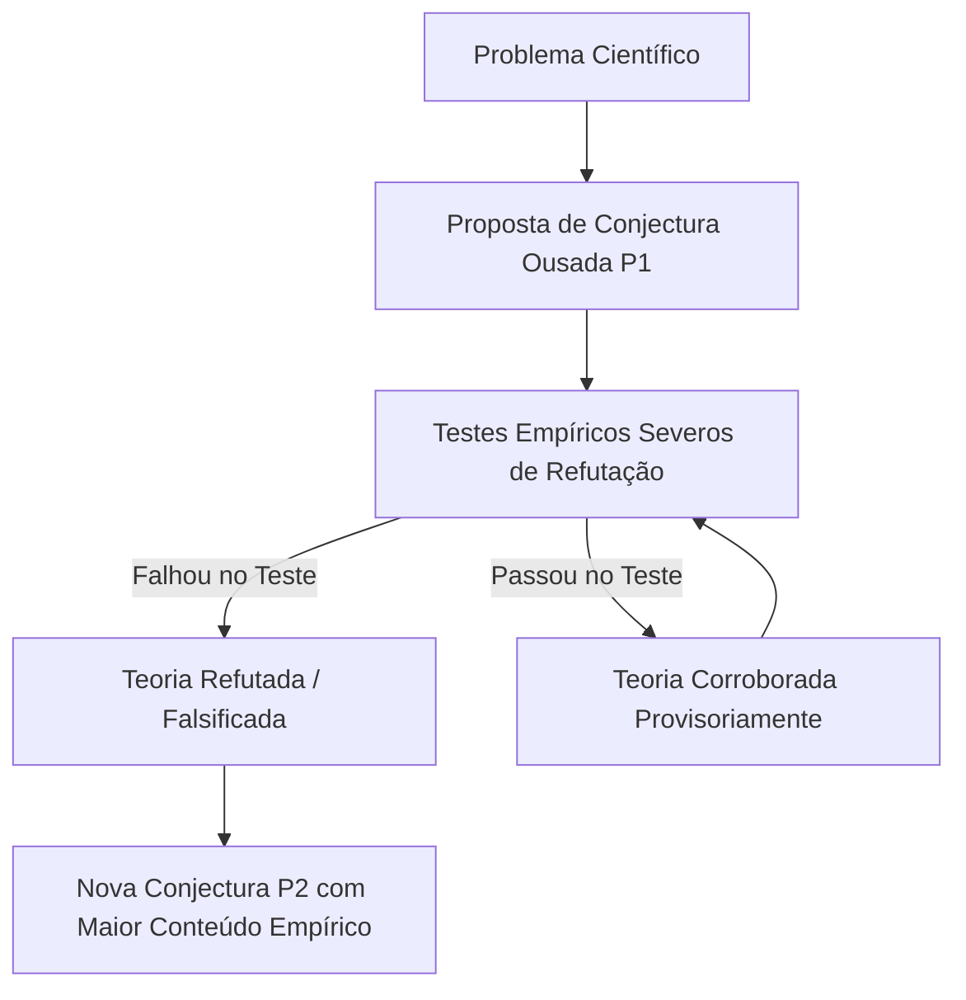

  
⬅️ <b><a href="/pt-br/resource/engenharia-de-computação/6-periodo/filosofia-da-ciencia-e-tecnologia/anotacoes/aula-04-o-metodo-cientifico-classico-e-o-indutivismo">Aula Anterior</a></b>

  
🏠 <b><a href="/pt-br/resource/engenharia-de-computação/6-periodo/filosofia-da-ciencia-e-tecnologia">Hub da Disciplina</a></b>

  
➡️ <b><a href="/pt-br/resource/engenharia-de-computação/6-periodo/filosofia-da-ciencia-e-tecnologia/anotacoes/aula-06-thomas-kuhn-paradigmas-cientificos-e-revolucoes">Próxima Aula</a></b>

> [!info] 📅 Informações da Aula
> - **Disciplina:** Filosofia da Ciência e Tecnologia (CSECBJI.43)
> - **Professor:** Hugo
> - **Data Realizada:** 30/09/2026
> - **Tópico Principal:** Karl Popper, Falsificacionismo e o Racionalismo Crítico
> - **Status:** Concluída e Revisada

> [!note] 📂 Material Complementar & Slides
> - 📄 **Slides Oficiais:** [[slide-05-filosofia-da-ciencia-e-tecnologia|Acessar Apresentação em PDF]]
> - 🎥 **Short Lecture / Gravação:** [[video-05-filosofia-da-ciencia-e-tecnologia|Assistir Síntese da Aula (Vídeo)]]

---

### 📑 Resumo das Seções
- [📌 1. Anotações do Quadro: Karl Popper, Falsificacionismo e o Racionalismo Crítico](#-anotações-do-quadro-karl-popper,-falsificacionismo-e-o-racionalismo-crítico)
- [🧮 2. Formulação & Exemplo Prático Resolvido](#-formulação--exemplo-prático-resolvido)
- [📊 3. Esquema Visual & Fluxograma (Mermaid)](#-esquema-visual--fluxograma-mermaid)
- [🧠 4. Resumo Pessoal & Macetes do Professor](#-resumo-pessoal--macetes-do-professor)
- [📝 5. Dúvidas & Exercícios Recomendados para Casa](#-dúvidas--exercícios-recomendados-para-casa)

---

## 📌 Anotações do Quadro: Karl Popper, Falsificacionismo e o Racionalismo Crítico

### 5.1 Karl Popper e o Racionalismo Crítico
Em sua obra seminal *A Lógica da Pesquisa Científica* (1934), Karl Popper propôs uma solução revolucionária para a crise da indução rejeitando o indutivismo e o positivismo lógico.

### 5.2 O Problema da Demarcação
Como distinguir o que é **Ciência genuína** do que é **Pseudociência**, mito ou metafísica?
- Para Popper, o critério de demarcação NÃO é a verificabilidade (já que teorias pseudocientíficas como a astrologia conseguem reinterpretar qualquer evento como confirmação).
- O critério universal de demarcação científica é a **Falseabilidade (*Falsifiability*)**.

### 5.3 O Princípio da Falseabilidade
Uma teoria é científica se e somente se for **potencialmente refutável** por observações empíricas (se for possível conceber um teste experimental capaz de provar que ela é falsa):
- **Assimetria Lógica entre Verificação e Refutação:** Infinitas observações positivas não provam que uma teoria é verdadeira, mas **uma única observação contrária basta para refutá-la logicamente** pelo método *Modus Tollens*:
  $$(P \implies Q) \land \neg Q \implies \neg P$$

### 5.4 Progresso Científico por Conjecturas e Refutações
A ciência não evolui acumulando certezas absolutas, mas através de um processo evolutivo contínuo de **conjecturas ousadas e tentativas implacáveis de refutação**. Nenhuma teoria científica é definitiva: todas são hipóteses provisórias que sobreviveram aos testes até o momento (*corroboração*).

---

## 🧮 Formulação & Exemplo Prático Resolvido

### ✏️ Testabilidade e Falseabilidade de Hipóteses na Computação

| Hipótese | É Falseável? | Classificação | Justificativa |
| :--- | :---: | :---: | :--- |
| **"Este algoritmo de criptografia é inviolável por qualquer força cósmica."** | **NÃO** | **Metafísica / Dogma** | Não estabelece nenhuma condição empírica verificável de quebra. |
| **"O tempo de execução deste algoritmo cresce em no máximo $O(N \log N)$ para entradas aleatórias."** | **SIM** | **Científica** | Pode ser falseada se encontrarmos uma bateria de entradas que force tempo quadrático $O(N^2)$. |
| **"Se o software falhar, foi por causa de energia negativa no ambiente."** | **NÃO** | **Pseudociência** | Hipótese imune a qualquer teste empírico objetivo. |

---

## 📊 Esquema Visual & Fluxograma (Mermaid)

---

## 🧠 Resumo Pessoal & Macetes do Professor

| Conceito-Chave | *Takeaway* do Professor | Dicas de Prova / Atenção |
| :--- | :--- | :--- |
| **Corroboração NÃO é Prova de Verdade!** | Popper afirma categoricamente que uma teoria nunca é 'provada' como verdadeira; ela é apenas **corroborada** (resistiu às tentativas de refutação até agora). | A ciência é intrinsecamente falível e aberta à revisão contínua. |
| **Imunização contra Refutação** | Modificar uma teoria adicionando hipóteses *ad hoc* exclusivamente para salvá-la de uma refutação empírica degrada seu estatuto científico. | Aplicação prática direta |

---

## 📝 Dúvidas & Exercícios Recomendados para Casa

1. Explique a assimetria lógica fundamental entre verificação e falseamento segundo Karl Popper.
2. Aplique o critério de demarcação popperiano para analisar se a 'Hipótese da Simulação' (a ideia de que vivemos em uma simulação computacional) possui estatuto científico.

---

  
⬅️ <b><a href="/pt-br/resource/engenharia-de-computação/6-periodo/filosofia-da-ciencia-e-tecnologia/anotacoes/aula-04-o-metodo-cientifico-classico-e-o-indutivismo">Aula Anterior</a></b>

  
🏠 <b><a href="/pt-br/resource/engenharia-de-computação/6-periodo/filosofia-da-ciencia-e-tecnologia">Hub da Disciplina</a></b>

  
➡️ <b><a href="/pt-br/resource/engenharia-de-computação/6-periodo/filosofia-da-ciencia-e-tecnologia/anotacoes/aula-06-thomas-kuhn-paradigmas-cientificos-e-revolucoes">Próxima Aula</a></b>

