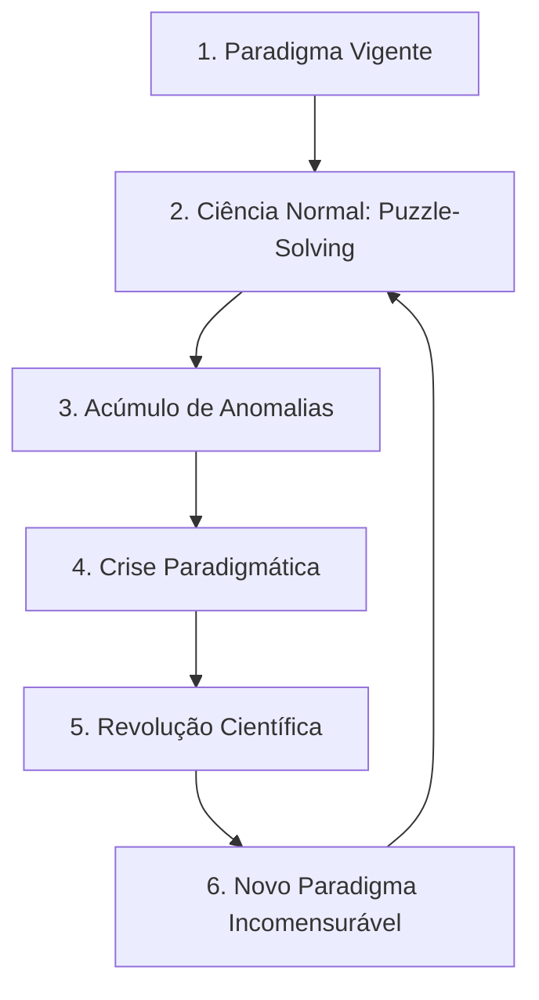

<div style="display: flex; justify-content: space-between; align-items: center; padding: 10px 16px; background: var(--light, #f8fafc); border: 1px solid var(--lightgray, #e2e8f0); border-radius: 10px; margin: 1.5rem 0;">
  <div>⬅️ <b><a href="/pt-br/resource/engenharia-de-computação/6-periodo/filosofia-da-ciencia-e-tecnologia/anotacoes/aula-05-karl-popper-falsificacionismo-e-o-racionalismo-critico">Aula Anterior</a></b></div>
  <div>🏠 <b><a href="/pt-br/resource/engenharia-de-computação/6-periodo/filosofia-da-ciencia-e-tecnologia">Hub da Disciplina</a></b></div>
  <div>➡️ <b><a href="/pt-br/resource/engenharia-de-computação/6-periodo/filosofia-da-ciencia-e-tecnologia/anotacoes/aula-07-a-crise-da-ciencia-e-do-paradigma-dominante">Próxima Aula</a></b></div>
</div>

> [!info] 📅 Informações da Aula
> - **Disciplina:** Filosofia da Ciência e Tecnologia (CSECBJI.43)
> - **Professor:** Hugo
> - **Data Realizada:** 07/10/2026
> - **Tópico Principal:** Thomas Kuhn: Paradigmas Científicos e Revoluções
> - **Status:** Concluída e Revisada

> [!note] 📂 Material Complementar & Slides
> - 📄 **Slides Oficiais:** [[slide-06-filosofia-da-ciencia-e-tecnologia|Acessar Apresentação em PDF]]
> - 🎥 **Short Lecture / Gravação:** [[video-06-filosofia-da-ciencia-e-tecnologia|Assistir Síntese da Aula (Vídeo)]]

---

### 📑 Resumo das Seções
- [📌 1. Anotações do Quadro: Thomas Kuhn: Paradigmas Científicos e Revoluções](#-anotações-do-quadro-thomas-kuhn-paradigmas-científicos-e-revoluções)
- [🧮 2. Formulação & Exemplo Prático Resolvido](#-formulação--exemplo-prático-resolvido)
- [📊 3. Esquema Visual & Fluxograma (Mermaid)](#-esquema-visual--fluxograma-mermaid)
- [🧠 4. Resumo Pessoal & Macetes do Professor](#-resumo-pessoal--macetes-do-professor)
- [📝 5. Dúvidas & Exercícios Recomendados para Casa](#-dúvidas--exercícios-recomendados-para-casa)

---

## 📌 Anotações do Quadro: Thomas Kuhn: Paradigmas Científicos e Revoluções

### 6.1 Thomas Kuhn e a Dinâmica Histórica da Ciência
Em *A Estrutura das Revoluções Científicas* (1962), Thomas Kuhn contrapôs a visão puramente lógica de Popper, demonstrando através da história real da ciência que o conhecimento científico não evolui de forma linear e cumulativa, mas através de **rupturas paradigmáticas periódicas**.

### 6.2 Conceitos Fundamentais da Epistemologia Kuhniana
1. **Paradigma:** Conjunto integrado de teorias, leis, métodos experimentais, instrumentos e valores ontológicos compartilhados consensualmente por uma comunidade científica (ex: Mecânica Newtoniana, Eletromagnetismo de Maxwell, Relatividade de Einstein).
2. **Ciência Normal:** Trabalho cotidiano dos cientistas sob a vigência de um paradigma dominante. Consiste na **Resolução de Quebra-Cabeças (*Puzzle-Solving*)**, sem questionar as premissas fundamentais do paradigma.
3. **Anomalia:** Resultado experimental que resiste teimosamente a se encaixar nas previsões do paradigma vigente.
4. **Crise Científica:** Quando anomalias graves se acumulam e atingem o núcleo do paradigma, gerando insegurança e proliferação de teorias rivais.
5. **Revolução Científica:** Substituição dramática do paradigma em crise por um novo paradigma incompatível.

### 6.3 A Tese da Incomensurabilidade
Dois paradigmas concorrentes são **incomensuráveis**: não existe uma régua neutra universal para compará-los, pois os proponentes de paradigmas diferentes utilizam linguagens, conceitos e visões de mundo distintas (uma *conversão gestáltica* de percepção).

---

## 🧮 Formulação & Exemplo Prático Resolvido

### ✏️ O Ciclo de Kuhn Aplicado aos Paradigmas da Computação

```text
┌────────────────────────────────────────────────────────┐
│                   CIÊNCIA NORMAL                       │
│    (Paradigma Estruturado / Procedural: C, Pascal)     │
└──────────────────────────┬─────────────────────────────┘
                           │
                           ▼
               [ Acúmulo de Anomalias ]
(Sistemas com milhões de linhas sofrem com variáveis globais,
 acoplamento descontrolado e bugs de estado compartilhado)
                           │
                           ▼
                   [ CRISE DO SOFTWARE ]
                           │
                           ▼
                 [ REVOLUÇÃO CIENTÍFICA ]
(Surgimento do Paradigma Orientado a Objetos: Smalltalk, C++, Java)
                           │
                           ▼
                 [ NOVO PARADIGMA DOMINANTE ]
             (Nova Ciência Normal com Classes e GoF)
```

---

## 📊 Esquema Visual & Fluxograma (Mermaid)



---

## 🧠 Resumo Pessoal & Macetes do Professor

| Conceito-Chave | *Takeaway* do Professor | Dicas de Prova / Atenção |
| :--- | :--- | :--- |
| **Popper vs Kuhn: O Grande Duelo** | Para **Popper**, o cientista é um revolucionário permanente que tenta falsear teorias a todo momento; para **Kuhn**, o cientista normal é um solucionador conservador de quebra-cabeças que defende o paradigma até a crise ser insustentável. | A comparação mais clássica da história da epistemologia. |
| **Incomensurabilidade** | Cientistas em paradigmas diferentes 'vivem em mundos diferentes', pois os mesmos termos adquirem novos significados. | Aplicação prática direta |

---

## 📝 Dúvidas & Exercícios Recomendados para Casa

1. Descreva as etapas do ciclo de desenvolvimento científico de Thomas Kuhn, desde a pré-ciência até o estabelecimento do novo paradigma.
2. Explique a tese da incomensurabilidade e como ela desafia a visão positivista de progresso científico cumulativo linear.

---

<div style="display: flex; justify-content: space-between; align-items: center; padding: 10px 16px; background: var(--light, #f8fafc); border: 1px solid var(--lightgray, #e2e8f0); border-radius: 10px; margin: 1.5rem 0;">
  <div>⬅️ <b><a href="/pt-br/resource/engenharia-de-computação/6-periodo/filosofia-da-ciencia-e-tecnologia/anotacoes/aula-05-karl-popper-falsificacionismo-e-o-racionalismo-critico">Aula Anterior</a></b></div>
  <div>🏠 <b><a href="/pt-br/resource/engenharia-de-computação/6-periodo/filosofia-da-ciencia-e-tecnologia">Hub da Disciplina</a></b></div>
  <div>➡️ <b><a href="/pt-br/resource/engenharia-de-computação/6-periodo/filosofia-da-ciencia-e-tecnologia/anotacoes/aula-07-a-crise-da-ciencia-e-do-paradigma-dominante">Próxima Aula</a></b></div>
</div>
