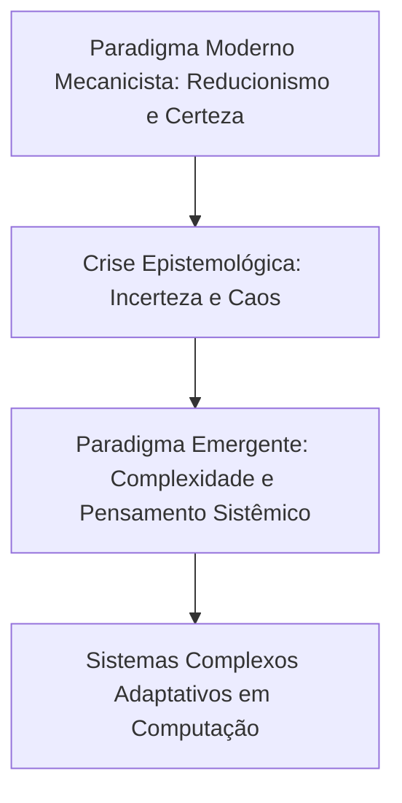

  
⬅️ <b><a href="/pt-br/resource/engenharia-de-computação/6-periodo/filosofia-da-ciencia-e-tecnologia/anotacoes/aula-06-thomas-kuhn-paradigmas-cientificos-e-revolucoes">Aula Anterior</a></b>

  
🏠 <b><a href="/pt-br/resource/engenharia-de-computação/6-periodo/filosofia-da-ciencia-e-tecnologia">Hub da Disciplina</a></b>

  
➡️ <b><a href="/pt-br/resource/engenharia-de-computação/6-periodo/filosofia-da-ciencia-e-tecnologia/anotacoes/aula-08-avaliacao-tematica-p1-debates-epistemologicos">Próxima Aula</a></b>

> [!info] 📅 Informações da Aula
> - **Disciplina:** Filosofia da Ciência e Tecnologia (CSECBJI.43)
> - **Professor:** Hugo
> - **Data Realizada:** 14/10/2026
> - **Tópico Principal:** A Crise da Ciência e do Paradigma Dominante
> - **Status:** Concluída e Revisada

> [!note] 📂 Material Complementar & Slides
> - 📄 **Slides Oficiais:** [[slide-07-filosofia-da-ciencia-e-tecnologia|Acessar Apresentação em PDF]]
> - 🎥 **Short Lecture / Gravação:** [[video-07-filosofia-da-ciencia-e-tecnologia|Assistir Síntese da Aula (Vídeo)]]

---

### 📑 Resumo das Seções
- [📌 1. Anotações do Quadro: A Crise da Ciência e do Paradigma Dominante](#-anotações-do-quadro-a-crise-da-ciência-e-do-paradigma-dominante)
- [🧮 2. Formulação & Exemplo Prático Resolvido](#-formulação--exemplo-prático-resolvido)
- [📊 3. Esquema Visual & Fluxograma (Mermaid)](#-esquema-visual--fluxograma-mermaid)
- [🧠 4. Resumo Pessoal & Macetes do Professor](#-resumo-pessoal--macetes-do-professor)
- [📝 5. Dúvidas & Exercícios Recomendados para Casa](#-dúvidas--exercícios-recomendados-para-casa)

---

## 📌 Anotações do Quadro: A Crise da Ciência e do Paradigma Dominante

### 7.1 A Crise do Paradigma Moderno (Boaventura de Sousa Santos)
Em *Um Discurso sobre as Ciências* (1987), o sociólogo Boaventura de Sousa Santos diagnostica a crise profunda do **Paradigma Científico Moderno** (cartesiano-newtoniano):
- **Premissas da Ciência Moderna:** Mecanicismo, reducionismo (dividir o todo em partes isoladas), determinismo causal estrito, busca pelo domínio utilitarista da natureza e separação radical entre Sujeito e Objeto.
- **Sintomas da Crise:** Teoria da Relatividade de Einstein (relatividade do espaço-tempo), Mecânica Quântica de Heisenberg (Princípio da Incerteza onde o observador altera o fenômeno) e Teoria do Caos (efeito borboleta e não-linearidade).

### 7.2 O Paradigma Emergente Pós-Moderno
1. **Todo conhecimento científico-natural é científico-social:** A ciência é produzida por seres humanos em contextos históricos.
2. **Todo conhecimento é local e total:** Superação da hiperespecialização alienante em favor do conhecimento holístico.
3. **O conhecimento científico deve se transformar em Senso Comum Esclarecido:** A ciência deve dialogar democraticamente com a sociedade.

### 7.3 Edgar Morin e o Pensamento Complexo
Em *Ciência com Consciência*, Edgar Morin denuncia a **patologia do saber disjuntivo e redutor**:
- O pensamento complexo recusa o reducionismo cego, reconhecendo que **o Todo é mais que a soma das partes** (propriedades emergentes) e que sistemas reais são abertos, dialógicos e auto-organizáveis.

---

## 🧮 Formulação & Exemplo Prático Resolvido

### ✏️ Da Engenharia Reducionista à Engenharia dos Sistemas Complexos

- **Visão Reducionista Clássica:** Modela a rede de computadores como um conjunto linear estático de nós isolados.
- **Visão Complexa / Sistêmica Contemporânea:** A Internet é um **Sistema Complexo Adaptativo (CAS)** com bilhões de dispositivos autônomos, ataques cibernéticos dinâmicos, comportamento de rebanho em redes sociais e propriedades emergentes imprevisíveis que não podem ser explicadas pela simples análise de um roteador isolado!

---

## 📊 Esquema Visual & Fluxograma (Mermaid)

---

## 🧠 Resumo Pessoal & Macetes do Professor

| Conceito-Chave | *Takeaway* do Professor | Dicas de Prova / Atenção |
| :--- | :--- | :--- |
| **Princípio da Incerteza de Heisenberg** | Na física quântica, é impossível medir simultaneamente com precisão absoluta a posição e o momento de uma partícula. O observador interfere no sistema observado! | Destruiu o determinismo mecânico clássico de Laplace. |
| **Pensamento Complexo de Morin** | Complexidade vem do latim *complexus* ('o que é tecido junto'). Não significa complicação, mas a recusa em mutilar a realidade isolando variáveis. | Aplicação prática direta |

---

## 📝 Dúvidas & Exercícios Recomendados para Casa

1. Sintetize os quatro princípios do paradigma emergente propostos por Boaventura de Sousa Santos.
2. Explique como o pensamento reducionista se mostra insuficiente para resolver problemas contemporâneos de segurança em sistemas distribuídos complexos.

---

  
⬅️ <b><a href="/pt-br/resource/engenharia-de-computação/6-periodo/filosofia-da-ciencia-e-tecnologia/anotacoes/aula-06-thomas-kuhn-paradigmas-cientificos-e-revolucoes">Aula Anterior</a></b>

  
🏠 <b><a href="/pt-br/resource/engenharia-de-computação/6-periodo/filosofia-da-ciencia-e-tecnologia">Hub da Disciplina</a></b>

  
➡️ <b><a href="/pt-br/resource/engenharia-de-computação/6-periodo/filosofia-da-ciencia-e-tecnologia/anotacoes/aula-08-avaliacao-tematica-p1-debates-epistemologicos">Próxima Aula</a></b>

