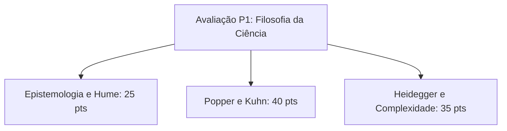

  
⬅️ <b><a href="/pt-br/resource/engenharia-de-computação/6-periodo/filosofia-da-ciencia-e-tecnologia/anotacoes/aula-07-a-crise-da-ciencia-e-do-paradigma-dominante">Aula Anterior</a></b>

  
🏠 <b><a href="/pt-br/resource/engenharia-de-computação/6-periodo/filosofia-da-ciencia-e-tecnologia">Hub da Disciplina</a></b>

  
➡️ <b><a href="/pt-br/resource/engenharia-de-computação/6-periodo/filosofia-da-ciencia-e-tecnologia/anotacoes/aula-09-bruno-latour-e-a-sociologia-do-conhecimento">Próxima Aula</a></b>

> [!info] 📅 Informações da Aula
> - **Disciplina:** Filosofia da Ciência e Tecnologia (CSECBJI.43)
> - **Professor:** Hugo
> - **Data Realizada:** 21/10/2026
> - **Tópico Principal:** Avaliação Temática P1: Debates Epistemológicos
> - **Status:** Concluída e Revisada

> [!note] 📂 Material Complementar & Slides
> - 📄 **Slides Oficiais:** [[slide-08-filosofia-da-ciencia-e-tecnologia|Acessar Apresentação em PDF]]
> - 🎥 **Short Lecture / Gravação:** [[video-08-filosofia-da-ciencia-e-tecnologia|Assistir Síntese da Aula (Vídeo)]]

---

### 📑 Resumo das Seções
- [📌 1. Anotações do Quadro: Avaliação Temática P1: Debates Epistemológicos](#-anotações-do-quadro-avaliação-temática-p1-debates-epistemológicos)
- [🧮 2. Formulação & Exemplo Prático Resolvido](#-formulação--exemplo-prático-resolvido)
- [📊 3. Esquema Visual & Fluxograma (Mermaid)](#-esquema-visual--fluxograma-mermaid)
- [🧠 4. Resumo Pessoal & Macetes do Professor](#-resumo-pessoal--macetes-do-professor)
- [📝 5. Dúvidas & Exercícios Recomendados para Casa](#-dúvidas--exercícios-recomendados-para-casa)

---

## 📌 Anotações do Quadro: Avaliação Temática P1: Debates Epistemológicos

### 8.1 Síntese Conceitual para Avaliação Parcial P1
Revisão dos Grandes Debates Epistemológicos da Ciência:
1. **Teoria do Conhecimento:** Platão (JTB), Problema de Gettier, Racionalismo vs Empirismo e Síntese Kantiana.
2. **Conceitos de Técnica e Tecnologia:** Aristóteles (Episteme, Techné, Phronesis), Heidegger (Gestell, Reserva Disponível) e Álvaro Vieira Pinto.
3. **Crítica da Indução:** Positivismo Lógico e o Problema da Indução de David Hume.
4. **Falsificacionismo Popperiano:** Demarcação, Falseabilidade e Conjecturas e Refutações.
5. **Revoluções Científicas de Kuhn:** Paradigmas, Ciência Normal, Anomalias e Incomensurabilidade.
6. **Crise do Paradigma Dominante:** Boaventura de Sousa Santos e a Complexidade de Edgar Morin.

---

## 🧮 Formulação & Exemplo Prático Resolvido

### ✏️ Roteiro Estruturado para Produção do Ensaio Filosófico P1

**Tema:** *"A pretensa neutralidade dos algoritmos de tomada de decisão frente à epistemologia contemporânea"*.

**Estrutura Obrigatória do Ensaio:**
1. **Introdução:** Contextualização do problema e formulação da tese central.
2. **Fundamentação Epistemológica:** Confronto entre a visão positivista da computação e a crítica de Popper/Heidegger sobre o enquadramento técnico.
3. **Estudo de Caso Contemporâneo:** Análise de um algoritmo real (ex: triagem de currículos por IA ou score de crédito).
4. **Considerações Finais e Síntese Ética:** Proposta de diretrizes baseadas na Phronesis aristotélica e na responsabilidade social do engenheiro.

---

## 📊 Esquema Visual & Fluxograma (Mermaid)

---

## 🧠 Resumo Pessoal & Macetes do Professor

| Conceito-Chave | *Takeaway* do Professor | Dicas de Prova / Atenção |
| :--- | :--- | :--- |
| **Dica para a Avaliação P1** | Articule sempre os conceitos teóricos dos autores com **dilemas reais da Engenharia de Computação**. | Ensaios que demonstram aplicação prática da filosofia no código têm nota máxima. |
| **Rigor Argumentativo** | Evite falácias lógicas (*Ad Hominem*, Apelo à Autoridade, Petição de Princípio). | Aplicação prática direta |

---

## 📝 Dúvidas & Exercícios Recomendados para Casa

1. Revise todos os textos de leitura obrigatória da primeira metade do semestre.
2. Escreva um resumo esquemático comparando as visões de Popper, Kuhn e Boaventura sobre o progresso científico.

---

  
⬅️ <b><a href="/pt-br/resource/engenharia-de-computação/6-periodo/filosofia-da-ciencia-e-tecnologia/anotacoes/aula-07-a-crise-da-ciencia-e-do-paradigma-dominante">Aula Anterior</a></b>

  
🏠 <b><a href="/pt-br/resource/engenharia-de-computação/6-periodo/filosofia-da-ciencia-e-tecnologia">Hub da Disciplina</a></b>

  
➡️ <b><a href="/pt-br/resource/engenharia-de-computação/6-periodo/filosofia-da-ciencia-e-tecnologia/anotacoes/aula-09-bruno-latour-e-a-sociologia-do-conhecimento">Próxima Aula</a></b>

