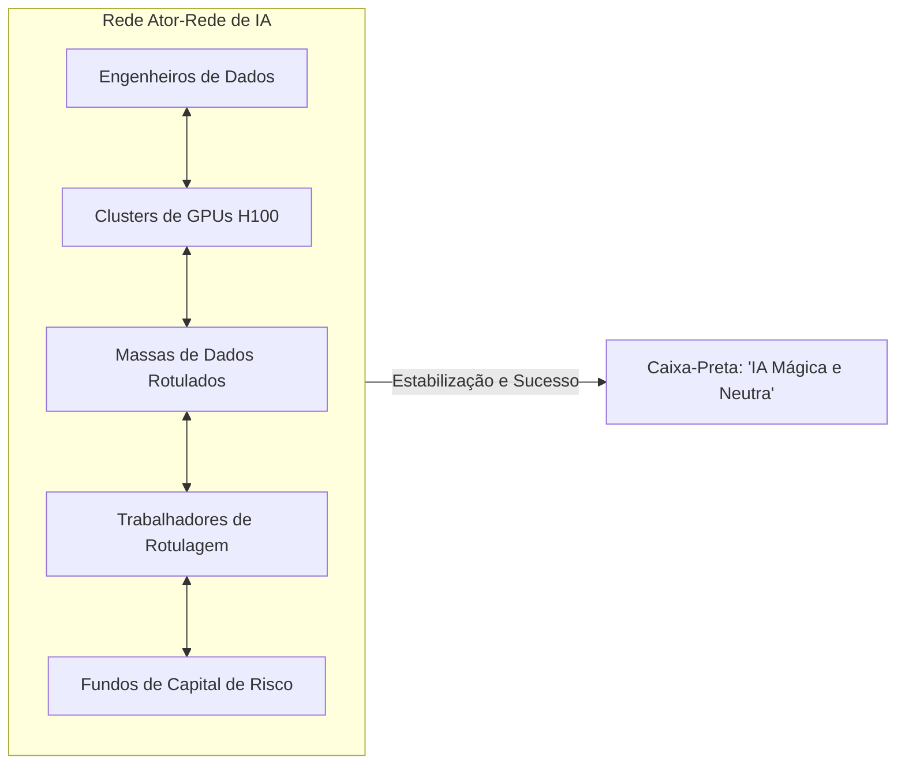

  
⬅️ <b><a href="/pt-br/resource/engenharia-de-computação/6-periodo/filosofia-da-ciencia-e-tecnologia/anotacoes/aula-08-avaliacao-tematica-p1-debates-epistemologicos">Aula Anterior</a></b>

  
🏠 <b><a href="/pt-br/resource/engenharia-de-computação/6-periodo/filosofia-da-ciencia-e-tecnologia">Hub da Disciplina</a></b>

  
➡️ <b><a href="/pt-br/resource/engenharia-de-computação/6-periodo/filosofia-da-ciencia-e-tecnologia/anotacoes/aula-10-civilizacao-tecnologica-e-o-determinismo-tecnologico">Próxima Aula</a></b>

> [!info] 📅 Informações da Aula
> - **Disciplina:** Filosofia da Ciência e Tecnologia (CSECBJI.43)
> - **Professor:** Hugo
> - **Data Realizada:** 28/10/2026
> - **Tópico Principal:** Bruno Latour e a Sociologia do Conhecimento
> - **Status:** Concluída e Revisada

> [!note] 📂 Material Complementar & Slides
> - 📄 **Slides Oficiais:** [[slide-09-filosofia-da-ciencia-e-tecnologia|Acessar Apresentação em PDF]]
> - 🎥 **Short Lecture / Gravação:** [[video-09-filosofia-da-ciencia-e-tecnologia|Assistir Síntese da Aula (Vídeo)]]

---

### 📑 Resumo das Seções
- [📌 1. Anotações do Quadro: Bruno Latour e a Sociologia do Conhecimento](#-anotações-do-quadro-bruno-latour-e-a-sociologia-do-conhecimento)
- [🧮 2. Formulação & Exemplo Prático Resolvido](#-formulação--exemplo-prático-resolvido)
- [📊 3. Esquema Visual & Fluxograma (Mermaid)](#-esquema-visual--fluxograma-mermaid)
- [🧠 4. Resumo Pessoal & Macetes do Professor](#-resumo-pessoal--macetes-do-professor)
- [📝 5. Dúvidas & Exercícios Recomendados para Casa](#-dúvidas--exercícios-recomendados-para-casa)

---

## 📌 Anotações do Quadro: Bruno Latour e a Sociologia do Conhecimento

### 9.1 Bruno Latour e a Sociologia da Ciência
Em *Ciência em Ação* (1987), o antropólogo e sociólogo francês Bruno Latour investigou a prática científica real através de estudos etnográficos em laboratórios, rejeitando tanto o idealismo positivista quanto o relativismo puro.

### 9.2 A Ciência Pronta vs A Ciência em Construção
- **Ciência Pronta (Caixa-Preta Fechada):** Os livros didáticos e manuais apresentam os fatos científicos como verdades incontestáveis, objetivas e frias, ocultando todas as disputas anteriores.
- **Ciência em Construção (*Science in the Making*):** O processo vivo de pesquisa no laboratório, marcado por controvérsias acirradas, negociações políticas, busca por financiamento e incerteza técnica.

### 9.3 A Teoria Ator-Rede (TAR / ANT)
A Teoria Ator-Rede propõe o **Princípio da Simetria Generalizada**:
- Não apenas os seres humanos são atores: objetos técnicos, instrumentos de medição, algoritmos, chips e servidores são tratados como **Actantes (Atores Não-Humanos)**.
- Um fato científico ou artefato tecnológico só se torna estável quando constrói uma **Rede Heterogênea sólida de alianças** entre cientistas, financiadores, instituições e actantes materiais.
- **Caixa-Preta (*Black Box*):** Ocorre quando uma rede complexa de relações técnicas e sociais é tão bem-sucedida que se torna invisível aos olhos do usuário comum (ex: ninguém pensa na infraestrutura global de servidores ao enviar uma mensagem no WhatsApp).

---

## 🧮 Formulação & Exemplo Prático Resolvido

### ✏️ Abertura da Caixa-Preta de um Modelo de Aprendizado Profundo (*Deep Learning*)

Ao abrirmos a caixa-preta de uma IA generativa comercial:
- **Não vemos apenas matemática pura:** Vemos uma rede heterogênea massiva composta por fazendas de GPUs da NVIDIA, bilhões de litros de água para resfriamento de data centers, milhares de trabalhadores precários no Sul Global rotulando dados manualmente (*Clickworkers*), bilhões de textos raspados da web sem autorização e bilhões de dólares de fundos de investimento.
A teoria de Latour revela a rede sociotécnica completa que sustenta a inteligência artificial!

---

## 📊 Esquema Visual & Fluxograma (Mermaid)

---

## 🧠 Resumo Pessoal & Macetes do Professor

| Conceito-Chave | *Takeaway* do Professor | Dicas de Prova / Atenção |
| :--- | :--- | :--- |
| **O Conceito de Actante** | Um actante é qualquer entidade (humana ou não-humana) que produz uma diferença mensurável na rede de relações. | Um microprocessador queimado ou um bug de firmware são actantes com enorme agência causal. |
| **Seguir os Cientistas Sociedade Afora** | A ciência não termina na porta do laboratório: ela envolve patentes, tribunais, mídia e relações governamentais. | Aplicação prática direta |

---

## 📝 Dúvidas & Exercícios Recomendados para Casa

1. Explique o conceito de 'Caixa-Preta' de Bruno Latour e descreva o processo necessário para reabrir uma caixa-preta tecnológica.
2. Identifique os actantes humanos e não-humanos envolvidos na rede sociotécnica do protocolo de consenso do Bitcoin.

---

  
⬅️ <b><a href="/pt-br/resource/engenharia-de-computação/6-periodo/filosofia-da-ciencia-e-tecnologia/anotacoes/aula-08-avaliacao-tematica-p1-debates-epistemologicos">Aula Anterior</a></b>

  
🏠 <b><a href="/pt-br/resource/engenharia-de-computação/6-periodo/filosofia-da-ciencia-e-tecnologia">Hub da Disciplina</a></b>

  
➡️ <b><a href="/pt-br/resource/engenharia-de-computação/6-periodo/filosofia-da-ciencia-e-tecnologia/anotacoes/aula-10-civilizacao-tecnologica-e-o-determinismo-tecnologico">Próxima Aula</a></b>

