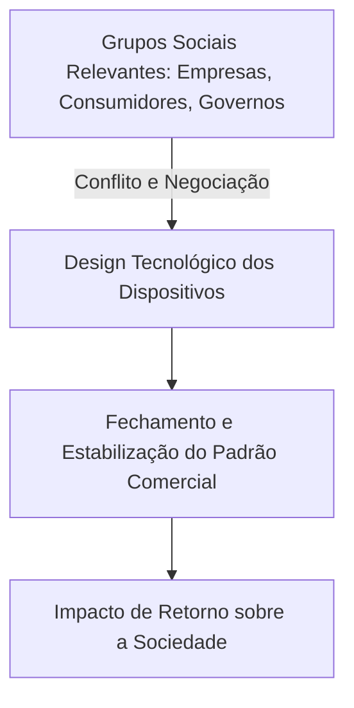

  
⬅️ <b><a href="/pt-br/resource/engenharia-de-computação/6-periodo/filosofia-da-ciencia-e-tecnologia/anotacoes/aula-09-bruno-latour-e-a-sociologia-do-conhecimento">Aula Anterior</a></b>

  
🏠 <b><a href="/pt-br/resource/engenharia-de-computação/6-periodo/filosofia-da-ciencia-e-tecnologia">Hub da Disciplina</a></b>

  
➡️ <b><a href="/pt-br/resource/engenharia-de-computação/6-periodo/filosofia-da-ciencia-e-tecnologia/anotacoes/aula-11-ciencia-tecnologia-e-humanismo-no-seculo-xxi">Próxima Aula</a></b>

> [!info] 📅 Informações da Aula
> - **Disciplina:** Filosofia da Ciência e Tecnologia (CSECBJI.43)
> - **Professor:** Hugo
> - **Data Realizada:** 04/11/2026
> - **Tópico Principal:** Civilização Tecnológica e o Determinismo Tecnológico
> - **Status:** Concluída e Revisada

> [!note] 📂 Material Complementar & Slides
> - 📄 **Slides Oficiais:** [[slide-10-filosofia-da-ciencia-e-tecnologia|Acessar Apresentação em PDF]]
> - 🎥 **Short Lecture / Gravação:** [[video-10-filosofia-da-ciencia-e-tecnologia|Assistir Síntese da Aula (Vídeo)]]

---

### 📑 Resumo das Seções
- [📌 1. Anotações do Quadro: Civilização Tecnológica e o Determinismo Tecnológico](#-anotações-do-quadro-civilização-tecnológica-e-o-determinismo-tecnológico)
- [🧮 2. Formulação & Exemplo Prático Resolvido](#-formulação--exemplo-prático-resolvido)
- [📊 3. Esquema Visual & Fluxograma (Mermaid)](#-esquema-visual--fluxograma-mermaid)
- [🧠 4. Resumo Pessoal & Macetes do Professor](#-resumo-pessoal--macetes-do-professor)
- [📝 5. Dúvidas & Exercícios Recomendados para Casa](#-dúvidas--exercícios-recomendados-para-casa)

---

## 📌 Anotações do Quadro: Civilização Tecnológica e o Determinismo Tecnológico

### 10.1 O Determinismo Tecnológico vs O Construtivismo Social (SCOT)
- **Determinismo Tecnológico (Karl Marx [interpretação comum], William Ogburn):** A tecnologia evolui segundo uma lógica autônoma própria e determina mecanicamente as transformações sociais, culturais e econômicas da história (*"O moinho de vento nos dá a sociedade feudal; o moinho a vapor, a sociedade capitalista industrial"*).
- **Construtivismo Social da Tecnologia (SCOT - Pinch & Bijker):** A tecnologia não tem vida própria; seu design e sucesso são moldados pelas negociações, conflitos e valores dos **Grupos Sociais Relevantes** envolvidos até atingir o fechamento (*Closure*).

### 10.2 A Técnica Autônoma (Jacques Ellul)
Em *A Sociedade Tecnológica* (1954), Jacques Ellul alerta para o fenômeno da técnica como sistema totalitário autônomo que busca a **eficiência máxima universal** em todas as esferas da existência humana, subordinando a moralidade, a arte e a política à lógica da eficácia operacional.

### 10.3 Zygmunt Bauman e a Modernidade Líquida
A aceleração dos fluxos digitais desintegra as instituições sólidas tradicionais, transformando as relações humanas em conexões descartáveis e superficiais mediadas por telas e métricas de engajamento.

---

## 🧮 Formulação & Exemplo Prático Resolvido

### ✏️ Análise Crítica: A Obsolescência Programada como Decisão Sociotécnica

A redução proposital da vida útil de smartphones e baterias não decorre de limites físicos dos semicondutores, mas de uma decisão econômica deliberada para forçar o consumo contínuo e alimentar a taxa de lucro das corporações:
- O construtivismo social demonstra que os aparelhos **poderiam ser modulares e durar 10 anos**, mas o arranjo sociotécnico capitalista impõe a cultura do descarte e do e-waste!

---

## 📊 Esquema Visual & Fluxograma (Mermaid)

---

## 🧠 Resumo Pessoal & Macetes do Professor

| Conceito-Chave | *Takeaway* do Professor | Dicas de Prova / Atenção |
| :--- | :--- | :--- |
| **Armadilha do Fatalismo Tecnológico** | Afirmar que 'a IA vai inevitavelmente roubar todos os empregos e não há nada a fazer' é uma postura determinista ingênua. A forma como a automação é implantada depende de leis, políticas públicas e decisões corporativas humanas. | A tecnologia é fruto da agência humana. |
| **Flexibilidade Interpretativa (SCOT)** | Diferentes grupos sociais enxergam o mesmo artefato de maneiras radicalmente distintas (ex: um drone pode ser um brinquedo, uma arma letal ou uma ferramenta de resgate). | Aplicação prática direta |

---

## 📝 Dúvidas & Exercícios Recomendados para Casa

1. Confronte o Determinismo Tecnológico com a abordagem do Construtivismo Social da Tecnologia (SCOT).
2. Discuta o impacto da 'Modernidade Líquida' de Zygmunt Bauman na saúde mental e nos relacionamentos mediados por algoritmos de redes sociais.

---

  
⬅️ <b><a href="/pt-br/resource/engenharia-de-computação/6-periodo/filosofia-da-ciencia-e-tecnologia/anotacoes/aula-09-bruno-latour-e-a-sociologia-do-conhecimento">Aula Anterior</a></b>

  
🏠 <b><a href="/pt-br/resource/engenharia-de-computação/6-periodo/filosofia-da-ciencia-e-tecnologia">Hub da Disciplina</a></b>

  
➡️ <b><a href="/pt-br/resource/engenharia-de-computação/6-periodo/filosofia-da-ciencia-e-tecnologia/anotacoes/aula-11-ciencia-tecnologia-e-humanismo-no-seculo-xxi">Próxima Aula</a></b>

