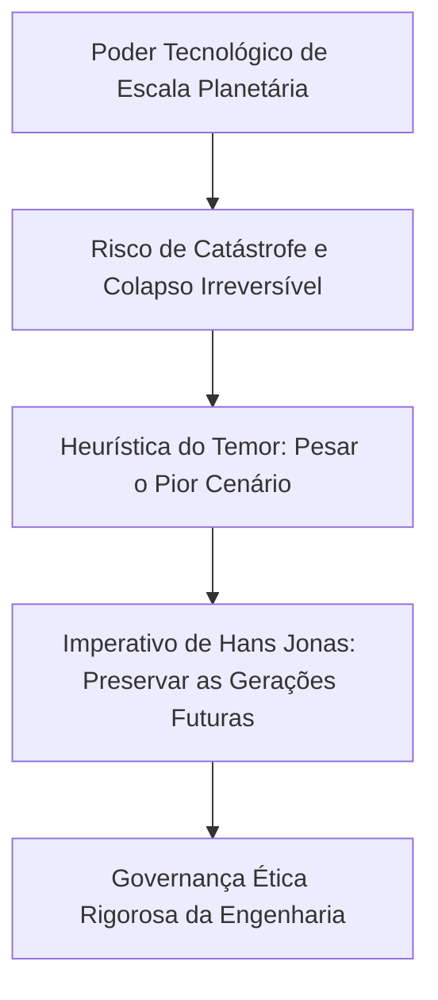

  
⬅️ <b><a href="/pt-br/resource/engenharia-de-computação/6-periodo/filosofia-da-ciencia-e-tecnologia/anotacoes/aula-10-civilizacao-tecnologica-e-o-determinismo-tecnologico">Aula Anterior</a></b>

  
🏠 <b><a href="/pt-br/resource/engenharia-de-computação/6-periodo/filosofia-da-ciencia-e-tecnologia">Hub da Disciplina</a></b>

  
➡️ <b><a href="/pt-br/resource/engenharia-de-computação/6-periodo/filosofia-da-ciencia-e-tecnologia/anotacoes/aula-12-etica-na-inteligencia-artificial-e-automacao">Próxima Aula</a></b>

> [!info] 📅 Informações da Aula
> - **Disciplina:** Filosofia da Ciência e Tecnologia (CSECBJI.43)
> - **Professor:** Hugo
> - **Data Realizada:** 11/11/2026
> - **Tópico Principal:** Ciência, Tecnologia e Humanismo no Século XXI
> - **Status:** Concluída e Revisada

> [!note] 📂 Material Complementar & Slides
> - 📄 **Slides Oficiais:** [[slide-11-filosofia-da-ciencia-e-tecnologia|Acessar Apresentação em PDF]]
> - 🎥 **Short Lecture / Gravação:** [[video-11-filosofia-da-ciencia-e-tecnologia|Assistir Síntese da Aula (Vídeo)]]

---

### 📑 Resumo das Seções
- [📌 1. Anotações do Quadro: Ciência, Tecnologia e Humanismo no Século XXI](#-anotações-do-quadro-ciência,-tecnologia-e-humanismo-no-século-xxi)
- [🧮 2. Formulação & Exemplo Prático Resolvido](#-formulação--exemplo-prático-resolvido)
- [📊 3. Esquema Visual & Fluxograma (Mermaid)](#-esquema-visual--fluxograma-mermaid)
- [🧠 4. Resumo Pessoal & Macetes do Professor](#-resumo-pessoal--macetes-do-professor)
- [📝 5. Dúvidas & Exercícios Recomendados para Casa](#-dúvidas--exercícios-recomendados-para-casa)

---

## 📌 Anotações do Quadro: Ciência, Tecnologia e Humanismo no Século XXI

### 11.1 Hans Jonas e o Princípio Responsabilidade
Em sua obra-prima *O Princípio Responsabilidade: Ensaio de uma ética para a civilização tecnológica* (1979), o filósofo Hans Jonas demonstrou que as éticas tradicionais (Aristóteles, Kant) eram antropocêntricas e limitadas ao presente imediato.

A civilização tecnológica moderna concedeu ao ser humano um **poder de destruição de escala cósmica e planetária** (armas nucleares, colapso climático, engenharia genética e inteligência artificial geral), exigindo uma nova ética ontológica:
- **O Novo Imperativo Categórico de Hans Jonas:**
  $$\text{"Age de tal modo que os efeitos de tua ação sejam compatíveis com a permanência de uma vida autenticamente humana sobre a Terra."}$$

### 11.2 A Heurística do Temor e as Gerações Futuras
- **Heurística do Temor:** Diante de tecnologias com potencial catastrófico irreversível, devemos dar maior peso à previsão do pior cenário possível (*Worst-Case Scenario*) do que às promessas otimistas de lucro ou conveniência.
- **Dever com o Futuro:** Temos uma obrigação moral irrevogável com as **gerações futuras** que ainda não nasceram, garantindo que elas herdem um planeta habitável e uma humanidade livre da tirania algorítmica.

---

## 🧮 Formulação & Exemplo Prático Resolvido

### ✏️ Aplicação do Princípio da Responsabilidade em Sistemas Críticos

**Estudo de Caso:** Desenvolvimento de Armas Autônomas Letais (LAWS - *Lethal Autonomous Weapons Systems*):
- Sob a ótica utilitarista de curto prazo: robôs de combate poupam soldados do próprio país.
- **Sob o Princípio da Responsabilidade de Hans Jonas:** Delegar a decisão irrevogável de matar seres humanos a algoritmos computacionais sem consciência moral viola a dignidade humana fundamental e abre precedentes apocalípticos de desumanização da guerra.
- **Diretriz Ética:** Proibição de algoritmos que retirem o ser humano do circuito decisório (*Human-in-the-Loop*).

---

## 📊 Esquema Visual & Fluxograma (Mermaid)

---

## 🧠 Resumo Pessoal & Macetes do Professor

| Conceito-Chave | *Takeaway* do Professor | Dicas de Prova / Atenção |
| :--- | :--- | :--- |
| **Princípio da Precaução** | Na ausência de certeza científica absoluta sobre a segurança de uma tecnologia emergente, a carga da prova cabe aos proponentes demonstrar que ela NÃO causará danos graves ou irreversíveis. | Base dos tratados internacionais de biossegurança e IA. |
| **Vulnerabilidade da Natureza** | Hans Jonas supera o antropocentrismo clássico ao incluir a biosfera inteira como objeto de responsabilidade moral humana. | Aplicação prática direta |

---

## 📝 Dúvidas & Exercícios Recomendados para Casa

1. Explique a 'Heurística do Temor' de Hans Jonas e justifique sua aplicação na governança de inteligências artificiais com capacidade de auto-aperfeiçoamento.
2. Compare o imperativo categórico de Immanuel Kant com o imperativo ecológico-tecnológico de Hans Jonas.

---

  
⬅️ <b><a href="/pt-br/resource/engenharia-de-computação/6-periodo/filosofia-da-ciencia-e-tecnologia/anotacoes/aula-10-civilizacao-tecnologica-e-o-determinismo-tecnologico">Aula Anterior</a></b>

  
🏠 <b><a href="/pt-br/resource/engenharia-de-computação/6-periodo/filosofia-da-ciencia-e-tecnologia">Hub da Disciplina</a></b>

  
➡️ <b><a href="/pt-br/resource/engenharia-de-computação/6-periodo/filosofia-da-ciencia-e-tecnologia/anotacoes/aula-12-etica-na-inteligencia-artificial-e-automacao">Próxima Aula</a></b>

