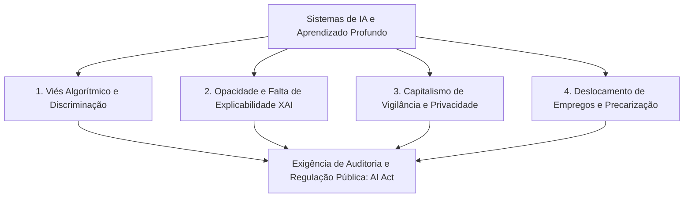

  
⬅️ <b><a href="/pt-br/resource/engenharia-de-computação/6-periodo/filosofia-da-ciencia-e-tecnologia/anotacoes/aula-11-ciencia-tecnologia-e-humanismo-no-seculo-xxi">Aula Anterior</a></b>

  
🏠 <b><a href="/pt-br/resource/engenharia-de-computação/6-periodo/filosofia-da-ciencia-e-tecnologia">Hub da Disciplina</a></b>

  
➡️ <b><a href="/pt-br/resource/engenharia-de-computação/6-periodo/filosofia-da-ciencia-e-tecnologia/anotacoes/aula-13-responsabilidade-social-do-engenheiro-e-sustentabilidade">Próxima Aula</a></b>

> [!info] 📅 Informações da Aula
> - **Disciplina:** Filosofia da Ciência e Tecnologia (CSECBJI.43)
> - **Professor:** Hugo
> - **Data Realizada:** 18/11/2026
> - **Tópico Principal:** Ética na Inteligência Artificial e Automação
> - **Status:** Concluída e Revisada

> [!note] 📂 Material Complementar & Slides
> - 📄 **Slides Oficiais:** [[slide-12-filosofia-da-ciencia-e-tecnologia|Acessar Apresentação em PDF]]
> - 🎥 **Short Lecture / Gravação:** [[video-12-filosofia-da-ciencia-e-tecnologia|Assistir Síntese da Aula (Vídeo)]]

---

### 📑 Resumo das Seções
- [📌 1. Anotações do Quadro: Ética na Inteligência Artificial e Automação](#-anotações-do-quadro-ética-na-inteligência-artificial-e-automação)
- [🧮 2. Formulação & Exemplo Prático Resolvido](#-formulação--exemplo-prático-resolvido)
- [📊 3. Esquema Visual & Fluxograma (Mermaid)](#-esquema-visual--fluxograma-mermaid)
- [🧠 4. Resumo Pessoal & Macetes do Professor](#-resumo-pessoal--macetes-do-professor)
- [📝 5. Dúvidas & Exercícios Recomendados para Casa](#-dúvidas--exercícios-recomendados-para-casa)

---

## 📌 Anotações do Quadro: Ética na Inteligência Artificial e Automação

### 12.1 Desafios Éticos na Era da Inteligência Artificial
O avanço dos sistemas de aprendizado de máquina e redes neurais profundas coloca dilemas éticos sem precedentes para os engenheiros de computação:

1. **Viés Algorítmico (*Algorithmic Bias*):** Modelos de Machine Learning treinados sobre bases de dados históricas reproduzem e amplificam preconceitos estruturais de gênero, raça e classe (ex: softwares de reconhecimento facial com taxas de erro 30x maiores para pessoas negras).
2. **Opacidade e Explicabilidade (*Black Box Problem*):** Modelos com centenas de bilhões de parâmetros tomam decisões críticas (concessão de empréstimos, diagnósticos médicos, sentenças penais) sem que nenhum ser humano compreenda o caminho lógico exato da decisão, violando o direito à ampla defesa e transparência.
3. **Capitalismo de Vigilância (Shoshana Zuboff):** Monetização da experiência humana através da extração não-consensual de dados comportamentais para criar mercados de previsões futuras de conduta humana.
4. **O Futuro do Trabalho e a Automação:** Risco de desemprego tecnológico estrutural e precarização das relações trabalhistas mediadas por plataformas de entrega e trabalho sob demanda (*Uberização*).

---

## 🧮 Formulação & Exemplo Prático Resolvido

### ✏️ O Dilema do Veículo Autônomo e a Ética da Programação

Considere o clássico **Dilema do Bonde (*Trolley Problem*)** adaptado para o software de controle de um carro autônomo:
- Em uma situação de colisão iminente com falha de freios, o algoritmo deve desviar atropelando 1 pedestre na calçada para salvar os 4 passageiros do veículo, ou manter a trajetória colidindo contra um muro e sacrificando os passageiros?
- **O Perigo da Quantificação Moral:** A decisão do algoritmo é uma escolha ética programada previamente por engenheiros de software. Nenhuma função de perda matemática (*Loss Function*) pode resolver dilemas morais sem carregar escolhas ontológicas sobre o valor da vida humana!

---

## 📊 Esquema Visual & Fluxograma (Mermaid)

---

## 🧠 Resumo Pessoal & Macetes do Professor

| Conceito-Chave | *Takeaway* do Professor | Dicas de Prova / Atenção |
| :--- | :--- | :--- |
| **IA Explicável (XAI - Explainable AI)** | Em sistemas críticos (medicina, crédito, justiça), a explicabilidade do modelo é um requisito não-funcional mandatório tão importante quanto a acurácia estatística. | Modelos caixas-pretas inauditáveis estão sendo banidos pela legislação europeia (EU AI Act). |
| **A Ilusão da Objetividade Algorítmica** | Algoritmos não são neutros; eles são opiniões codificadas em matemática (*Cathy O'Neil - Weapons of Math Destruction*). | Aplicação prática direta |

---

## 📝 Dúvidas & Exercícios Recomendados para Casa

1. Analise criticamente o conceito de 'Capitalismo de Vigilância' de Shoshana Zuboff aplicado aos modelos de negócio das Big Techs.
2. Proponha uma metodologia de auditoria algorítmica para detectar e mitigar vieses discriminatórios em um sistema automatizado de concessão de crédito bancário.

---

  
⬅️ <b><a href="/pt-br/resource/engenharia-de-computação/6-periodo/filosofia-da-ciencia-e-tecnologia/anotacoes/aula-11-ciencia-tecnologia-e-humanismo-no-seculo-xxi">Aula Anterior</a></b>

  
🏠 <b><a href="/pt-br/resource/engenharia-de-computação/6-periodo/filosofia-da-ciencia-e-tecnologia">Hub da Disciplina</a></b>

  
➡️ <b><a href="/pt-br/resource/engenharia-de-computação/6-periodo/filosofia-da-ciencia-e-tecnologia/anotacoes/aula-13-responsabilidade-social-do-engenheiro-e-sustentabilidade">Próxima Aula</a></b>

