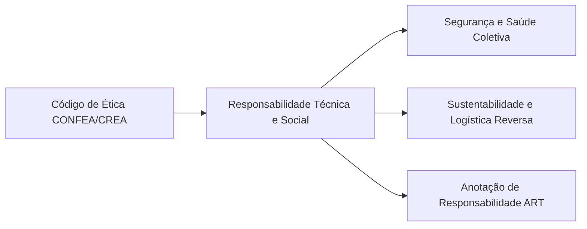

  
⬅️ <b><a href="/pt-br/resource/engenharia-de-computação/6-periodo/filosofia-da-ciencia-e-tecnologia/anotacoes/aula-12-etica-na-inteligencia-artificial-e-automacao">Aula Anterior</a></b>

  
🏠 <b><a href="/pt-br/resource/engenharia-de-computação/6-periodo/filosofia-da-ciencia-e-tecnologia">Hub da Disciplina</a></b>

  
➡️ <b><a href="/pt-br/resource/engenharia-de-computação/6-periodo/filosofia-da-ciencia-e-tecnologia/anotacoes/aula-14-seminarios-tematicos-tecnologia-e-sociedade">Próxima Aula</a></b>

> [!info] 📅 Informações da Aula
> - **Disciplina:** Filosofia da Ciência e Tecnologia (CSECBJI.43)
> - **Professor:** Hugo
> - **Data Realizada:** 25/11/2026
> - **Tópico Principal:** Responsabilidade Social do Engenheiro e Sustentabilidade
> - **Status:** Concluída e Revisada

> [!note] 📂 Material Complementar & Slides
> - 📄 **Slides Oficiais:** [[slide-13-filosofia-da-ciencia-e-tecnologia|Acessar Apresentação em PDF]]
> - 🎥 **Short Lecture / Gravação:** [[video-13-filosofia-da-ciencia-e-tecnologia|Assistir Síntese da Aula (Vídeo)]]

---

### 📑 Resumo das Seções
- [📌 1. Anotações do Quadro: Responsabilidade Social do Engenheiro e Sustentabilidade](#-anotações-do-quadro-responsabilidade-social-do-engenheiro-e-sustentabilidade)
- [🧮 2. Formulação & Exemplo Prático Resolvido](#-formulação--exemplo-prático-resolvido)
- [📊 3. Esquema Visual & Fluxograma (Mermaid)](#-esquema-visual--fluxograma-mermaid)
- [🧠 4. Resumo Pessoal & Macetes do Professor](#-resumo-pessoal--macetes-do-professor)
- [📝 5. Dúvidas & Exercícios Recomendados para Casa](#-dúvidas--exercícios-recomendados-para-casa)

---

## 📌 Anotações do Quadro: Responsabilidade Social do Engenheiro e Sustentabilidade

### 13.1 O Código de Ética Profissional da Engenharia (CONFEA / CREA)
A prática da Engenharia de Computação no Brasil é regida pelo Código de Ética Profissional do Sistema CONFEA/CREA (Resolução nº 1.002/2002):
- **Deveres Fundamentais:** Exercer a profissão com integridade, proteger a segurança e a saúde da coletividade, recusar trabalhos para os quais não possua qualificação técnica comprovada e preservar o meio ambiente.
- **Anotação de Responsabilidade Técnica (ART):** Instrumento legal que define para a sociedade o responsável técnico pela execução de projetos e obras de engenharia.

### 13.2 Responsabilidade Socioambiental e Economia Circular
- **Lixo Eletrônico (*E-Waste*):** O descarte de placas de circuito impresso contendo metais pesados tóxicos (chumbo, cádmio, mercúrio) contamina lençóis freáticos e exige logística reversa obrigatória.
- **Análise do Ciclo de Vida (ACV):** Avaliação do impacto ambiental de um produto desde a extração das matérias-primas de silício até a reciclagem final (*Cradle-to-Cradle*).

### 13.3 O Engenheiro como Agente de Transformação Social
O engenheiro de computação formado por uma instituição pública como o IFF possui o compromisso de colocar a tecnologia a serviço do desenvolvimento regional sustentável, da inclusão digital e da redução das desigualdades sociais.

---

## 🧮 Formulação & Exemplo Prático Resolvido

### ✏️ Estudo de Caso de Falha Ética na Engenharia: O Escândalo *Dieselgate* da Volkswagen

Em 2015, revelou-se que engenheiros de software da Volkswagen programaram deliberadamente o código da central de injeção eletrônica (ECU) dos motores a diesel com um algoritmo fraudulento (*Defeat Device*):
- O software detectava quando o veículo estava em bancada de testes de emissões e ativava os filtros de controle de poluição.
- Em condições normais de direção na rua, o software desativava os filtros para economizar combustível, emitindo até 40x mais gases tóxicos ($NO_x$) na atmosfera.

**Consequências:** Multas de mais de US$ 30 bilhões, prisões de executivos e engenheiros, e dano reputacional irreparável. A obediência cega a ordens corporativas que violam a ética profissional acarreta responsabilidade civil e criminal para os desenvolvedores!

---

## 📊 Esquema Visual & Fluxograma (Mermaid)

---

## 🧠 Resumo Pessoal & Macetes do Professor

| Conceito-Chave | *Takeaway* do Professor | Dicas de Prova / Atenção |
| :--- | :--- | :--- |
| **A ART não é Mera Burocracia** | A Anotação de Responsabilidade Técnica (ART) é a certidão jurídica que delimita a responsabilidade civil do engenheiro perante a Justiça e comprova seu Acervo Técnico profissional. | Nunca assine projetos que você não acompanhou pessoalmente! |
| **Whistleblowing (Denúncia de Fraudes)** | O código de ética obriga o engenheiro a alertar seus superiores e, se necessário, os órgãos reguladores, caso detecte fraudes técnicas que ameacem vidas humanas. | Aplicação prática direta |

---

## 📝 Dúvidas & Exercícios Recomendados para Casa

1. Analise as responsabilidades éticas e jurídicas dos engenheiros de software envolvidos no caso dos acidentes aéreos do Boeing 737 MAX (sistema MCAS).
2. Descreva as diretrizes da Política Nacional de Resíduos Sólidos (PNRS) para a logística reversa de lixo eletrônico no Brasil.

---

  
⬅️ <b><a href="/pt-br/resource/engenharia-de-computação/6-periodo/filosofia-da-ciencia-e-tecnologia/anotacoes/aula-12-etica-na-inteligencia-artificial-e-automacao">Aula Anterior</a></b>

  
🏠 <b><a href="/pt-br/resource/engenharia-de-computação/6-periodo/filosofia-da-ciencia-e-tecnologia">Hub da Disciplina</a></b>

  
➡️ <b><a href="/pt-br/resource/engenharia-de-computação/6-periodo/filosofia-da-ciencia-e-tecnologia/anotacoes/aula-14-seminarios-tematicos-tecnologia-e-sociedade">Próxima Aula</a></b>

