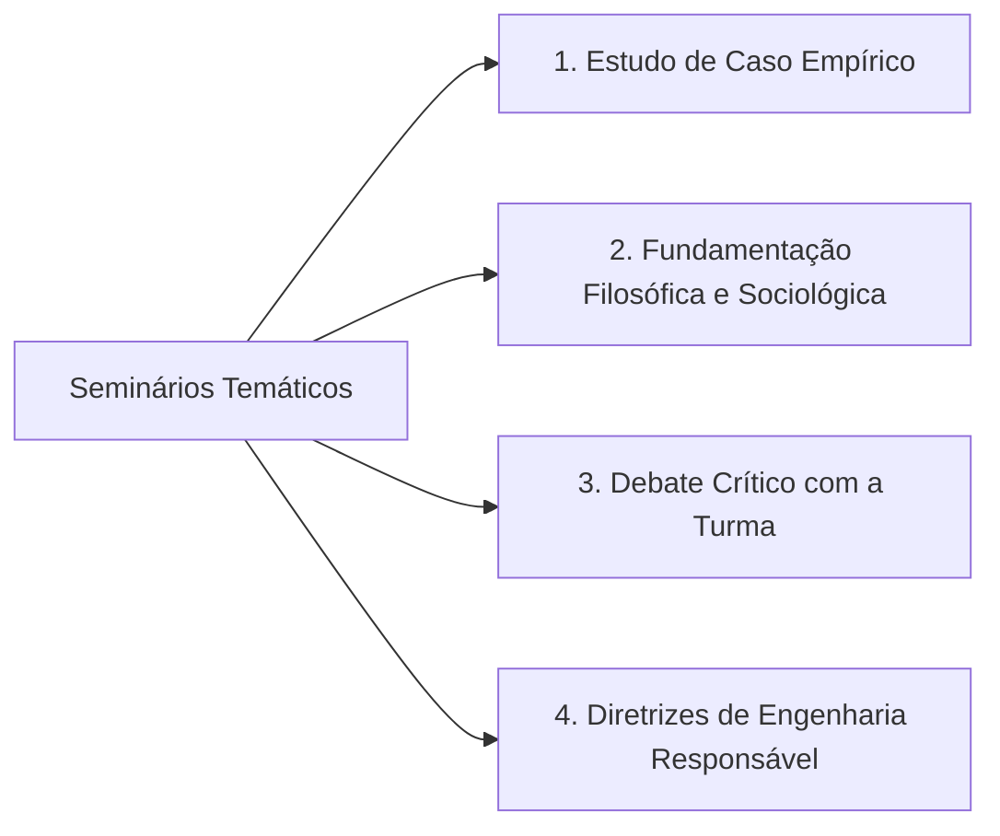

  
⬅️ <b><a href="/pt-br/resource/engenharia-de-computação/6-periodo/filosofia-da-ciencia-e-tecnologia/anotacoes/aula-13-responsabilidade-social-do-engenheiro-e-sustentabilidade">Aula Anterior</a></b>

  
🏠 <b><a href="/pt-br/resource/engenharia-de-computação/6-periodo/filosofia-da-ciencia-e-tecnologia">Hub da Disciplina</a></b>

  
➡️ <b><a href="/pt-br/resource/engenharia-de-computação/6-periodo/filosofia-da-ciencia-e-tecnologia/anotacoes/aula-15-avaliacao-tematica-p2-e-defesa-dos-ensaios">Próxima Aula</a></b>

> [!info] 📅 Informações da Aula
> - **Disciplina:** Filosofia da Ciência e Tecnologia (CSECBJI.43)
> - **Professor:** Hugo
> - **Data Realizada:** 02/12/2026
> - **Tópico Principal:** Seminários Temáticos: Tecnologia e Sociedade
> - **Status:** Concluída e Revisada

> [!note] 📂 Material Complementar & Slides
> - 📄 **Slides Oficiais:** [[slide-14-filosofia-da-ciencia-e-tecnologia|Acessar Apresentação em PDF]]
> - 🎥 **Short Lecture / Gravação:** [[video-14-filosofia-da-ciencia-e-tecnologia|Assistir Síntese da Aula (Vídeo)]]

---

### 📑 Resumo das Seções
- [📌 1. Anotações do Quadro: Seminários Temáticos: Tecnologia e Sociedade](#-anotações-do-quadro-seminários-temáticos-tecnologia-e-sociedade)
- [🧮 2. Formulação & Exemplo Prático Resolvido](#-formulação--exemplo-prático-resolvido)
- [📊 3. Esquema Visual & Fluxograma (Mermaid)](#-esquema-visual--fluxograma-mermaid)
- [🧠 4. Resumo Pessoal & Macetes do Professor](#-resumo-pessoal--macetes-do-professor)
- [📝 5. Dúvidas & Exercícios Recomendados para Casa](#-dúvidas--exercícios-recomendados-para-casa)

---

## 📌 Anotações do Quadro: Seminários Temáticos: Tecnologia e Sociedade

### 14.1 Apresentação de Seminários Temáticos
Apresentação em equipes dos estudos de caso aprofundados sobre as complexas interseções entre tecnologia, sociedade, ética e poder político:

1. **Tema 1: A Inteligência Artificial e a Reconfiguração do Trabalho:** Análise dos impactos da automação em postos de trabalho de colarinho branco e a ascensão da gig economy.
2. **Tema 2: Algoritmos de Redes Sociais, Polarização Política e Desinformação:** Como a arquitetura dos sistemas de recomendação afeta a democracia e as eleições.
3. **Tema 3: Soberania Digital e Guerra Cibernética:** Vulnerabilidades de infraestruturas críticas nacionais (redes elétricas, telecomunicações) frente a ataques estatais.
4. **Tema 4: Grandes Desastres Tecnológicos sob a Ótica da Sociologia da Engenharia:** Análise comparativa das falhas organizacionais e éticas em Chernobyl, Bhopal e rompimento de barragens no Brasil.

---

## 🧮 Formulação & Exemplo Prático Resolvido

### ✏️ Roteiro Metodológico para a Apresentação do Seminário

- **Contextualização Fática:** Apresentação do caso real com dados empíricos precisos.
- **Diagnóstico Teórico:** Análise do problema utilizando os referenciais de Heidegger, Latour, Popper, Kuhn e Hans Jonas.
- **Debate Ético:** Confronto das perspectivas utilitarista, deontológica e da responsabilidade socioambiental.
- **Recomendações Práticas de Engenharia:** Diretrizes concretas de governança para evitar a repetição dos erros históricos.

---

## 📊 Esquema Visual & Fluxograma (Mermaid)

---

## 🧠 Resumo Pessoal & Macetes do Professor

| Conceito-Chave | *Takeaway* do Professor | Dicas de Prova / Atenção |
| :--- | :--- | :--- |
| **Debate com a Turma** | Reserve os últimos 5 minutos da apresentação para formular perguntas provocativas que estimulem a participação e o pensamento crítico dos colegas. | O debate em plenária enriquece a nota do grupo. |
| **Fuga do Superficial** | Não faça um seminário puramente jornalístico; o foco principal deve ser a **análise epistemológica e filosófica profunda** dos fatos. | Aplicação prática direta |

---

## 📝 Dúvidas & Exercícios Recomendados para Casa

1. Conclua a preparação dos slides e referências bibliográficas para o seminário temático da equipe.
2. Formule 3 perguntas críticas sobre o tema do grupo adversário para participação no debate.

---

  
⬅️ <b><a href="/pt-br/resource/engenharia-de-computação/6-periodo/filosofia-da-ciencia-e-tecnologia/anotacoes/aula-13-responsabilidade-social-do-engenheiro-e-sustentabilidade">Aula Anterior</a></b>

  
🏠 <b><a href="/pt-br/resource/engenharia-de-computação/6-periodo/filosofia-da-ciencia-e-tecnologia">Hub da Disciplina</a></b>

  
➡️ <b><a href="/pt-br/resource/engenharia-de-computação/6-periodo/filosofia-da-ciencia-e-tecnologia/anotacoes/aula-15-avaliacao-tematica-p2-e-defesa-dos-ensaios">Próxima Aula</a></b>

