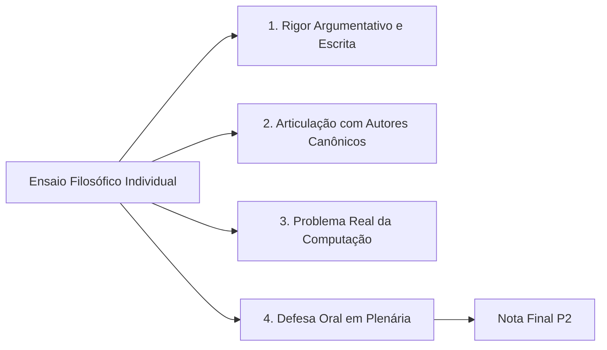

  
⬅️ <b><a href="/pt-br/resource/engenharia-de-computação/6-periodo/filosofia-da-ciencia-e-tecnologia/anotacoes/aula-14-seminarios-tematicos-tecnologia-e-sociedade">Aula Anterior</a></b>

  
🏠 <b><a href="/pt-br/resource/engenharia-de-computação/6-periodo/filosofia-da-ciencia-e-tecnologia">Hub da Disciplina</a></b>

  
➡️ <b><a href="/pt-br/resource/engenharia-de-computação/6-periodo/filosofia-da-ciencia-e-tecnologia/anotacoes/aula-16-consideracoes-finais-prova-final-e-fechamento">Próxima Aula</a></b>

> [!info] 📅 Informações da Aula
> - **Disciplina:** Filosofia da Ciência e Tecnologia (CSECBJI.43)
> - **Professor:** Hugo
> - **Data Realizada:** 09/12/2026
> - **Tópico Principal:** Avaliação Temática P2 e Defesa dos Ensaios
> - **Status:** Concluída e Revisada

> [!note] 📂 Material Complementar & Slides
> - 📄 **Slides Oficiais:** [[slide-15-filosofia-da-ciencia-e-tecnologia|Acessar Apresentação em PDF]]
> - 🎥 **Short Lecture / Gravação:** [[video-15-filosofia-da-ciencia-e-tecnologia|Assistir Síntese da Aula (Vídeo)]]

---

### 📑 Resumo das Seções
- [📌 1. Anotações do Quadro: Avaliação Temática P2 e Defesa dos Ensaios](#-anotações-do-quadro-avaliação-temática-p2-e-defesa-dos-ensaios)
- [🧮 2. Formulação & Exemplo Prático Resolvido](#-formulação--exemplo-prático-resolvido)
- [📊 3. Esquema Visual & Fluxograma (Mermaid)](#-esquema-visual--fluxograma-mermaid)
- [🧠 4. Resumo Pessoal & Macetes do Professor](#-resumo-pessoal--macetes-do-professor)
- [📝 5. Dúvidas & Exercícios Recomendados para Casa](#-dúvidas--exercícios-recomendados-para-casa)

---

## 📌 Anotações do Quadro: Avaliação Temática P2 e Defesa dos Ensaios

### 15.1 Critérios de Avaliação e Defesa Pública dos Ensaios
A avaliação temática P2 consiste na entrega da monografia/ensaio filosófico individual e na sua respectiva defesa oral pública perante o docente e a turma:
1. Formulação clara de uma tese epistemológica, ética ou política autoral sobre a Engenharia de Computação.
2. Articulação consistente com pelo menos três autores canônicos estudados (ex: Platão, Kant, Popper, Kuhn, Heidegger, Latour, Hans Jonas, Boaventura de Sousa Santos).
3. Coerência lógica, rigor conceitual e ausência de falácias argumentativas.
4. Análise aprofundada de um problema contemporâneo real de tecnologia.
5. Clareza, postura acadêmica e segurança teórica na arguição oral.

---

## 🧮 Formulação & Exemplo Prático Resolvido

### ✏️ Exemplo de Tese de Ensaio Aprovada com Excelência

*"A opacidade dos modelos de aprendizado profundo (Deep Learning) como reconfiguração contemporânea do conceito de Caixa-Preta de Latour e seus impactos sobre a autonomia moral kantiana no julgamento penal automatizado."*

O ensaio articula a sociologia da ciência de Latour com a filosofia moral de Kant para demonstrar que sentenças penais proferidas por algoritmos inauditáveis tratam os cidadãos como meros objetos estatísticos, violando a autonomia da vontade humana!

---

## 📊 Esquema Visual & Fluxograma (Mermaid)

---

## 🧠 Resumo Pessoal & Macetes do Professor

| Conceito-Chave | *Takeaway* do Professor | Dicas de Prova / Atenção |
| :--- | :--- | :--- |
| **Dica para a Defesa Oral** | Tenha clareza absoluta sobre **qual é a sua tese central**. Em 3 minutos, explique qual problema você investigou, quais autores utilizou para fundamentar e qual conclusão crítica você alcançou. | Segurança conceitual impressiona a banca. |
| **Estrutura das Citações** | Siga rigorosamente as normas da ABNT (NBR 10520) para citações diretas e indiretas. | Aplicação prática direta |

---

## 📝 Dúvidas & Exercícios Recomendados para Casa

1. Finalize a revisão textual e formatação ABNT do seu ensaio monográfico.
2. Ensaie a apresentação oral da defesa de sua tese dentro do tempo estrito de 5 minutos.

---

  
⬅️ <b><a href="/pt-br/resource/engenharia-de-computação/6-periodo/filosofia-da-ciencia-e-tecnologia/anotacoes/aula-14-seminarios-tematicos-tecnologia-e-sociedade">Aula Anterior</a></b>

  
🏠 <b><a href="/pt-br/resource/engenharia-de-computação/6-periodo/filosofia-da-ciencia-e-tecnologia">Hub da Disciplina</a></b>

  
➡️ <b><a href="/pt-br/resource/engenharia-de-computação/6-periodo/filosofia-da-ciencia-e-tecnologia/anotacoes/aula-16-consideracoes-finais-prova-final-e-fechamento">Próxima Aula</a></b>

