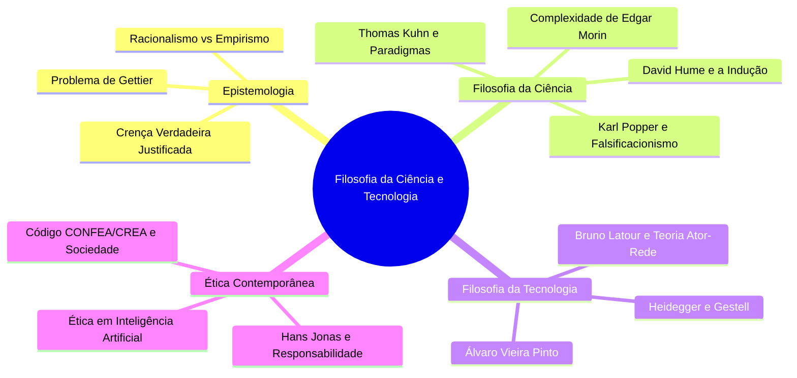

<div style="display: flex; justify-content: space-between; align-items: center; padding: 10px 16px; background: var(--light, #f8fafc); border: 1px solid var(--lightgray, #e2e8f0); border-radius: 10px; margin: 1.5rem 0;">
  <div>⬅️ <b><a href="/pt-br/resource/engenharia-de-computação/6-periodo/filosofia-da-ciencia-e-tecnologia/anotacoes/aula-15-avaliacao-tematica-p2-e-defesa-dos-ensaios">Aula Anterior</a></b></div>
  <div>🏠 <b><a href="/pt-br/resource/engenharia-de-computação/6-periodo/filosofia-da-ciencia-e-tecnologia">Hub da Disciplina</a></b></div>
  <div>➡️ <span style="color: gray;">Última Aula</span></div>
</div>

> [!info] 📅 Informações da Aula
> - **Disciplina:** Filosofia da Ciência e Tecnologia (CSECBJI.43)
> - **Professor:** Hugo
> - **Data Realizada:** 16/12/2026
> - **Tópico Principal:** Considerações Finais, Prova Final e Fechamento
> - **Status:** Concluída e Revisada

> [!note] 📂 Material Complementar & Slides
> - 📄 **Slides Oficiais:** [[slide-16-filosofia-da-ciencia-e-tecnologia|Acessar Apresentação em PDF]]
> - 🎥 **Short Lecture / Gravação:** [[video-16-filosofia-da-ciencia-e-tecnologia|Assistir Síntese da Aula (Vídeo)]]

---

### 📑 Resumo das Seções
- [📌 1. Anotações do Quadro: Considerações Finais, Prova Final e Fechamento](#-anotações-do-quadro-considerações-finais,-prova-final-e-fechamento)
- [🧮 2. Formulação & Exemplo Prático Resolvido](#-formulação--exemplo-prático-resolvido)
- [📊 3. Esquema Visual & Fluxograma (Mermaid)](#-esquema-visual--fluxograma-mermaid)
- [🧠 4. Resumo Pessoal & Macetes do Professor](#-resumo-pessoal--macetes-do-professor)
- [📝 5. Dúvidas & Exercícios Recomendados para Casa](#-dúvidas--exercícios-recomendados-para-casa)

---

## 📌 Anotações do Quadro: Considerações Finais, Prova Final e Fechamento

### 16.1 Síntese Holística da Filosofia da Ciência e Tecnologia
A disciplina consolida a formação humanística, crítica e cidadã do Engenheiro de Computação:
```text
Epistemologia e Teoria do Conhecimento ──▶ Método Científico e Falsificacionismo ──▶ Revoluções de Kuhn ──▶ TAR de Latour ──▶ Ética de Hans Jonas & IA
```

### 16.2 O Engenheiro de Computação no Século XXI
A formação do IFF busca diplomar profissionais que não sejam meros executores técnicos operacionais, mas **cidadãos conscientes, éticos e líderes intelectuais** capazes de conduzir a transformação digital da sociedade com responsabilidade humanística, compromisso ecológico e justiça social.

---

## 🧮 Formulação & Exemplo Prático Resolvido

### ✏️ Fechamento do Semestre Letivo 2026-2

1. **Revisão das Avaliações:** Média Final $= (P1 + P2) / 2 \ge 6.0$.
2. **Mensagem Final:** Que a reflexão crítica e o imperativo de Hans Jonas acompanhem cada projeto, algoritmo e sistema construído ao longo de toda a sua trajetória profissional!

---

## 📊 Esquema Visual & Fluxograma (Mermaid)



---

## 🧠 Resumo Pessoal & Macetes do Professor

| Conceito-Chave | *Takeaway* do Professor | Dicas de Prova / Atenção |
| :--- | :--- | :--- |
| **Legado da Disciplina** | A técnica passa e as linguagens de programação se transformam a cada década; a sabedoria filosófica e a consciência ética permanecem como o alicerce imutável da dignidade humana. | Carregue esta visão crítica para a vida. |
| **Encerramento do Semestre** | Parabéns pela brilhante trajetória na disciplina de Filosofia da Ciência e Tecnologia! | Aplicação prática direta |

---

## 📝 Dúvidas & Exercícios Recomendados para Casa

1. Revisão integral dos tópicos conceituais para a Prova Final institucional.
2. Consulte as grandes obras de referência: Latour (Ciência em Ação), Popper (A Lógica da Pesquisa Científica), Kuhn (A Estrutura das Revoluções Científicas) e Hans Jonas (O Princípio Responsabilidade).

---

<div style="display: flex; justify-content: space-between; align-items: center; padding: 10px 16px; background: var(--light, #f8fafc); border: 1px solid var(--lightgray, #e2e8f0); border-radius: 10px; margin: 1.5rem 0;">
  <div>⬅️ <b><a href="/pt-br/resource/engenharia-de-computação/6-periodo/filosofia-da-ciencia-e-tecnologia/anotacoes/aula-15-avaliacao-tematica-p2-e-defesa-dos-ensaios">Aula Anterior</a></b></div>
  <div>🏠 <b><a href="/pt-br/resource/engenharia-de-computação/6-periodo/filosofia-da-ciencia-e-tecnologia">Hub da Disciplina</a></b></div>
  <div>➡️ <span style="color: gray;">Última Aula</span></div>
</div>
