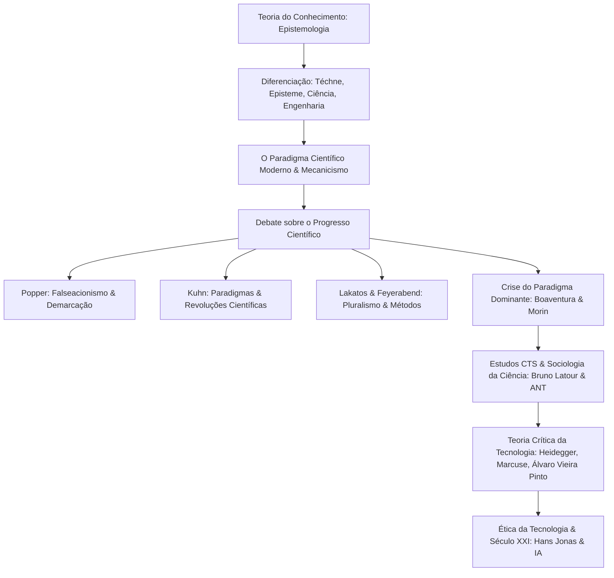
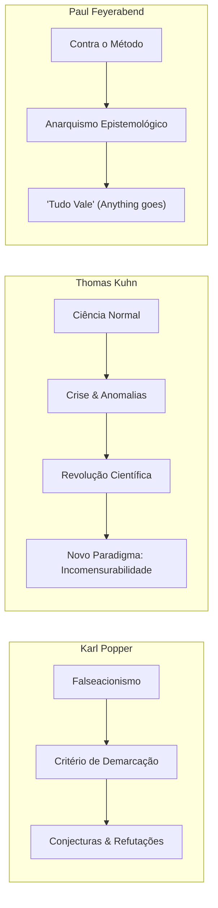

# 🧠 Short Lecture — Filosofia da Ciência e Tecnologia

> [!abstract] 📌 Visão Geral da Disciplina
> * **Código:** `CSECBJI.43` | **Carga Horária:** 60 h/a | **Período:** 6º Período
> * **Pré-requisito:** Nenhum | **Tranca:** Nenhuma
> * **Ementa Síntese:** Teoria do Conhecimento; Arte, técnica, ciência e engenharia (definições epistemológicas); O progresso científico e tecnológico; Crise da Ciência Moderna e do paradigma científico dominante; Civilização tecnológica; Estudos CTS e o laboratório social; Ética, humanismo e responsabilidade na era digital e da IA.

---

## 🗺️ Mapa Conceitual da Disciplina

---

## 🏛️ Módulo 1: Teoria do Conhecimento e as Fronteiras Conceituais

### 1.1 O que é Conhecer? (Epistemologia)
A **Epistemologia** investiga as origens, a estrutura, os métodos e a validade do conhecimento humano.
- **Racionalismo (Descartes, Spinoza, Leibniz):** A razão pura e as ideias inatas são a fonte primária e confiável da verdade.
- **Empirismo (Locke, Berkeley, Hume):** O conhecimento provém inteiramente da experiência sensível (*tábula rasa*).
- **Criticismo Kantiano (Kant):** Síntese entre razão e experiência — conhecemos os fenômenos estruturados pelas formas puras da sensibilidade (espaço e tempo) e pelas categorias do entendimento.

### 1.2 Distinção Epistemológica Fundamental: Téchne, Episteme e Engenharia

| Conceito Grego / Termo | Significado Clássico | Caracterização Filosófica | Dimensão Contemporânea |
|---|---|---|---|
| **Poiesis** | *Criação / Fabricação* | O ato de trazer algo à existência que antes não existia. | Criação artística, estética e invenção primária. |
| **Téchne (Técnica)** | *Saber-fazer / Artefato* | Conhecimento prático, empírico e orientado à ação utilitária. Não exige necessariamente compreensão teórica causal. | Habilidade instrumental, códigos manuais, procedimentos. |
| **Episteme (Ciência)** | *Saber puro / Teoria* | Conhecimento demonstrativo, universal, necessário e desinteressado sobre as causas primeiras da natureza. | Ciência pura, física teórica, matemática formal. |
| **Tecnologia** | *Téchne + Logos* | A **técnica informada e transformada pelo saber científico formal**. Não é mero instrumento, mas um sistema sociotécnico estruturado. | Sistemas computacionais, nanotecnologia, biotecnologia. |
| **Engenharia** | *Engenho + Método* | A aplicação sistemática, rigorosa, econômica e ética dos conhecimentos científicos e técnicos para a resolução de problemas humanos concretos. | Projetos de engenharia de computação, infraestrutura, hardware e software. |

---

## 🔬 Módulo 2: O Paradigma Científico Moderno e sua Crise

### 2.1 A Matriz da Ciência Moderna (Séculos XVI–XIX)
A ciência moderna consolidou-se sobre os pilares do:
1. **Mecanicismo:** O universo concebido como um imenso relógio regido por leis matemáticas determinísticas imutáveis (Newton, Galileu, Descartes).
2. **Separação Sujeito-Objeto:** O cientista como observador neutro, descolado e objetivo da realidade.
3. **Reducionismo:** A fragmentação dos fenômenos complexos em suas menores partes para compreendê-los (hiperespecialização disciplinar).
4. **Positivismo (Auguste Comte):** A consagração da ciência experimental como único conhecimento autêntico e estágio final da evolução humana.

### 2.2 A Crise da Ciência Moderna
No século XX e XXI, essa visão mecanicista e triunfalista entrou em colapso devido a:
- **Revoluções na Física:** A Teoria da Relatividade de Einstein e a Mecânica Quântica (Princípio da Incerteza de Heisenberg e dualidade onda-partícula) demonstraram que o observador afeta a medida e que a certeza mecanicista é insustentável na escala subatômica.
- **Teoria do Caos e da Complexidade (Edgar Morin):** Fenômenos reais não lineares, auto-organizáveis e interdependentes exigem um *pensamento complexo* em vez de reducionismo.
- **Crise Ecológica e Humanitária:** A percepção de que o domínio irrestrito da natureza e o desenvolvimento tecnológico cego geram ameaças existenciais (mudanças climáticas, armas de destruição em massa).

---

## ⚔️ Módulo 3: O Debate sobre o Progresso Científico

### 3.1 Karl Popper: O Falseacionismo e o Problema da Indução
- **Crítica à Indução:** Não importa quantas observações de cisnes brancos tenhamos feito, isso não prova a teoria de que "todos os cisnes são brancos". Um único cisne negro refuta a hipótese.
- **Critério de Demarcação:** O que distingue a ciência da pseudociência ou metafísica não é a verificabilidade, mas a **capacidade de ser falseada / refutada** (*falsifiability*).
- **O Progresso Científico:** A ciência avança por meio de sucessões de conjecturas ousadas e refutações rigorosas; nunca alcançamos a verdade absoluta, mas aproximações sucessivas da verdade (*verossimilhança*).

### 3.2 Thomas Kuhn: Paradigmas, Ciência Normal e Revoluções Científicas
Em sua obra seminal *A Estrutura das Revoluções Científicas* (1962), Kuhn demonstrou que a ciência não evolui de forma linear e cumulativa:
1. **Pré-Ciência:** Inexistência de consenso metodológico ou teórico.
2. **Paradigma:** Conjunto compartilhado de crenças, modelos, experimentos exemplares e valores que orientam uma comunidade científica.
3. **Ciência Normal:** Trabalho rotineiro de "resolução de quebra-cabeças" (*puzzle-solving*) sob as regras do paradigma vigente.
4. **Anomalias & Crise:** Acúmulo de fatos empíricos que o paradigma não consegue explicar.
5. **Revolução Científica & Mudança de Paradigma:** Ruptura radical onde um novo paradigma substitui o antigo (ex: Física Aristotélica $\rightarrow$ Newtoniana $\rightarrow$ Relativista/Quântica).
6. **Incomensurabilidade:** Paradigmas rivais não podem ser perfeitamente comparados ponto a ponto, pois utilizam linguagens, ontologias e critérios de validação distintos.

### 3.3 Lakatos e Feyerabend
- **Imre Lakatos (Programas de Pesquisa Científica):** A ciência opera com um *núcleo rígido* (*hard core*) protegido por um *cinturão protetor* de hipóteses auxiliares. Um programa é progressivo se antecipa fatos novos; degenerativo se apenas inventa desculpas *ad hoc*.
- **Paul Feyerabend (*Contra o Método*):** Defendeu o **anarquismo epistemológico**. Nenhuma regra metodológica fixa governou todas as descobertas históricas. O único princípio constante é: *"Tudo vale"* (*anything goes*).

---

## 🏭 Módulo 4: Teoria Crítica da Tecnologia e Civilização Técnica

### 4.1 A Tecnologia como Ideologia e Dominação
- **Martin Heidegger (*A Questão da Técnica*):** A técnica moderna não é mero instrumento neutro; é uma forma de desocultamento (*Gestell* - a "armação/enquadramento") que reduz toda a natureza e o ser humano a um mero "fundo de reserva" (*Bestand*), disponível para exploração eficiente.
- **Herbert Marcuse (*O Homem Unidimensional*):** A racionalidade tecnológica converteu-se em instrumento de controle social e conformismo, onde as necessidades humanas são moldadas pela produção industrial.
- **Jürgen Habermas:** Denuncia a colonização do *Mundo da Vida* (*Lebenswelt*) pela razão instrumental do sistema técnico-econômico.

### 4.2 Álvaro Vieira Pinto e o Pensamento Tecnológico Brasileiro
Na obra clássica *O Conceito de Tecnologia* (2008), o filósofo brasileiro Álvaro Vieira Pinto analisa a tecnologia sob a perspectiva do desenvolvimento e da soberania nacional:
- A tecnologia deve ser compreendida como a capacidade de trabalho criador do homem sobre a sua realidade histórica e material.
- Crítica veemente ao consumo passivo de pacotes tecnológicos importados, defendendo a capacidade endógena dos países periféricos de conceber soluções para suas necessidades reais.

---

## 🧪 Módulo 5: Estudos CTS e a Sociologia da Ciência (Bruno Latour)

### 5.1 O Laboratório como Espaço Social e de Conflito
Na obra *Ciência em Ação* e *A Vida de Laboratório*, **Bruno Latour** e os teóricos dos Estudos de Ciência, Tecnologia e Sociedade (CTS) propõem abrir a "caixa-preta" da produção científica:
- A ciência pronta (*ready-made science*) parece fria, objetiva e inquestionável. Mas a **ciência em construção** (*science in the making*) é repleta de incertezas, alianças políticas, financiamentos, negociações e disputas de autoridade.

### 5.2 A Teoria Ator-Rede (ANT - *Actor-Network Theory*)
- **Simetria Generalizada:** Tanto atores humanos (pesquisadores, gestores, usuários) quanto **não-humanos / actantes** (computadores, micróbios, instrumentos de medição, algoritmos, protocolos) participam ativamente da rede e moldam os resultados científicos e técnicos.
- Os fatos científicos não são descobertos no vácuo; são **construídos e estabilizados** através de redes sociotécnicas heterogêneas robustas.

---

## ⚖️ Módulo 6: Ética, Humanismo e o Engenheiro no Século XXI

### 6.1 Hans Jonas e o Princípio Responsabilidade
Em *O Princípio Responsabilidade* (1979), Hans Jonas argumenta que a ética tradicional (kantiana ou utilitarista) era restrita ao presente e à esfera das relações interpessoais imediatas. O poder destrutivo e cumulativo da tecnologia moderna exige um novo imperativo ético:

> [!important] O Imperativo de Hans Jonas
> *"Age de tal modo que os efeitos de tua ação sejam compatíveis com a permanência de uma autêntica vida humana sobre a Terra."*

### 6.2 Os Dilemas Éticos da Computação Contemporânea
1. **Inteligência Artificial & Automação:** Vieses algorítmicos em modelos de Machine Learning, transparência e explicabilidade (*XAI*), deslocamento de postos de trabalho e armas autônomas.
2. **Privacidade e Capitalismo de Vigilância (Shoshana Zuboff):** A transformação da experiência humana comportamental em matéria-prima para predição e modificação de condutas.
3. **Responsabilidade Social e Legal do Engenheiro:** O código de software não é neutro; ele embute valores políticos, sociais e morais (*code is law* - Lawrence Lessig).

---

## 🧪 Resumo Executivo / Cheat Sheet para Provas & Debates

1. **Episteme vs Téchne:** Episteme = Saber teórico puro; Téchne = Fazer prático; Tecnologia = Técnica fundamentada e retroalimentada pela ciência.
2. **Popper:** Critério de Falseabilidade (ciência avança refutando hipóteses falsas).
3. **Kuhn:** Paradigmas $\rightarrow$ Ciência Normal $\rightarrow$ Anomalias $\rightarrow$ Revolução Científica $\rightarrow$ Novo Paradigma Incomensurável.
4. **Latour & ANT:** Fatos científicos são construções de redes sociotécnicas formadas por humanos e não-humanos (actantes).
5. **Heidegger & Marcuse:** Crítica à técnica como enquadramento ontológico reducionista e instrumento de dominação ideológica.
6. **Hans Jonas:** Ética prospectiva e Princípio Responsabilidade com as gerações futuras.

---

## 🔗 Referências e Conexões no Cofre
* [[02 - Áreas/Acadêmico/IFF - Engenharia de Computação/06 - Periodo/43 - Filosofia da Ciência e Tecnologia/Ementa - Filosofia da Ciência e Tecnologia|📄 Ementa Oficial de FCT]]
* [[02 - Áreas/Acadêmico/IFF - Engenharia de Computação/00 - Documentos/PPC_EngComp_Completo_Ementario|📜 PPC & Ementário Geral]]
* Livros Base:
  * CHAUÍ, Marilena. *Convite à Filosofia*. Ática, 2011.
  * LATOUR, Bruno. *Ciência em Ação: como seguir cientistas e engenheiros sociedade afora*. UNESP, 2000.
  * PINTO, Álvaro Vieira. *O Conceito de Tecnologia*. Contraponto, 2008.
  * KUHN, Thomas. *A Estrutura das Revoluções Científicas*. Perspectiva, 2000.
