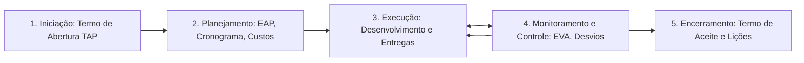

  
⬅️ Primeira Aula

  
🏠 <b><a href="/pt-br/resource/engenharia-de-computação/6-periodo/gestao-de-projetos">Hub da Disciplina</a></b>

  
➡️ <b><a href="/pt-br/resource/engenharia-de-computação/6-periodo/gestao-de-projetos/anotacoes/aula-01-definicao-conceitos-fundamentais-e-ciclo-de-vida-de-projetos">Próxima Aula</a></b>

> [!info] 📅 Informações da Aula
> - **Disciplina:** Gestão de Projetos (CSECBJI.49)
> - **Professor:** Hilton
> - **Data Realizada:** 27/08/2026
> - **Tópico Principal:** Apresentação da Disciplina, Ementário e Alinhamento Metodológico
> - **Status:** Concluída e Revisada

> [!note] 📂 Material Complementar & Slides
> - 📄 **Slides Oficiais:** [[slide-00-gestao-de-projetos|Acessar Apresentação em PDF]]
> - 🎥 **Short Lecture / Gravação:** [[video-00-gestao-de-projetos|Assistir Síntese da Aula (Vídeo)]]

---

### 📑 Resumo das Seções
- [📌 1. Anotações do Quadro: Apresentação da Disciplina, Ementário e Alinhamento Metodológico](#-anotações-do-quadro-apresentação-da-disciplina,-ementário-e-alinhamento-metodológico)
- [🧮 2. Formulação & Exemplo Prático Resolvido](#-formulação--exemplo-prático-resolvido)
- [📊 3. Esquema Visual & Fluxograma (Mermaid)](#-esquema-visual--fluxograma-mermaid)
- [🧠 4. Resumo Pessoal & Macetes do Professor](#-resumo-pessoal--macetes-do-professor)
- [📝 5. Dúvidas & Exercícios Recomendados para Casa](#-dúvidas--exercícios-recomendados-para-casa)

---

## 📌 Anotações do Quadro: Apresentação da Disciplina, Ementário e Alinhamento Metodológico

### 1.1 O Papel da Gestão de Projetos na Engenharia de Computação
Na prática profissional da engenharia, soluções tecnológicas (software, hardware, redes, telecomunicações) não ocorrem isoladas no vácuo: elas nascem como **projetos de investimento** que precisam comprovar viabilidade técnica, retorno econômico-financeiro e alinhamento estratégico com os objetivos das organizações.

### 1.2 Padrões Globais de Gerenciamento: O Guia PMBOK (PMI)
O *Project Management Body of Knowledge* (PMBOK) estrutura o gerenciamento de projetos em Grupos de Processos fundamentais:
1. **Iniciação:** Autorização formal do projeto e identificação das partes interessadas (*Stakeholders*).
2. **Planejamento:** Definição detalhada do escopo, cronograma, custos, qualidade, riscos, aquisições e equipe.
3. **Execução:** Integração de pessoas e recursos para produzir as entregas planejadas.
4. **Monitoramento e Controle:** Acompanhamento do progresso, medição de desvios e ações corretivas.
5. **Encerramento:** Formalização da aceitação das entregas, lições aprendidas e encerramento contratual.

### 1.3 Metodologias Tradicionais vs Metodologias Ágeis (Scrum / Kanban)
- **Projetos Preditivos (Cascata / PMBOK):** Escopo bem definido no início, cronograma detalhado de longo prazo (ideal para obras de infraestrutura física, fábricas de hardware e data centers).
- **Projetos Adaptativos (Ágil):** Escopo flexível com refinamento contínuo em sprints iterativas (ideal para desenvolvimento de produtos de software inovadores).

---

## 🧮 Formulação & Exemplo Prático Resolvido

### ✏️ Dinâmica do Projeto Integrador Semestral (EVTE)

Durante o semestre, as equipes desenvolverão um **Estudo de Viabilidade Técnico-Econômica (EVTE)** completo para o lançamento de uma empresa ou produto tecnológico inovador de base computacional:
1. Pesquisa de mercado e dimensionamento de demanda.
2. Projeto de engenharia, balanço de insumos e layout.
3. Modelagem da Estrutura Analítica do Projeto (EAP).
4. Cronograma com determinação do Caminho Crítico (CPM/PERT).
5. Orçamento detalhado, fluxo de caixa projetado e cálculo de viabilidade (VPL, TIR, Payback).

---

## 📊 Esquema Visual & Fluxograma (Mermaid)

---

## 🧠 Resumo Pessoal & Macetes do Professor

| Conceito-Chave | *Takeaway* do Professor | Dicas de Prova / Atenção |
| :--- | :--- | :--- |
| **O que é o Termo de Abertura do Projeto (TAP)?** | É o documento formal emitido pelo patrocinador (*Sponsor*) que autoriza oficialmente a existência do projeto e confere ao gerente de projetos a autoridade para aplicar recursos da empresa. | Sem TAP assinado, o projeto não existe formalmente. |
| **Stakeholders Críticos** | Identifique e mapeie as expectativas de todos os stakeholders logo no primeiro dia do projeto. | Aplicação prática direta |

---

## 📝 Dúvidas & Exercícios Recomendados para Casa

1. Diferencie detalhadamente um Projeto de uma Operação de Rotina contínua.
2. Descreva os 5 grupos de processos do Guia PMBOK e a finalidade de cada um.

---

  
⬅️ Primeira Aula

  
🏠 <b><a href="/pt-br/resource/engenharia-de-computação/6-periodo/gestao-de-projetos">Hub da Disciplina</a></b>

  
➡️ <b><a href="/pt-br/resource/engenharia-de-computação/6-periodo/gestao-de-projetos/anotacoes/aula-01-definicao-conceitos-fundamentais-e-ciclo-de-vida-de-projetos">Próxima Aula</a></b>

