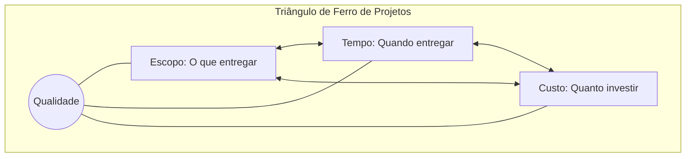

<div style="display: flex; justify-content: space-between; align-items: center; padding: 10px 16px; background: var(--light, #f8fafc); border: 1px solid var(--lightgray, #e2e8f0); border-radius: 10px; margin: 1.5rem 0;">
  <div>⬅️ <b><a href="/pt-br/resource/engenharia-de-computação/6-periodo/gestao-de-projetos/anotacoes/aula-00-apresentacao-da-disciplina-ementario-e-alinhamento-metodologico">Aula Anterior</a></b></div>
  <div>🏠 <b><a href="/pt-br/resource/engenharia-de-computação/6-periodo/gestao-de-projetos">Hub da Disciplina</a></b></div>
  <div>➡️ <b><a href="/pt-br/resource/engenharia-de-computação/6-periodo/gestao-de-projetos/anotacoes/aula-02-estudo-de-viabilidade-tecnico-economica-evte-e-analise-de-mercado">Próxima Aula</a></b></div>
</div>

> [!info] 📅 Informações da Aula
> - **Disciplina:** Gestão de Projetos (CSECBJI.49)
> - **Professor:** Hilton
> - **Data Realizada:** 03/09/2026
> - **Tópico Principal:** Definição, Conceitos Fundamentais e Ciclo de Vida de Projetos
> - **Status:** Concluída e Revisada

> [!note] 📂 Material Complementar & Slides
> - 📄 **Slides Oficiais:** [[slide-01-gestao-de-projetos|Acessar Apresentação em PDF]]
> - 🎥 **Short Lecture / Gravação:** [[video-01-gestao-de-projetos|Assistir Síntese da Aula (Vídeo)]]

---

### 📑 Resumo das Seções
- [📌 1. Anotações do Quadro: Definição, Conceitos Fundamentais e Ciclo de Vida de Projetos](#-anotações-do-quadro-definição,-conceitos-fundamentais-e-ciclo-de-vida-de-projetos)
- [🧮 2. Formulação & Exemplo Prático Resolvido](#-formulação--exemplo-prático-resolvido)
- [📊 3. Esquema Visual & Fluxograma (Mermaid)](#-esquema-visual--fluxograma-mermaid)
- [🧠 4. Resumo Pessoal & Macetes do Professor](#-resumo-pessoal--macetes-do-professor)
- [📝 5. Dúvidas & Exercícios Recomendados para Casa](#-dúvidas--exercícios-recomendados-para-casa)

---

## 📌 Anotações do Quadro: Definição, Conceitos Fundamentais e Ciclo de Vida de Projetos

### 1.1 Definição Formal de Projeto (PMI)
Um **Projeto** é um esforço temporário empreendido para criar um produto, serviço ou resultado **exclusivo/único**.
- **Temporalidade:** Todo projeto possui um início e um término claramente definidos. O fim é atingido quando os objetivos foram alcançados ou quando o projeto se torna inviável.
- **Exclusividade / Singularidade:** O produto ou serviço resultante difere de forma marcante de todas as entregas prévias da empresa.
- **Elaboração Progressiva:** O projeto é desenvolvido em etapas e refinado com maiores detalhes e precisão à medida que mais informações são conhecidas.

### 1.2 O Triângulo de Restrições (*Iron Triangle*)
O sucesso de qualquer projeto de engenharia é governado pelo equilíbrio indissociável entre três restrições fundamentais:
$$\text{Escopo} \iff \text{Tempo} \iff \text{Custo} \quad (\text{com a Qualidade no centro})$$
Se o cliente exigir redução do prazo de entrega (**Tempo**), a equipe deverá aumentar o orçamento (**Custo**) ou reduzir funcionalidades (**Escopo**) para preservar a **Qualidade**.

### 1.3 Ciclo de Vida de um Projeto
Níveis de custos e pessoal ao longo do tempo:
```text
Custos / Pessoal
      ▲
      │                 ┌───────────────┐
      │               ┌─┘   EXECUÇÃO    └─┐
      │         ┌─────┘ (Pico de Custos)  └─────┐
      │   ┌─────┘                               └─────┐
      │ ┌─┘ INICIAÇÃO e PLANEJAMENTO        ENCERRAMENTO └─▶ Tempo
      └────────────────────────────────────────────────────────
```

---

## 🧮 Formulação & Exemplo Prático Resolvido

### ✏️ Análise de Trade-off no Triângulo de Ferro

**Estudo de Caso:** Um cliente corporativo contrata o desenvolvimento de um aplicativo de telemetria IoT com orçamento de R$ 120.000 e prazo de 6 meses.
No 3º mês, a diretoria exige adiantar o lançamento em 2 meses (redução do tempo em $33\%$).

**Opções de Decisão Gerencial:**
1. **Compressão por Paralelismo (*Fast-Tracking*):** Executar tarefas de design e codificação em paralelo (aumenta o risco de retrabalho).
2. **Compressão por Custos (*Crashing*):** Alocar mais desenvolvedores e pagar horas extras (aumenta o custo total para R$ 160.000).
3. **Redução de Escopo:** Lançar a versão MVP (Produto Mínimo Viável) com apenas os sensores essenciais, postergando módulos secundários para a versão 2.0.

---

## 📊 Esquema Visual & Fluxograma (Mermaid)



---

## 🧠 Resumo Pessoal & Macetes do Professor

| Conceito-Chave | *Takeaway* do Professor | Dicas de Prova / Atenção |
| :--- | :--- | :--- |
| **Impacto das Mudanças ao Longo do Tempo** | O custo de realizar uma alteração de escopo é mínimo no início (fase de planejamento) e cresce exponencialmente à medida que o projeto se aproxima do final. | Descubra os requisitos reais o quanto antes! |
| **Risco vs Certeza** | O risco e a incerteza são máximos no início do projeto e caem progressivamente conforme as entregas são validadas. | Aplicação prática direta |

---

## 📝 Dúvidas & Exercícios Recomendados para Casa

1. Explique a diferença entre compressão de cronograma por Fast-Tracking e por Crashing.
2. Descreva como a elaboração progressiva se aplica ao desenvolvimento de uma nova placa de circuito impresso embarcada.

---

<div style="display: flex; justify-content: space-between; align-items: center; padding: 10px 16px; background: var(--light, #f8fafc); border: 1px solid var(--lightgray, #e2e8f0); border-radius: 10px; margin: 1.5rem 0;">
  <div>⬅️ <b><a href="/pt-br/resource/engenharia-de-computação/6-periodo/gestao-de-projetos/anotacoes/aula-00-apresentacao-da-disciplina-ementario-e-alinhamento-metodologico">Aula Anterior</a></b></div>
  <div>🏠 <b><a href="/pt-br/resource/engenharia-de-computação/6-periodo/gestao-de-projetos">Hub da Disciplina</a></b></div>
  <div>➡️ <b><a href="/pt-br/resource/engenharia-de-computação/6-periodo/gestao-de-projetos/anotacoes/aula-02-estudo-de-viabilidade-tecnico-economica-evte-e-analise-de-mercado">Próxima Aula</a></b></div>
</div>
