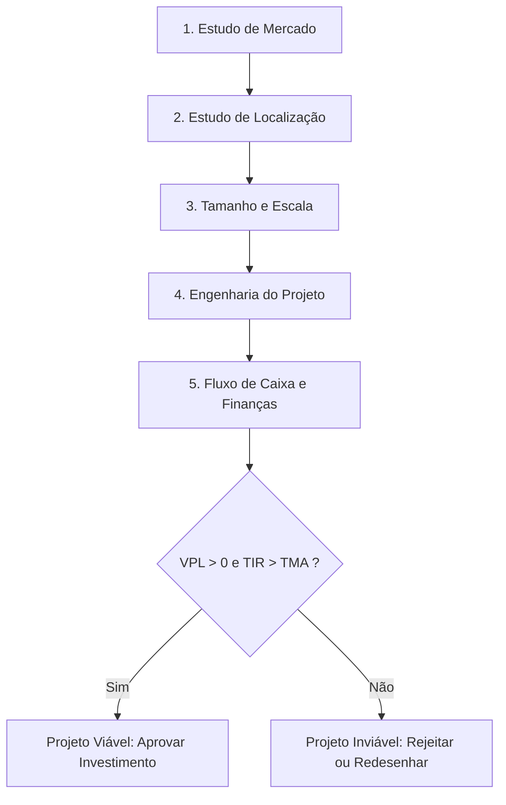

  
⬅️ <b><a href="/pt-br/resource/engenharia-de-computação/6-periodo/gestao-de-projetos/anotacoes/aula-01-definicao-conceitos-fundamentais-e-ciclo-de-vida-de-projetos">Aula Anterior</a></b>

  
🏠 <b><a href="/pt-br/resource/engenharia-de-computação/6-periodo/gestao-de-projetos">Hub da Disciplina</a></b>

  
➡️ <b><a href="/pt-br/resource/engenharia-de-computação/6-periodo/gestao-de-projetos/anotacoes/aula-03-estudo-de-localizacao-e-tamanho-escala-do-projeto">Próxima Aula</a></b>

> [!info] 📅 Informações da Aula
> - **Disciplina:** Gestão de Projetos (CSECBJI.49)
> - **Professor:** Hilton
> - **Data Realizada:** 10/09/2026
> - **Tópico Principal:** Estudo de Viabilidade Técnico-Econômica (EVTE) e Análise de Mercado
> - **Status:** Concluída e Revisada

> [!note] 📂 Material Complementar & Slides
> - 📄 **Slides Oficiais:** [[slide-02-gestao-de-projetos|Acessar Apresentação em PDF]]
> - 🎥 **Short Lecture / Gravação:** [[video-02-gestao-de-projetos|Assistir Síntese da Aula (Vídeo)]]

---

### 📑 Resumo das Seções
- [📌 1. Anotações do Quadro: Estudo de Viabilidade Técnico-Econômica (EVTE) e Análise de Mercado](#-anotações-do-quadro-estudo-de-viabilidade-técnico-econômica-evte-e-análise-de-mercado)
- [🧮 2. Formulação & Exemplo Prático Resolvido](#-formulação--exemplo-prático-resolvido)
- [📊 3. Esquema Visual & Fluxograma (Mermaid)](#-esquema-visual--fluxograma-mermaid)
- [🧠 4. Resumo Pessoal & Macetes do Professor](#-resumo-pessoal--macetes-do-professor)
- [📝 5. Dúvidas & Exercícios Recomendados para Casa](#-dúvidas--exercícios-recomendados-para-casa)

---

## 📌 Anotações do Quadro: Estudo de Viabilidade Técnico-Econômica (EVTE) e Análise de Mercado

### 2.1 Estrutura de um Estudo de Viabilidade Técnico-Econômica (EVTE)
O EVTE é o documento formal que fundamenta a decisão de investimento de capital em um projeto de engenharia, composto por 6 módulos integrados:
1. **Análise de Mercado:** Comportamento da demanda, oferta e concorrência.
2. **Estudo de Localização:** Escolha do local ótimo de instalação física/data center.
3. **Escala e Tamanho:** Determinação da capacidade produtiva nominal e efetiva.
4. **Engenharia do Projeto:** Tecnologias, balanço de materiais, maquinário e infraestrutura.
5. **Orçamento e Dimensionamento Financeiro:** Custos de implantação (Capex) e operacionais (Opex).
6. **Avaliação Econômica:** Indicadores de retorno financeiro (VPL, TIR, Payback).

### 2.2 Pesquisa e Análise Mercadológica
- **Demanda Histórica e Projetada:** Projeção estatística do volume de clientes potenciais através de regressão linear e séries temporais.
- **Análise da Concorrência e Oferta:** Mapeamento de concorrentes diretos e indiretos, participação de mercado (*Market Share*) e diferenciais competitivos.
- **Definição da Estratégia de Preço (*Pricing*):** Preço baseado em custos (*Cost-plus*), preço baseado na concorrência ou precificação por valor percebido (*Value-based*).

---

## 🧮 Formulação & Exemplo Prático Resolvido

### ✏️ Projeção de Demanda por Regressão Linear

Dadas as vendas históricas de um serviço de nuvem nos últimos 4 anos:

| Ano ($x$) | Clientes Ativos ($y$) | $x^2$ | $x \cdot y$ |
| :---: | :---: | :---: | :---: |
| 1 | 120 | 1 | 120 |
| 2 | 190 | 4 | 380 |
| 3 | 260 | 9 | 780 |
| 4 | 340 | 16 | 1360 |
| **$\sum$** | $\mathbf{\sum y = 910}$ | $\mathbf{\sum x^2 = 30}$ | $\mathbf{\sum xy = 2640}$ |

**Equação da Reta de Tendência:** $y = a \cdot x + b$
$$\bar{x} = 2.5, \quad \bar{y} = 227.5$$
$$a = \frac{\sum xy - n \bar{x}\bar{y}}{\sum x^2 - n \bar{x}^2} = \frac{2640 - 4(2.5)(227.5)}{30 - 4(6.25)} = \frac{2640 - 2275}{30 - 25} = \frac{365}{5} = 73$$
$$b = \bar{y} - a \bar{x} = 227.5 - 73(2.5) = 227.5 - 182.5 = 45$$

**Projeção para o Ano 5 ($x=5$):**
$$y_5 = 73(5) + 45 = 365 + 45 = 410\text{ clientes projetados!}$$

---

## 📊 Esquema Visual & Fluxograma (Mermaid)

---

## 🧠 Resumo Pessoal & Macetes do Professor

| Conceito-Chave | *Takeaway* do Professor | Dicas de Prova / Atenção |
| :--- | :--- | :--- |
| **Mercado Potencial vs Mercado Alvo** | O mercado potencial é o total de pessoas que poderiam usar o produto; o mercado alvo (*SAM/SOM*) é a fatia realista que a empresa tem capacidade de atender. | Superestimar o mercado é o erro número 1 que quebra startups de tecnologia. |
| **Elasticidade-Preço da Demanda** | Avalie a sensibilidade dos clientes antes de estipular o preço final. | Aplicação prática direta |

---

## 📝 Dúvidas & Exercícios Recomendados para Casa

1. Projete a demanda de um provedor de Internet para os anos 5 e 6 utilizando o método dos mínimos quadrados.
2. Explique a diferença entre concorrentes diretos e concorrentes substitutos (indiretos) com exemplos na área de TI.

---

  
⬅️ <b><a href="/pt-br/resource/engenharia-de-computação/6-periodo/gestao-de-projetos/anotacoes/aula-01-definicao-conceitos-fundamentais-e-ciclo-de-vida-de-projetos">Aula Anterior</a></b>

  
🏠 <b><a href="/pt-br/resource/engenharia-de-computação/6-periodo/gestao-de-projetos">Hub da Disciplina</a></b>

  
➡️ <b><a href="/pt-br/resource/engenharia-de-computação/6-periodo/gestao-de-projetos/anotacoes/aula-03-estudo-de-localizacao-e-tamanho-escala-do-projeto">Próxima Aula</a></b>

