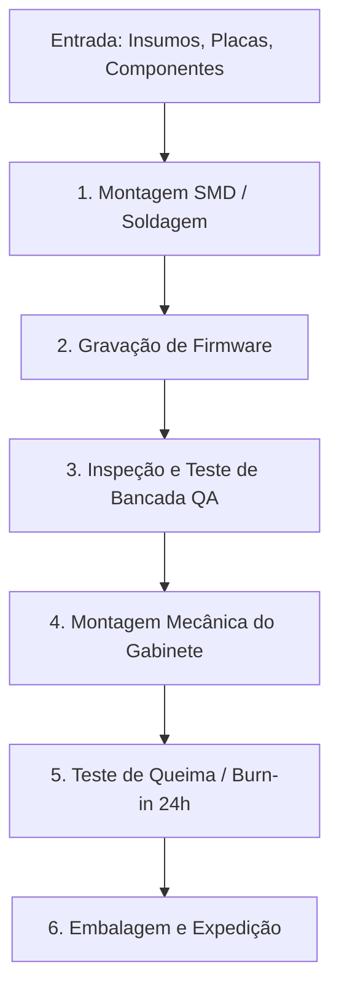

  
⬅️ <b><a href="/pt-br/resource/engenharia-de-computação/6-periodo/gestao-de-projetos/anotacoes/aula-03-estudo-de-localizacao-e-tamanho-escala-do-projeto">Aula Anterior</a></b>

  
🏠 <b><a href="/pt-br/resource/engenharia-de-computação/6-periodo/gestao-de-projetos">Hub da Disciplina</a></b>

  
➡️ <b><a href="/pt-br/resource/engenharia-de-computação/6-periodo/gestao-de-projetos/anotacoes/aula-05-planejamento-de-escopo-estrutura-analitica-do-projeto-eap-wbs">Próxima Aula</a></b>

> [!info] 📅 Informações da Aula
> - **Disciplina:** Gestão de Projetos (CSECBJI.49)
> - **Professor:** Hilton
> - **Data Realizada:** 24/09/2026
> - **Tópico Principal:** Engenharia do Projeto, Balanço de Materiais e Layout Operacional
> - **Status:** Concluída e Revisada

> [!note] 📂 Material Complementar & Slides
> - 📄 **Slides Oficiais:** [[slide-04-gestao-de-projetos|Acessar Apresentação em PDF]]
> - 🎥 **Short Lecture / Gravação:** [[video-04-gestao-de-projetos|Assistir Síntese da Aula (Vídeo)]]

---

### 📑 Resumo das Seções
- [📌 1. Anotações do Quadro: Engenharia do Projeto, Balanço de Materiais e Layout Operacional](#-anotações-do-quadro-engenharia-do-projeto,-balanço-de-materiais-e-layout-operacional)
- [🧮 2. Formulação & Exemplo Prático Resolvido](#-formulação--exemplo-prático-resolvido)
- [📊 3. Esquema Visual & Fluxograma (Mermaid)](#-esquema-visual--fluxograma-mermaid)
- [🧠 4. Resumo Pessoal & Macetes do Professor](#-resumo-pessoal--macetes-do-professor)
- [📝 5. Dúvidas & Exercícios Recomendados para Casa](#-dúvidas--exercícios-recomendados-para-casa)

---

## 📌 Anotações do Quadro: Engenharia do Projeto, Balanço de Materiais e Layout Operacional

### 4.1 Engenharia do Projeto
A etapa de engenharia detalha a solução física e técnica para viabilizar a entrega:
- Seleção de equipamentos de hardware, maquinário de teste e infraestrutura de TI.
- Especificação de matérias-primas, insumos consumíveis e fornecedores homologados.
- Dimensionamento do quadro de pessoal técnico e administrativo (perfis, salários, encargos trabalhistas de $\sim 70\%$ a $100\%$).

### 4.2 Balanço de Materiais e Fluxogramas de Operação
- **Balanço de Massa / Materiais:** Equação de conservação dos insumos no processo produtivo:
  $$\text{Entrada de Insumos} = \text{Produtos Úteis} + \text{Perdas / Refugos} + \text{Subprodutos}$$
- **Fluxograma de Processo (SFC / Process Flowchart):** Representação sequencial de todas as operações, inspeções de qualidade, transportes e esperas.

### 4.3 Arranjo Físico (*Layout* Operacional)
- **Layout Posicional / Fixo:** O produto fica fixo e os recursos se deslocam até ele (ex: montagem de navios, aeronaves, data center físico).
- **Layout por Processo / Funcional:** Agrupa máquinas e especialistas por função (ex: laboratório de soldagem, setor de testes de software, setor de QA).
- **Layout por Produto / Linha de Produção:** Recursos organizados na ordem exata de montagem linear do produto (alta escala e baixo custo unitário).

---

## 🧮 Formulação & Exemplo Prático Resolvido

### ✏️ Dimensionamento do Quadro de Engenharia e Encargos Trabalhistas

**Cálculo do Custo Real de Mão de Obra Técnica:**
- Salário Base de um Engenheiro de Software Pleno: R$ 8.000,00 / mês.
- Provisões e Encargos Sociais no Brasil (INSS, FGTS, 13º Salário, 1/3 de Férias, Vale-Refeição/Transporte): **$80\%$**.
- **Custo Mensal por Engenheiro:**
  $$\text{Custo Real} = \text{R\$} 8.000 \times (1 + 0.80) = \text{R\$} 14.400,00 / \text{mês}$$
- Para uma equipe de 5 engenheiros: Custo de folha anual $= 5 \times 14.400 \times 12 = \text{R\$} 864.000,00$!

---

## 📊 Esquema Visual & Fluxograma (Mermaid)

---

## 🧠 Resumo Pessoal & Macetes do Professor

| Conceito-Chave | *Takeaway* do Professor | Dicas de Prova / Atenção |
| :--- | :--- | :--- |
| **A Regra dos Encargos Trabalhistas** | Em projetos no Brasil, nunca orce pessoal considerando apenas o salário nominal da CLT; o custo real para o projeto é de 1.7x a 2.0x o valor do salário. | Subdimensionar encargos é motivo frequente de estouro de orçamento. |
| **Diagrama de Espaguete** | Ferramenta visual do Lean Manufacturing utilizada para mapear a movimentação de pessoas no layout e eliminar deslocamentos inúteis. | Aplicação prática direta |

---

## 📝 Dúvidas & Exercícios Recomendados para Casa

1. Construa o fluxograma de processo completo para a montagem e homologação de um dispositivo IoT de rastreamento veicular.
2. Dimensione o espaço físico e a potência elétrica necessária para um laboratório de testes de 10 estações de trabalho de engenharia.

---

  
⬅️ <b><a href="/pt-br/resource/engenharia-de-computação/6-periodo/gestao-de-projetos/anotacoes/aula-03-estudo-de-localizacao-e-tamanho-escala-do-projeto">Aula Anterior</a></b>

  
🏠 <b><a href="/pt-br/resource/engenharia-de-computação/6-periodo/gestao-de-projetos">Hub da Disciplina</a></b>

  
➡️ <b><a href="/pt-br/resource/engenharia-de-computação/6-periodo/gestao-de-projetos/anotacoes/aula-05-planejamento-de-escopo-estrutura-analitica-do-projeto-eap-wbs">Próxima Aula</a></b>

