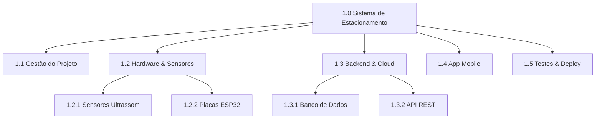

<div style="display: flex; justify-content: space-between; align-items: center; padding: 10px 16px; background: var(--light, #f8fafc); border: 1px solid var(--lightgray, #e2e8f0); border-radius: 10px; margin: 1.5rem 0;">
  <div>⬅️ <b><a href="/pt-br/resource/engenharia-de-computação/6-periodo/gestao-de-projetos/anotacoes/aula-04-engenharia-do-projeto-balanco-de-materiais-e-layout-operacional">Aula Anterior</a></b></div>
  <div>🏠 <b><a href="/pt-br/resource/engenharia-de-computação/6-periodo/gestao-de-projetos">Hub da Disciplina</a></b></div>
  <div>➡️ <b><a href="/pt-br/resource/engenharia-de-computação/6-periodo/gestao-de-projetos/anotacoes/aula-06-gestao-de-tempo-sequenciamento-diagramas-de-rede-e-caminho-critico-cpm-pert">Próxima Aula</a></b></div>
</div>

> [!info] 📅 Informações da Aula
> - **Disciplina:** Gestão de Projetos (CSECBJI.49)
> - **Professor:** Hilton
> - **Data Realizada:** 01/10/2026
> - **Tópico Principal:** Planejamento de Escopo: Estrutura Analítica do Projeto (EAP / WBS)
> - **Status:** Concluída e Revisada

> [!note] 📂 Material Complementar & Slides
> - 📄 **Slides Oficiais:** [[slide-05-gestao-de-projetos|Acessar Apresentação em PDF]]
> - 🎥 **Short Lecture / Gravação:** [[video-05-gestao-de-projetos|Assistir Síntese da Aula (Vídeo)]]

---

### 📑 Resumo das Seções
- [📌 1. Anotações do Quadro: Planejamento de Escopo: Estrutura Analítica do Projeto (EAP / WBS)](#-anotações-do-quadro-planejamento-de-escopo-estrutura-analítica-do-projeto-eap-/-wbs)
- [🧮 2. Formulação & Exemplo Prático Resolvido](#-formulação--exemplo-prático-resolvido)
- [📊 3. Esquema Visual & Fluxograma (Mermaid)](#-esquema-visual--fluxograma-mermaid)
- [🧠 4. Resumo Pessoal & Macetes do Professor](#-resumo-pessoal--macetes-do-professor)
- [📝 5. Dúvidas & Exercícios Recomendados para Casa](#-dúvidas--exercícios-recomendados-para-casa)

---

## 📌 Anotações do Quadro: Planejamento de Escopo: Estrutura Analítica do Projeto (EAP / WBS)

### 5.1 Planejamento do Escopo do Projeto
O gerenciamento do escopo garante que o projeto inclua **todo o trabalho necessário, e APENAS o trabalho necessário**, para completar as entregas com sucesso.

### 5.2 A Estrutura Analítica do Projeto (EAP / WBS - *Work Breakdown Structure*)
A EAP é uma decomposição hierárquica orientada às **entregas (*Deliverables*)** do trabalho total executado pela equipe:
- **Regra dos 100%:** A soma de todas as entregas filhas de um nível da EAP deve representar exatamente $100\%$ do escopo do elemento pai (sem omissões e sem adicionar trabalho extra fora de escopo).
- **Nível mais baixo (Pacote de Trabalho / *Work Package*):** Bloco de trabalho gerenciável que pode ser atribuído a um responsável, com custo e prazo estimáveis.

### 5.3 O Dicionário da EAP
Documento textual que detalha cada pacote de trabalho da EAP:
- Código identificador (ex: `1.3.2`).
- Descrição da entrega e critérios de aceitação formal.
- Responsável pela entrega e estimativa de recursos necessários.

### 5.4 Prevenção de *Scope Creep* (Aumento Descontrolado do Escopo)
Ocorre quando novas funcionalidades são adicionadas informalmente durante a execução sem aprovação orçamentária, ajuste de prazo ou análise de impacto.

---

## 🧮 Formulação & Exemplo Prático Resolvido

### ✏️ Decomposição Hierárquica da EAP: Sistema de Estacionamento Inteligente

```text
1.0 Sistema de Estacionamento Inteligente
├── 1.1 Gerenciamento do Projeto (Planejamento, Reuniões, Relatórios)
├── 1.2 Módulo de Hardware / Sensores
│   ├── 1.2.1 Aquisição dos Sensores Ultrassônicos
│   ├── 1.2.2 Projeto da Placa Controladora ESP32
│   └── 1.2.3 Instalação Física nas Vagas
├── 1.3 Módulo de Software / Backend
│   ├── 1.3.1 Arquitetura e Modelagem do Banco de Dados
│   ├── 1.3.2 Desenvolvimento da API REST em Spring Boot
│   └── 1.3.3 Algoritmo de Otimização de Tarifas
├── 1.4 Aplicativo Móvel do Usuário (iOS e Android)
└── 1.5 Homologação, Testes Integrados e Treinamento
```

---

## 📊 Esquema Visual & Fluxograma (Mermaid)



---

## 🧠 Resumo Pessoal & Macetes do Professor

| Conceito-Chave | *Takeaway* do Professor | Dicas de Prova / Atenção |
| :--- | :--- | :--- |
| **EAP é Baseada em Substantivos (Entregas), NÃO em Verbos (Ações)!** | A EAP decompõe entregas físicas/lógicas (ex: `1.2 Módulo de Pagamento`), enquanto o Cronograma detalha as atividades com verbos (ex: `Codificar API de Pagamento`). | Erro conceitual gravíssimo em provas e projetos. |
| **Nível de Decomposição Adequado** | A regra prática de ouro: um pacote de trabalho deve ter duração estimada de 8 a 80 horas de trabalho de engenharia. | Aplicação prática direta |

---

## 📝 Dúvidas & Exercícios Recomendados para Casa

1. Construa a EAP com pelo menos 3 níveis hierárquicos para o desenvolvimento de um portal de telemedicina.
2. Escreva o Dicionário da EAP detalhado para o pacote de trabalho '1.3.1 Modelagem do Banco de Dados'.

---

<div style="display: flex; justify-content: space-between; align-items: center; padding: 10px 16px; background: var(--light, #f8fafc); border: 1px solid var(--lightgray, #e2e8f0); border-radius: 10px; margin: 1.5rem 0;">
  <div>⬅️ <b><a href="/pt-br/resource/engenharia-de-computação/6-periodo/gestao-de-projetos/anotacoes/aula-04-engenharia-do-projeto-balanco-de-materiais-e-layout-operacional">Aula Anterior</a></b></div>
  <div>🏠 <b><a href="/pt-br/resource/engenharia-de-computação/6-periodo/gestao-de-projetos">Hub da Disciplina</a></b></div>
  <div>➡️ <b><a href="/pt-br/resource/engenharia-de-computação/6-periodo/gestao-de-projetos/anotacoes/aula-06-gestao-de-tempo-sequenciamento-diagramas-de-rede-e-caminho-critico-cpm-pert">Próxima Aula</a></b></div>
</div>
