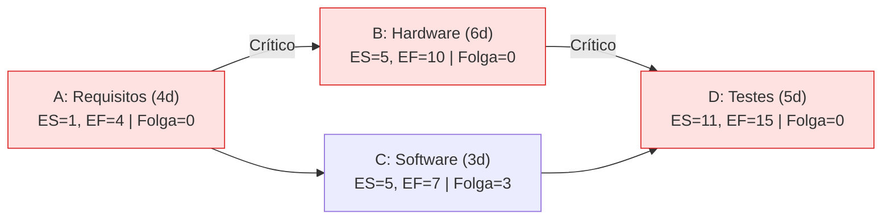

  
⬅️ <b><a href="/pt-br/resource/engenharia-de-computação/6-periodo/gestao-de-projetos/anotacoes/aula-05-planejamento-de-escopo-estrutura-analitica-do-projeto-eap-wbs">Aula Anterior</a></b>

  
🏠 <b><a href="/pt-br/resource/engenharia-de-computação/6-periodo/gestao-de-projetos">Hub da Disciplina</a></b>

  
➡️ <b><a href="/pt-br/resource/engenharia-de-computação/6-periodo/gestao-de-projetos/anotacoes/aula-07-avaliacao-teorico-pratica-p1-evte-eap-e-cpm-pert">Próxima Aula</a></b>

> [!info] 📅 Informações da Aula
> - **Disciplina:** Gestão de Projetos (CSECBJI.49)
> - **Professor:** Hilton
> - **Data Realizada:** 08/10/2026
> - **Tópico Principal:** Gestão de Tempo: Sequenciamento, Diagramas de Rede e Caminho Crítico (CPM/PERT)
> - **Status:** Concluída e Revisada

> [!note] 📂 Material Complementar & Slides
> - 📄 **Slides Oficiais:** [[slide-06-gestao-de-projetos|Acessar Apresentação em PDF]]
> - 🎥 **Short Lecture / Gravação:** [[video-06-gestao-de-projetos|Assistir Síntese da Aula (Vídeo)]]

---

### 📑 Resumo das Seções
- [📌 1. Anotações do Quadro: Gestão de Tempo: Sequenciamento, Diagramas de Rede e Caminho Crítico (CPM/PERT)](#-anotações-do-quadro-gestão-de-tempo-sequenciamento,-diagramas-de-rede-e-caminho-crítico-cpm/pert)
- [🧮 2. Formulação & Exemplo Prático Resolvido](#-formulação--exemplo-prático-resolvido)
- [📊 3. Esquema Visual & Fluxograma (Mermaid)](#-esquema-visual--fluxograma-mermaid)
- [🧠 4. Resumo Pessoal & Macetes do Professor](#-resumo-pessoal--macetes-do-professor)
- [📝 5. Dúvidas & Exercícios Recomendados para Casa](#-dúvidas--exercícios-recomendados-para-casa)

---

## 📌 Anotações do Quadro: Gestão de Tempo: Sequenciamento, Diagramas de Rede e Caminho Crítico (CPM/PERT)

### 6.1 Sequenciamento de Atividades e Métodos de Precedência (PDM)
Após decompor a EAP em atividades, determina-se a ordem lógica de dependência:
- **Término para Início (TI / FS):** A atividade $B$ só pode iniciar após o término de $A$ (mais comum).
- **Início para Início (II / SS):** $B$ só inicia após o início de $A$.
- **Término para Término (TT / FF):** $B$ só termina após o término de $A$.
- **Adiantamento (*Lead*) e Espera (*Lag*):** Antecipação ou atraso forçado entre atividades.

### 6.2 O Método do Caminho Crítico (CPM - *Critical Path Method*)
1. **Passo para Frente (*Forward Pass*):** Calcula as Datas Mais Cedo de Início ($ES$) e Término ($EF$):
   $$EF = ES + \text{Duração} - 1$$
2. **Passo para Trás (*Backward Pass*):** Calcula as Datas Mais Tarde de Término ($LF$) e Início ($LS$):
   $$LS = LF - \text{Duração} + 1$$
3. **Folga Total (*Total Float / Slack*):** $FT = LF - EF = LS - ES$.
4. **Caminho Crítico:** O caminho contínuo de atividades com **Folga Total igual a ZERO ($FT = 0$)**. É o caminho de maior duração total do projeto; qualquer atraso em uma atividade crítica atrasa o projeto inteiro!

### 6.3 Estimativas Probabilísticas PERT (3 Pontos)
Para tratar incertezas, calcula-se a Duração Esperada ($T_e$) e a Variância ($\sigma^2$) usando 3 estimativas: Otimista ($a$), Mais Provável ($m$) e Pessimista ($b$):
$$T_e = \frac{a + 4m + b}{6}$$
$$\sigma^2 = \left(\frac{b - a}{6}\right)^2$$

---

## 🧮 Formulação & Exemplo Prático Resolvido

### ✏️ Cálculo Completo de Caminho Crítico (CPM) Passo a Passo

**Tabela de Atividades do Projeto:**

| Atividade | Descrição | Predecessoras | Duração (dias) | $ES$ | $EF$ | $LS$ | $LF$ | Folga ($FT$) | É Crítica? |
| :---: | :--- | :---: | :---: | :---: | :---: | :---: | :---: | :---: | :---: |
| **A** | Requisitos | — | 4 | 1 | 4 | 1 | 4 | **0** | **SIM** |
| **B** | Hardware | A | 6 | 5 | 10 | 5 | 10 | **0** | **SIM** |
| **C** | Software | A | 3 | 5 | 7 | 8 | 10 | **3** | Não |
| **D** | Testes e Homologação | B, C | 5 | 11 | 15 | 11 | 15 | **0** | **SIM** |

**Caminho Crítico:** $A \to B \to D$
**Duração Total Mínima do Projeto:** $4 + 6 + 5 = 15\text{ dias}$.
A atividade $C$ possui $3\text{ dias de folga}$ sem impactar o prazo final!

---

## 📊 Esquema Visual & Fluxograma (Mermaid)

---

## 🧠 Resumo Pessoal & Macetes do Professor

| Conceito-Chave | *Takeaway* do Professor | Dicas de Prova / Atenção |
| :--- | :--- | :--- |
| **Múltiplas Predecessoras no Forward Pass** | Quando uma atividade tiver múltiplas predecessoras, seu $ES$ será o **MÁXIMO** entre os $EF$s de todas as predecessoras: $ES = \max(EF_{	ext{predecessoras}}) + 1$. | No Backward Pass, adota-se o MÍNIMO dos $LS$s. |
| **Pode haver mais de um Caminho Crítico?** | Sim! Um projeto pode ter dois ou mais caminhos críticos paralelos com a mesma duração máxima total. | Aplicação prática direta |

---

## 📝 Dúvidas & Exercícios Recomendados para Casa

1. Dada uma rede com 7 atividades, calcule o cronograma completo (ES, EF, LS, LF, FT) e identifique o caminho crítico.
2. Calcule a probabilidade de um projeto ser concluído em até 30 dias utilizando a distribuição normal padronizada com média PERT $\mu = 26$ e desvio padrão $\sigma = 2$.

---

  
⬅️ <b><a href="/pt-br/resource/engenharia-de-computação/6-periodo/gestao-de-projetos/anotacoes/aula-05-planejamento-de-escopo-estrutura-analitica-do-projeto-eap-wbs">Aula Anterior</a></b>

  
🏠 <b><a href="/pt-br/resource/engenharia-de-computação/6-periodo/gestao-de-projetos">Hub da Disciplina</a></b>

  
➡️ <b><a href="/pt-br/resource/engenharia-de-computação/6-periodo/gestao-de-projetos/anotacoes/aula-07-avaliacao-teorico-pratica-p1-evte-eap-e-cpm-pert">Próxima Aula</a></b>

