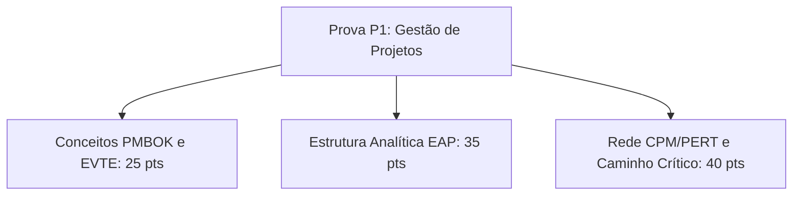

  
⬅️ <b><a href="/pt-br/resource/engenharia-de-computação/6-periodo/gestao-de-projetos/anotacoes/aula-06-gestao-de-tempo-sequenciamento-diagramas-de-rede-e-caminho-critico-cpm-pert">Aula Anterior</a></b>

  
🏠 <b><a href="/pt-br/resource/engenharia-de-computação/6-periodo/gestao-de-projetos">Hub da Disciplina</a></b>

  
➡️ <b><a href="/pt-br/resource/engenharia-de-computação/6-periodo/gestao-de-projetos/anotacoes/aula-08-gestao-de-custos-estimativas-orcamento-e-analise-de-ponto-de-equilibrio">Próxima Aula</a></b>

> [!info] 📅 Informações da Aula
> - **Disciplina:** Gestão de Projetos (CSECBJI.49)
> - **Professor:** Hilton
> - **Data Realizada:** 15/10/2026
> - **Tópico Principal:** Avaliação Teórico-Prática P1 (EVTE, EAP e CPM/PERT)
> - **Status:** Concluída e Revisada

> [!note] 📂 Material Complementar & Slides
> - 📄 **Slides Oficiais:** [[slide-07-gestao-de-projetos|Acessar Apresentação em PDF]]
> - 🎥 **Short Lecture / Gravação:** [[video-07-gestao-de-projetos|Assistir Síntese da Aula (Vídeo)]]

---

### 📑 Resumo das Seções
- [📌 1. Anotações do Quadro: Avaliação Teórico-Prática P1 (EVTE, EAP e CPM/PERT)](#-anotações-do-quadro-avaliação-teórico-prática-p1-evte,-eap-e-cpm/pert)
- [🧮 2. Formulação & Exemplo Prático Resolvido](#-formulação--exemplo-prático-resolvido)
- [📊 3. Esquema Visual & Fluxograma (Mermaid)](#-esquema-visual--fluxograma-mermaid)
- [🧠 4. Resumo Pessoal & Macetes do Professor](#-resumo-pessoal--macetes-do-professor)
- [📝 5. Dúvidas & Exercícios Recomendados para Casa](#-dúvidas--exercícios-recomendados-para-casa)

---

## 📌 Anotações do Quadro: Avaliação Teórico-Prática P1 (EVTE, EAP e CPM/PERT)

### 7.1 Síntese Conceitual para Avaliação Parcial P1
Revisão integrada de Planejamento e Estruturação de Projetos:
1. **Fundamentos e Triângulo de Restrições:** Escopo, Tempo, Custo, Qualidade e Grupos de Processos PMBOK.
2. **Estudo de Viabilidade Técnico-Econômica (EVTE):** Análise de mercado, projeção de demanda e método dos pesos ponderados para localização.
3. **Engenharia e Recursos:** Balanço de materiais, layout operacional e dimensionamento de mão de obra.
4. **Planejamento de Escopo:** Decomposição de EAP / WBS orientada a entregas e regra dos 100%.
5. **Gestão de Tempo:** Sequenciamento PDM, cálculo de datas (Forward/Backward Pass), Folgas e Método do Caminho Crítico (CPM/PERT).

---

## 🧮 Formulação & Exemplo Prático Resolvido

### ✏️ Resolução de Exercício de Prova: Rede de Projeto com PERT

**Problema:** Uma atividade possui estimativas: $a = 4\text{ dias}$, $m = 7\text{ dias}$, $b = 16\text{ dias}$.
1. Duração Esperada PERT:
   $$T_e = \frac{4 + 4(7) + 16}{6} = \frac{4 + 28 + 16}{6} = \frac{48}{6} = 8.0\text{ dias}$$
2. Variância da Atividade:
   $$\sigma^2 = \left(\frac{16 - 4}{6}\right)^2 = \left(\frac{12}{6}\right)^2 = 2^2 = 4.0\text{ dias}^2$$
3. Desvio Padrão: $\sigma = \sqrt{4} = 2.0\text{ dias}$.
O cálculo incorpora formalmente o risco e a assimetria da estimativa!

---

## 📊 Esquema Visual & Fluxograma (Mermaid)

---

## 🧠 Resumo Pessoal & Macetes do Professor

| Conceito-Chave | *Takeaway* do Professor | Dicas de Prova / Atenção |
| :--- | :--- | :--- |
| **Roteiro para a Prova P1** | 1. Desenhe a rede de blocos de atividades; 2. Preencha os nós com ES/EF da esquerda para a direita; 3. Preencha LF/LS da direita para a esquerda; 4. Destaque em vermelho as atividades com Folga=0. | Garante clareza e nota máxima na avaliação. |
| **Atenção com Folga Livre vs Total** | Folga Total é o atraso que não adia o PROJETO; Folga Livre é o atraso que não adia a ATIVIDADE SUCESSORA imediata. | Aplicação prática direta |

---

## 📝 Dúvidas & Exercícios Recomendados para Casa

1. Revise todos os exercícios das listas 1 a 6.
2. Refaça a modelagem completa de uma rede CPM/PERT para um projeto de implantação de Data Center.

---

  
⬅️ <b><a href="/pt-br/resource/engenharia-de-computação/6-periodo/gestao-de-projetos/anotacoes/aula-06-gestao-de-tempo-sequenciamento-diagramas-de-rede-e-caminho-critico-cpm-pert">Aula Anterior</a></b>

  
🏠 <b><a href="/pt-br/resource/engenharia-de-computação/6-periodo/gestao-de-projetos">Hub da Disciplina</a></b>

  
➡️ <b><a href="/pt-br/resource/engenharia-de-computação/6-periodo/gestao-de-projetos/anotacoes/aula-08-gestao-de-custos-estimativas-orcamento-e-analise-de-ponto-de-equilibrio">Próxima Aula</a></b>

