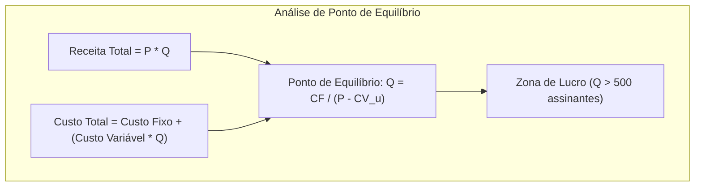

  
⬅️ <b><a href="/pt-br/resource/engenharia-de-computação/6-periodo/gestao-de-projetos/anotacoes/aula-07-avaliacao-teorico-pratica-p1-evte-eap-e-cpm-pert">Aula Anterior</a></b>

  
🏠 <b><a href="/pt-br/resource/engenharia-de-computação/6-periodo/gestao-de-projetos">Hub da Disciplina</a></b>

  
➡️ <b><a href="/pt-br/resource/engenharia-de-computação/6-periodo/gestao-de-projetos/anotacoes/aula-09-engenharia-economica-fluxo-de-caixa-projetado-e-taxa-minima-de-atratividade">Próxima Aula</a></b>

> [!info] 📅 Informações da Aula
> - **Disciplina:** Gestão de Projetos (CSECBJI.49)
> - **Professor:** Hilton
> - **Data Realizada:** 22/10/2026
> - **Tópico Principal:** Gestão de Custos: Estimativas, Orçamento e Análise de Ponto de Equilíbrio
> - **Status:** Concluída e Revisada

> [!note] 📂 Material Complementar & Slides
> - 📄 **Slides Oficiais:** [[slide-08-gestao-de-projetos|Acessar Apresentação em PDF]]
> - 🎥 **Short Lecture / Gravação:** [[video-08-gestao-de-projetos|Assistir Síntese da Aula (Vídeo)]]

---

### 📑 Resumo das Seções
- [📌 1. Anotações do Quadro: Gestão de Custos: Estimativas, Orçamento e Análise de Ponto de Equilíbrio](#-anotações-do-quadro-gestão-de-custos-estimativas,-orçamento-e-análise-de-ponto-de-equilíbrio)
- [🧮 2. Formulação & Exemplo Prático Resolvido](#-formulação--exemplo-prático-resolvido)
- [📊 3. Esquema Visual & Fluxograma (Mermaid)](#-esquema-visual--fluxograma-mermaid)
- [🧠 4. Resumo Pessoal & Macetes do Professor](#-resumo-pessoal--macetes-do-professor)
- [📝 5. Dúvidas & Exercícios Recomendados para Casa](#-dúvidas--exercícios-recomendados-para-casa)

---

## 📌 Anotações do Quadro: Gestão de Custos: Estimativas, Orçamento e Análise de Ponto de Equilíbrio

### 8.1 Classificação e Comportamento dos Custos
1. **Custos Diretos:** Facilmente atribuíveis a um pacote de trabalho específico (ex: salários dos desenvolvedores do módulo, licenças de software dedicadas).
2. **Custos Indiretos / Overhead:** Compartilhados entre múltiplos projetos da empresa (ex: aluguel do escritório central, energia elétrica, equipe jurídica e RH).
3. **Custos Fixos ($CF$):** Independem do volume de produção no curto prazo (ex: locação de servidores dedicados, salários administrativos).
4. **Custos Variáveis ($CV$):** Variam proporcionalmente à quantidade de unidades produzidas/serviços prestados (ex: taxas de transação em gateway de pagamento, consumo de banda em nuvem).

### 8.2 Margem de Contribuição e Ponto de Equilíbrio (*Break-Even Point*)
- **Margem de Contribuição Unitária ($MC_u$):** Parcela do preço de venda que sobra para cobrir os custos fixos e gerar lucro:
  $$MC_u = P_{\text{venda}} - CV_u$$
- **Ponto de Equilíbrio Contábil ($PE$):** O volume exato de vendas onde a receita total iguala o custo total (Lucro Zero):
  $$PE = \frac{\text{Custo Fixo Total } (CF)}{P_{\text{venda}} - CV_u} = \frac{CF}{MC_u} \quad \text{(unidades)}$$
- **Receita no Ponto de Equilíbrio:** $R_{PE} = PE \times P_{\text{venda}}$. Acima do $PE$, a empresa opera na zona de lucro!

---

## 🧮 Formulação & Exemplo Prático Resolvido

### ✏️ Dimensionamento de Ponto de Equilíbrio para Empresa SaaS

**Dados Financeiros:**
- Custo Fixo Mensal ($CF$ - Servidores, suporte, salários fixos): R$ 60.000,00 / mês.
- Preço da Mensalidade do Software ($P$): R$ 150,00 / usuário / mês.
- Custo Variável por Usuário ($CV_u$ - licenças de terceiros, processamento em nuvem): R$ 30,00 / usuário / mês.

**1. Margem de Contribuição:**
$$MC_u = 150 - 30 = \text{R\$} 120,00 / \text{usuário}$$

**2. Quantidade de Assinantes para Atingir o Ponto de Equilíbrio:**
$$PE = \frac{\text{R\$} 60.000}{\text{R\$} 120} = 500\text{ assinantes ativos}$$

A partir do 501º assinante, cada novo cliente gera **R$ 120,00 de lucro líquido puro** para a empresa!

---

## 📊 Esquema Visual & Fluxograma (Mermaid)

---

## 🧠 Resumo Pessoal & Macetes do Professor

| Conceito-Chave | *Takeaway* do Professor | Dicas de Prova / Atenção |
| :--- | :--- | :--- |
| **Ponto de Equilíbrio Financeiro vs Contábil** | O Ponto de Equilíbrio Financeiro deduz dos custos fixos as despesas não-desembolsáveis (como a depreciação de equipamentos), medindo a quantidade mínima de vendas para não faltar dinheiro vivo no caixa. | Indicador vital para startups no primeiro ano. |
| **Grau de Alavancagem Operacional** | Empresas de software possuem altos custos fixos e baixíssimos custos variáveis, gerando enorme alavancagem de lucro após superar o break-even point. | Aplicação prática direta |

---

## 📝 Dúvidas & Exercícios Recomendados para Casa

1. Calcule o ponto de equilíbrio de uma fábrica de placas controladoras que possui $CF = 	ext{R\$} 180.000$, $CV_u = 	ext{R\$} 45$ e $P = 	ext{R\$} 120$.
2. Determine quantas unidades a empresa deve vender para obter um lucro operacional de R$ 60.000,00 no mês.

---

  
⬅️ <b><a href="/pt-br/resource/engenharia-de-computação/6-periodo/gestao-de-projetos/anotacoes/aula-07-avaliacao-teorico-pratica-p1-evte-eap-e-cpm-pert">Aula Anterior</a></b>

  
🏠 <b><a href="/pt-br/resource/engenharia-de-computação/6-periodo/gestao-de-projetos">Hub da Disciplina</a></b>

  
➡️ <b><a href="/pt-br/resource/engenharia-de-computação/6-periodo/gestao-de-projetos/anotacoes/aula-09-engenharia-economica-fluxo-de-caixa-projetado-e-taxa-minima-de-atratividade">Próxima Aula</a></b>

