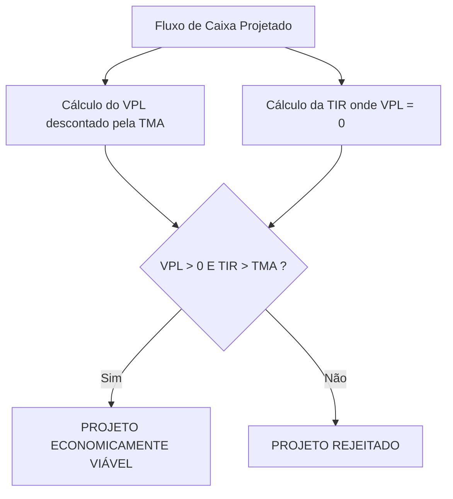

  
⬅️ <b><a href="/pt-br/resource/engenharia-de-computação/6-periodo/gestao-de-projetos/anotacoes/aula-10-metodos-de-avaliacao-de-investimentos-payback-simples-e-descontado">Aula Anterior</a></b>

  
🏠 <b><a href="/pt-br/resource/engenharia-de-computação/6-periodo/gestao-de-projetos">Hub da Disciplina</a></b>

  
➡️ <b><a href="/pt-br/resource/engenharia-de-computação/6-periodo/gestao-de-projetos/anotacoes/aula-12-gestao-de-riscos-em-projetos-identificacao-e-matriz-de-probabilidade">Próxima Aula</a></b>

> [!info] 📅 Informações da Aula
> - **Disciplina:** Gestão de Projetos (CSECBJI.49)
> - **Professor:** Hilton
> - **Data Realizada:** 12/11/2026
> - **Tópico Principal:** Avaliação Econômica Avançada: Valor Presente Líquido (VPL) e Taxa Interna de Retorno (TIR)
> - **Status:** Concluída e Revisada

> [!note] 📂 Material Complementar & Slides
> - 📄 **Slides Oficiais:** [[slide-11-gestao-de-projetos|Acessar Apresentação em PDF]]
> - 🎥 **Short Lecture / Gravação:** [[video-11-gestao-de-projetos|Assistir Síntese da Aula (Vídeo)]]

---

### 📑 Resumo das Seções
- [📌 1. Anotações do Quadro: Avaliação Econômica Avançada: Valor Presente Líquido (VPL) e Taxa Interna de Retorno (TIR)](#-anotações-do-quadro-avaliação-econômica-avançada-valor-presente-líquido-vpl-e-taxa-interna-de-retorno-tir)
- [🧮 2. Formulação & Exemplo Prático Resolvido](#-formulação--exemplo-prático-resolvido)
- [📊 3. Esquema Visual & Fluxograma (Mermaid)](#-esquema-visual--fluxograma-mermaid)
- [🧠 4. Resumo Pessoal & Macetes do Professor](#-resumo-pessoal--macetes-do-professor)
- [📝 5. Dúvidas & Exercícios Recomendados para Casa](#-dúvidas--exercícios-recomendados-para-casa)

---

## 📌 Anotações do Quadro: Avaliação Econômica Avançada: Valor Presente Líquido (VPL) e Taxa Interna de Retorno (TIR)

### 11.1 Valor Presente Líquido (VPL / NPV)
O **VPL** é o indicador de viabilidade econômica mais rigoroso e universal da engenharia, representando a riqueza líquida gerada pelo projeto em valores presentes de hoje, deduzido todo o investimento inicial e descontado pela TMA ($k$):
$$\text{VPL} = \sum_{t=1}^n \frac{FC_t}{(1 + k)^t} - I_0$$

**Regra de Decisão do VPL:**
- **$\text{VPL} > 0$:** O projeto é **economicamente viável** e agrega valor à empresa (rende mais que a TMA).
- **$\text{VPL} = 0$:** O projeto empata com a TMA (indiferente).
- **$\text{VPL} < 0$:** O projeto é **inviável** e destrói capital (rende menos que a aplicação na TMA).

### 11.2 Taxa Interna de Retorno (TIR / IRR)
A **TIR** é a taxa de desconto $r$ intrínseca do projeto que iguala o Valor Presente Líquido a ZERO:
$$\sum_{t=1}^n \frac{FC_t}{(1 + \text{TIR})^t} - I_0 = 0$$
- **Regra de Decisão:** Aceita-se o projeto se $\text{TIR} > \text{TMA}$.

### 11.3 Índice de Lucratividade (IL)
$$\text{IL} = \frac{\sum_{t=1}^n \frac{FC_t}{(1 + k)^t}}{I_0} = \frac{\text{VPL} + I_0}{I_0}$$
- Se $\text{IL} > 1.0$, o projeto é viável (mede o retorno em R$ gerado para cada R$ 1,00 investido).

---

## 🧮 Formulação & Exemplo Prático Resolvido

### ✏️ Cálculo de VPL, TIR e IL de um Projeto de Engenharia

**Dados:**
- Investimento Inicial: $I_0 = \text{R\$} 150.000$
- Fluxos de Caixa Anuais ($n=3$ anos): $FC_1 = 60\text{k}$, $FC_2 = 70\text{k}$, $FC_3 = 80\text{k}$
- Taxa Mínima de Atratividade (TMA): $k = 12\%\text{ a.a.}$

**1. Cálculo do Valor Presente dos Fluxos:**
$$VP = \frac{60.000}{(1.12)^1} + \frac{70.000}{(1.12)^2} + \frac{80.000}{(1.12)^3} = 53.571 + 55.804 + 56.942 = \text{R\$} 166.317$$

**2. Cálculo do VPL:**
$$\text{VPL} = 166.317 - 150.000 = +\text{R\$} 16.317\text{ (Projeto Viável!)}$$

**3. Cálculo do Índice de Lucratividade:**
$$\text{IL} = \frac{166.317}{150.000} = 1.109 \implies \text{Retorno de R\$ 1,11 para cada R\$ 1,00 investido!}$$

**4. Determinação da TIR (por interpolação linear / HP-12C):**
$$\text{TIR} \approx 18.25\%\text{ a.a.}$$
Como $\text{TIR } (18.25\%) > \text{TMA } (12.00\%)$, o projeto é duplamente aprovado!

---

## 📊 Esquema Visual & Fluxograma (Mermaid)

---

## 🧠 Resumo Pessoal & Macetes do Professor

| Conceito-Chave | *Takeaway* do Professor | Dicas de Prova / Atenção |
| :--- | :--- | :--- |
| **Em Caso de Conflito, Escolha SEMPRE o Maior VPL!** | Em projetos mutuamente exclusivos (onde só se pode escolher um), se um projeto tiver maior TIR mas menor VPL devido à escala, o critério soberano que maximiza o lucro absoluto da empresa é o **MAIOR VPL**. | A pegadinha mais cobrada em finanças de engenharia. |
| **Armadilha da TIR Múltipla** | Se o fluxo de caixa tiver mais de uma troca de sinal (ex: desativação custosa no final com fluxo negativo), o cálculo matemático pode gerar múltiplas TIRs falsas. Nesses casos, use a TIR Modificada (TIRM) ou VPL. | Aplicação prática direta |

---

## 📝 Dúvidas & Exercícios Recomendados para Casa

1. Compare dois projetos mutuamente exclusivos A e B (dados os fluxos) e decida qual escolher calculando VPL e TIR para TMA = 10%.
2. Demonstre por que o VPL decresce monotonicamente com o aumento da taxa de desconto.

---

  
⬅️ <b><a href="/pt-br/resource/engenharia-de-computação/6-periodo/gestao-de-projetos/anotacoes/aula-10-metodos-de-avaliacao-de-investimentos-payback-simples-e-descontado">Aula Anterior</a></b>

  
🏠 <b><a href="/pt-br/resource/engenharia-de-computação/6-periodo/gestao-de-projetos">Hub da Disciplina</a></b>

  
➡️ <b><a href="/pt-br/resource/engenharia-de-computação/6-periodo/gestao-de-projetos/anotacoes/aula-12-gestao-de-riscos-em-projetos-identificacao-e-matriz-de-probabilidade">Próxima Aula</a></b>

