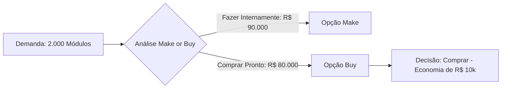

  
⬅️ <b><a href="/pt-br/resource/engenharia-de-computação/6-periodo/gestao-de-projetos/anotacoes/aula-12-gestao-de-riscos-em-projetos-identificacao-e-matriz-de-probabilidade">Aula Anterior</a></b>

  
🏠 <b><a href="/pt-br/resource/engenharia-de-computação/6-periodo/gestao-de-projetos">Hub da Disciplina</a></b>

  
➡️ <b><a href="/pt-br/resource/engenharia-de-computação/6-periodo/gestao-de-projetos/anotacoes/aula-14-monitoramento-e-controle-analise-do-valor-agregado-eva-e-encerramento">Próxima Aula</a></b>

> [!info] 📅 Informações da Aula
> - **Disciplina:** Gestão de Projetos (CSECBJI.49)
> - **Professor:** Hilton
> - **Data Realizada:** 26/11/2026
> - **Tópico Principal:** Gerenciamento de Aquisições, Contratos e Comunicação
> - **Status:** Concluída e Revisada

> [!note] 📂 Material Complementar & Slides
> - 📄 **Slides Oficiais:** [[slide-13-gestao-de-projetos|Acessar Apresentação em PDF]]
> - 🎥 **Short Lecture / Gravação:** [[video-13-gestao-de-projetos|Assistir Síntese da Aula (Vídeo)]]

---

### 📑 Resumo das Seções
- [📌 1. Anotações do Quadro: Gerenciamento de Aquisições, Contratos e Comunicação](#-anotações-do-quadro-gerenciamento-de-aquisições,-contratos-e-comunicação)
- [🧮 2. Formulação & Exemplo Prático Resolvido](#-formulação--exemplo-prático-resolvido)
- [📊 3. Esquema Visual & Fluxograma (Mermaid)](#-esquema-visual--fluxograma-mermaid)
- [🧠 4. Resumo Pessoal & Macetes do Professor](#-resumo-pessoal--macetes-do-professor)
- [📝 5. Dúvidas & Exercícios Recomendados para Casa](#-dúvidas--exercícios-recomendados-para-casa)

---

## 📌 Anotações do Quadro: Gerenciamento de Aquisições, Contratos e Comunicação

### 13.1 Gerenciamento de Aquisições e Decisão de *Make or Buy*
Processo de compra ou contratação externa de produtos, serviços ou resultados necessários para a execução do projeto:
- **Decisão Fazer ou Comprar (*Make or Buy Analysis*):** Avaliação de custos diretos e fixos, segredo industrial, competência central (*Core Competence*) e capacidade produtiva instalada.

### 13.2 Tipos Principais de Contratos
1. **Contratos de Preço Fixo (*Fixed-Price / FP*):**
   - Preço total fixado e inalterável para um escopo bem delimitado.
   - **Risco do Comprador:** Baixo (o fornecedor arca com estouros de custo).
   - Ideal para compras de prateleira e escopos com zero incerteza.
2. **Contratos de Custos Reembolsáveis (*Cost-Reimbursable / CR / Cost-Plus*):**
   - O comprador paga todos os custos reais do fornecedor mais uma taxa de lucro acordada.
   - **Risco do Comprador:** Alto (o fornecedor não tem incentivo para conter custos).
   - Ideal para pesquisa e desenvolvimento (P&D) onde o escopo não pode ser pré-definido.
3. **Contratos por Tempo e Material (*Time and Material - T&M*):**
   - Pagamento por hora/homem trabalhada e materiais consumidos. Híbrido muito comum em alocação de squads de software.

### 13.3 Gerenciamento das Comunicações
Cálculo da complexidade dos canais de comunicação entre $N$ partes interessadas:
$$\text{Número de Canais de Comunicação} = \frac{N(N - 1)}{2}$$

---

## 🧮 Formulação & Exemplo Prático Resolvido

### ✏️ Análise Numérica de *Make or Buy* (Fazer vs Comprar)

Uma empresa de engenharia precisa de 2.000 módulos de telemetria para um projeto:
- **Opção Fazer Internamente (*Make*):** Custo fixo de ferramentas e maquinário $CF = \text{R\$} 40.000$, mais custo variável unitário $CV = \text{R\$} 25,00$ por módulo.
  $$\text{Custo Fazer} = 40.000 + (25 \times 2.000) = 40.000 + 50.000 = \text{R\$} 90.000,00$$
- **Opção Comprar Pronto (*Buy*):** Preço de fornecedor homologado $P = \text{R\$} 40,00$ por módulo sem custo fixo inicial.
  $$\text{Custo Comprar} = 40 \times 2.000 = \text{R\$} 80.000,00$$

**Ponto de Indiferença:**
$$40.000 + 25 \cdot Q = 40 \cdot Q \implies 15 \cdot Q = 40.000 \implies Q = 2.667\text{ unidades}$$

**Decisão Gerencial:** Como o projeto precisa de 2.000 unidades ($< 2.667$), a decisão mais econômica é **COMPRAR PRONTO (*BUY*)**, economizando R$ 10.000 no orçamento!

---

## 📊 Esquema Visual & Fluxograma (Mermaid)

---

## 🧠 Resumo Pessoal & Macetes do Professor

| Conceito-Chave | *Takeaway* do Professor | Dicas de Prova / Atenção |
| :--- | :--- | :--- |
| **Crescimento Exponencial dos Canais de Comunicação** | Com 5 pessoas, há 10 canais de comunicação; com 10 pessoas, há 45 canais; com 20 pessoas, há 190 canais! | Por isso o framework Scrum recomenda equipes pequenas de 3 a 9 membros para evitar perda de alinhamento. |
| **Cláusulas de Incentivo em Contratos** | Contratos *Fixed Price Incentive Fee (FPIF)* bonificam o fornecedor se ele entregar antes do prazo ou com custos menores. | Aplicação prática direta |

---

## 📝 Dúvidas & Exercícios Recomendados para Casa

1. Calcule a quantidade de canais de comunicação de uma equipe com 12 engenheiros.
2. Determine o tipo de contrato mais adequado para contratar o desenvolvimento de um software inovador baseado em inteligência artificial generativa.

---

  
⬅️ <b><a href="/pt-br/resource/engenharia-de-computação/6-periodo/gestao-de-projetos/anotacoes/aula-12-gestao-de-riscos-em-projetos-identificacao-e-matriz-de-probabilidade">Aula Anterior</a></b>

  
🏠 <b><a href="/pt-br/resource/engenharia-de-computação/6-periodo/gestao-de-projetos">Hub da Disciplina</a></b>

  
➡️ <b><a href="/pt-br/resource/engenharia-de-computação/6-periodo/gestao-de-projetos/anotacoes/aula-14-monitoramento-e-controle-analise-do-valor-agregado-eva-e-encerramento">Próxima Aula</a></b>

