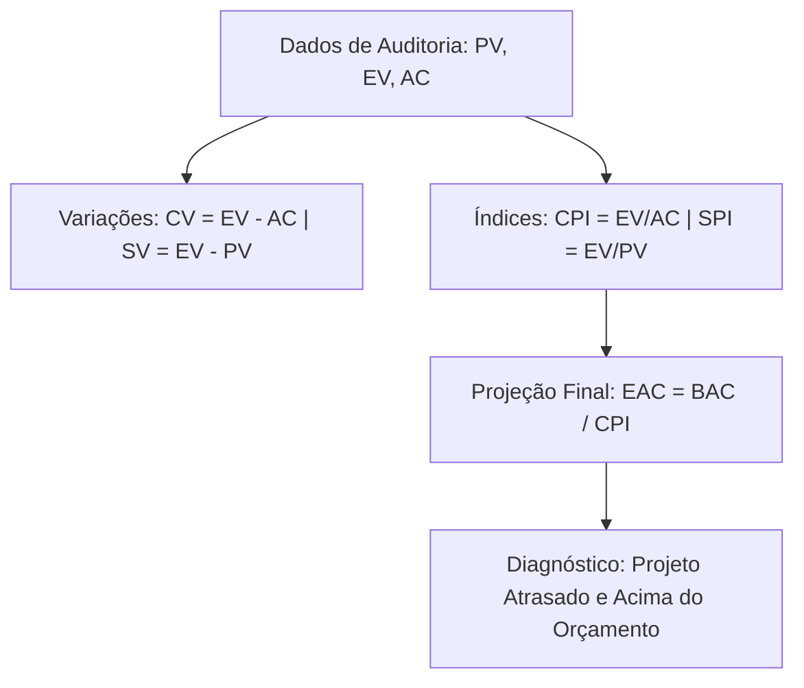

  
⬅️ <b><a href="/pt-br/resource/engenharia-de-computação/6-periodo/gestao-de-projetos/anotacoes/aula-13-gerenciamento-de-aquisicoes-contratos-e-comunicacao">Aula Anterior</a></b>

  
🏠 <b><a href="/pt-br/resource/engenharia-de-computação/6-periodo/gestao-de-projetos">Hub da Disciplina</a></b>

  
➡️ <b><a href="/pt-br/resource/engenharia-de-computação/6-periodo/gestao-de-projetos/anotacoes/aula-15-avaliacao-p2-e-apresentacao-do-plano-de-negocios-evte-final">Próxima Aula</a></b>

> [!info] 📅 Informações da Aula
> - **Disciplina:** Gestão de Projetos (CSECBJI.49)
> - **Professor:** Hilton
> - **Data Realizada:** 03/12/2026
> - **Tópico Principal:** Monitoramento e Controle: Análise do Valor Agregado (EVA) e Encerramento
> - **Status:** Concluída e Revisada

> [!note] 📂 Material Complementar & Slides
> - 📄 **Slides Oficiais:** [[slide-14-gestao-de-projetos|Acessar Apresentação em PDF]]
> - 🎥 **Short Lecture / Gravação:** [[video-14-gestao-de-projetos|Assistir Síntese da Aula (Vídeo)]]

---

### 📑 Resumo das Seções
- [📌 1. Anotações do Quadro: Monitoramento e Controle: Análise do Valor Agregado (EVA) e Encerramento](#-anotações-do-quadro-monitoramento-e-controle-análise-do-valor-agregado-eva-e-encerramento)
- [🧮 2. Formulação & Exemplo Prático Resolvido](#-formulação--exemplo-prático-resolvido)
- [📊 3. Esquema Visual & Fluxograma (Mermaid)](#-esquema-visual--fluxograma-mermaid)
- [🧠 4. Resumo Pessoal & Macetes do Professor](#-resumo-pessoal--macetes-do-professor)
- [📝 5. Dúvidas & Exercícios Recomendados para Casa](#-dúvidas--exercícios-recomendados-para-casa)

---

## 📌 Anotações do Quadro: Monitoramento e Controle: Análise do Valor Agregado (EVA) e Encerramento

### 14.1 Monitoramento com Análise do Valor Agregado (EVA / EVM)
A **Análise do Valor Agregado (*Earned Value Analysis*)** integra simultaneamente medições de **Escopo, Cronograma e Custo** em uma única metodologia matemática.

### 14.2 As Três Variáveis Fundamentais do EVA
1. **Valor Planejado (PV - *Planned Value*):** Orçamento autorizado previsto para o trabalho agendado até a data atual.
2. **Valor Agregado (EV - *Earned Value*):** Orçamento autorizado para o **trabalho REALMENTE concluído** até a data atual ($EV = \% \text{ concluído} \times \text{Orçamento Total}$).
3. **Custo Real (AC - *Actual Cost*):** O custo financeiro real total incorrido para realizar o trabalho concluído até a data.
4. **Orçamento no Término (BAC - *Budget at Completion*):** Custo total aprovado para o projeto inteiro.

### 14.3 Variações e Índices de Desempenho
- **Variação de Custo:** $CV = EV - AC$ (Se $CV > 0 \implies$ Abaixo do orçamento / Economia; Se $CV < 0 \implies$ Estouro de custo).
- **Variação de Cronograma:** $SV = EV - PV$ (Se $SV > 0 \implies$ Adiantado; Se $SV < 0 \implies$ Atrasado).
- **Índice de Desempenho de Custo:** $CPI = \frac{EV}{AC}$ (Se $CPI > 1.0 \implies$ Eficiência de custos).
- **Índice de Desempenho de Prazo:** $SPI = \frac{EV}{PV}$ (Se $SPI > 1.0 \implies$ Eficiência de cronograma).
- **Estimativa no Término (EAC):** $EAC = \frac{BAC}{CPI}$ (Custo final projetado do projeto se a tendência continuar).

---

## 🧮 Formulação & Exemplo Prático Resolvido

### ✏️ Diagnóstico Completo de EVA de um Projeto

**Cenário de Auditoria no 4º Mês:**
- Orçamento Total do Projeto: $BAC = \text{R\$} 200.000$
- Trabalho Planejado para o 4º Mês: Deveria ter $50\%$ concluído $\implies PV = 200.000 \times 0.50 = \text{R\$} 100.000$
- Trabalho Realmente Concluído: Equipe entregou $40\%$ do escopo $\implies EV = 200.000 \times 0.40 = \text{R\$} 80.000$
- Gasto Financeiro Real Acumulado: Desembolsado $AC = \text{R\$} 90.000$

**1. Variações e Índices:**
- $CV = 80.000 - 90.000 = -\text{R\$} 10.000$ ($10\text{k}$ de prejuízo/estouro).
- $SV = 80.000 - 100.000 = -\text{R\$} 20.000$ ($20\text{k}$ de trabalho atrasado).
- $CPI = \frac{80.000}{90.000} \approx 0.89$ (Para cada R$ 1,00 gasto, apenas R$ 0,89 de valor é gerado).
- $SPI = \frac{80.000}{100.000} = 0.80$ (O projeto está progredindo a apenas $80\%$ da velocidade planejada).

**2. Projeção de Custo Final:**
$$EAC = \frac{\text{R\$} 200.000}{0.89} \approx \text{R\$} 224.719\text{ (Estouro final previsto de R\$ 24.719)}$$

---

## 📊 Esquema Visual & Fluxograma (Mermaid)

---

## 🧠 Resumo Pessoal & Macetes do Professor

| Conceito-Chave | *Takeaway* do Professor | Dicas de Prova / Atenção |
| :--- | :--- | :--- |
| **Regra Mnemônica do EVA** | Se os índices ($CPI$ e $SPI$) forem **MAIORES QUE 1.0**, comemore! (Adiantado e com economia). Se forem **MENORES QUE 1.0**, o projeto está em crise (atrasado e estourando custos). | A métrica mais exigida em certificações PMP. |
| **Termo de Encerramento do Projeto (TEP)** | O encerramento formal exige a assinatura do Termo de Aceite pelo cliente e o arquivamento das Lições Aprendidas. | Aplicação prática direta |

---

## 📝 Dúvidas & Exercícios Recomendados para Casa

1. Um projeto com $BAC = 	ext{R\$} 500.000$ apresenta na metade do prazo $PV = 250	ext{k}$, $EV = 200	ext{k}$ e $AC = 180	ext{k}$. Calcule $CV, SV, CPI, SPI$ e interprete o estado do projeto.
2. Explique a finalidade do Termo de Aceite Definitivo e da documentação de Lições Aprendidas no encerramento.

---

  
⬅️ <b><a href="/pt-br/resource/engenharia-de-computação/6-periodo/gestao-de-projetos/anotacoes/aula-13-gerenciamento-de-aquisicoes-contratos-e-comunicacao">Aula Anterior</a></b>

  
🏠 <b><a href="/pt-br/resource/engenharia-de-computação/6-periodo/gestao-de-projetos">Hub da Disciplina</a></b>

  
➡️ <b><a href="/pt-br/resource/engenharia-de-computação/6-periodo/gestao-de-projetos/anotacoes/aula-15-avaliacao-p2-e-apresentacao-do-plano-de-negocios-evte-final">Próxima Aula</a></b>

