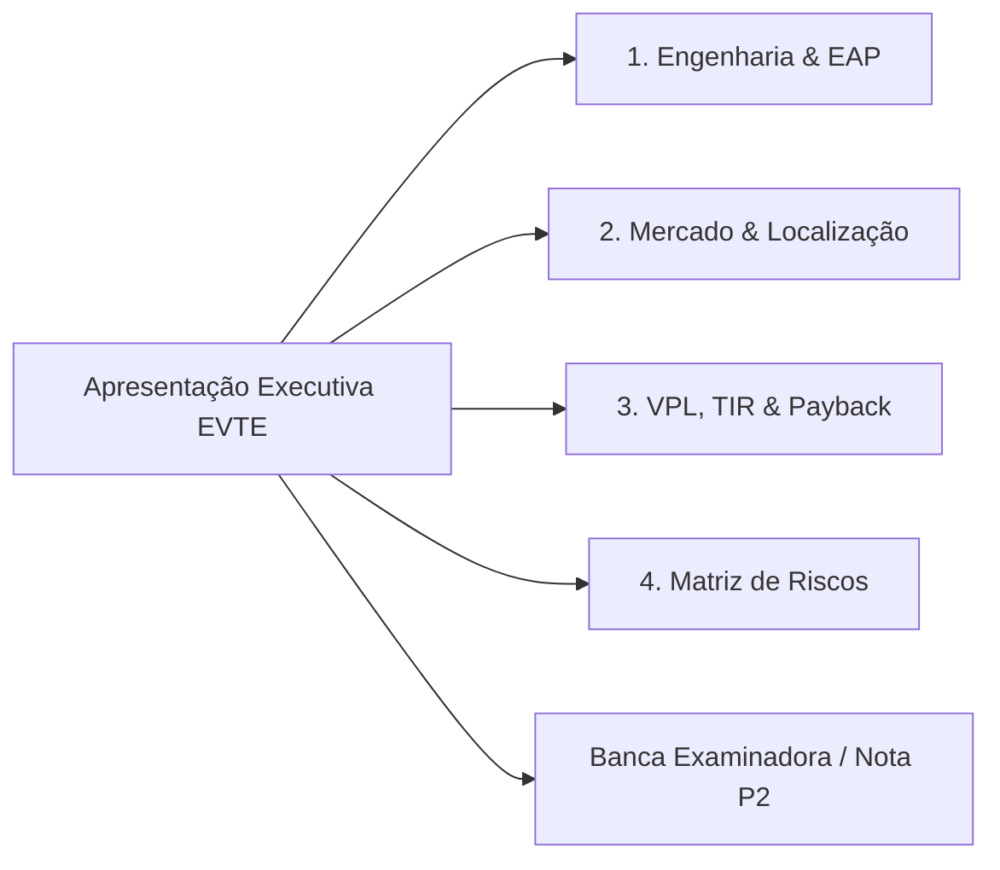

  
⬅️ <b><a href="/pt-br/resource/engenharia-de-computação/6-periodo/gestao-de-projetos/anotacoes/aula-14-monitoramento-e-controle-analise-do-valor-agregado-eva-e-encerramento">Aula Anterior</a></b>

  
🏠 <b><a href="/pt-br/resource/engenharia-de-computação/6-periodo/gestao-de-projetos">Hub da Disciplina</a></b>

  
➡️ <b><a href="/pt-br/resource/engenharia-de-computação/6-periodo/gestao-de-projetos/anotacoes/aula-16-prova-final-de-gestao-de-projetos-e-fechamento">Próxima Aula</a></b>

> [!info] 📅 Informações da Aula
> - **Disciplina:** Gestão de Projetos (CSECBJI.49)
> - **Professor:** Hilton
> - **Data Realizada:** 10/12/2026
> - **Tópico Principal:** Avaliação P2 e Apresentação do Plano de Negócios / EVTE Final
> - **Status:** Concluída e Revisada

> [!note] 📂 Material Complementar & Slides
> - 📄 **Slides Oficiais:** [[slide-15-gestao-de-projetos|Acessar Apresentação em PDF]]
> - 🎥 **Short Lecture / Gravação:** [[video-15-gestao-de-projetos|Assistir Síntese da Aula (Vídeo)]]

---

### 📑 Resumo das Seções
- [📌 1. Anotações do Quadro: Avaliação P2 e Apresentação do Plano de Negócios / EVTE Final](#-anotações-do-quadro-avaliação-p2-e-apresentação-do-plano-de-negócios-/-evte-final)
- [🧮 2. Formulação & Exemplo Prático Resolvido](#-formulação--exemplo-prático-resolvido)
- [📊 3. Esquema Visual & Fluxograma (Mermaid)](#-esquema-visual--fluxograma-mermaid)
- [🧠 4. Resumo Pessoal & Macetes do Professor](#-resumo-pessoal--macetes-do-professor)
- [📝 5. Dúvidas & Exercícios Recomendados para Casa](#-dúvidas--exercícios-recomendados-para-casa)

---

## 📌 Anotações do Quadro: Avaliação P2 e Apresentação do Plano de Negócios / EVTE Final

### 15.1 Critérios de Avaliação e Defesa do Plano de Negócios / EVTE
A avaliação P2 consiste na entrega e apresentação executiva (*Pitch de Negócios*) do Estudo de Viabilidade Técnico-Econômica completo desenvolvido pelas equipes ao longo do semestre:
1. Apresentação do Problema e Solução Tecnológica Inovadora.
2. Pesquisa de Mercado com Análise de Demanda, Concorrência e Precificação.
3. Projeto de Engenharia, Balanço de Materiais, Layout e Dimensionamento de RH.
4. Estrutura Analítica do Projeto (EAP) e Dicionário da EAP.
5. Cronograma de Atividades com determinação do Caminho Crítico (CPM/PERT).
6. Matriz de Gestão de Riscos ($P \times I$) e Estratégias de Mitigação.
7. Análise de Ponto de Equilíbrio, Fluxo de Caixa Projetado a 5 anos e Indicadores Econômicos (VPL, TIR, Payback Descontado, IL).

---

## 🧮 Formulação & Exemplo Prático Resolvido

### ✏️ Roteiro do Pitch Executivo para a Banca Examinadora

- **Minutos 0-3:** O Problema e a Proposta de Valor da Solução de Engenharia.
- **Minutos 3-6:** Mercado Alvo, Tamanho do Mercado e Estratégia de Vendas.
- **Minutos 6-9:** Engenharia da Solução, EAP e Cronograma de Implantação (Caminho Crítico).
- **Minutos 9-12:** Viabilidade Financeira (Investimento Inicial, Ponto de Equilíbrio, VPL, TIR e Payback).
- **Minutos 12-15:** Arguição técnica com os membros da banca examinadora.

---

## 📊 Esquema Visual & Fluxograma (Mermaid)

---

## 🧠 Resumo Pessoal & Macetes do Professor

| Conceito-Chave | *Takeaway* do Professor | Dicas de Prova / Atenção |
| :--- | :--- | :--- |
| **Dica para Apresentação Executiva** | Foque na **relação benefício-custo e no retorno do investimento**. Demonstre com firmeza por que o projeto tem VPL positivo e como os principais riscos foram mitigados. | Engenheiros que dominam linguagem executiva e financeira são líderes natos. |
| **Sensibilidade da TMA** | Apresente um gráfico de sensibilidade mostrando o comportamento do VPL caso a inflação ou a taxa de juros suba. | Aplicação prática direta |

---

## 📝 Dúvidas & Exercícios Recomendados para Casa

1. Conclua a montagem dos slides do pitch executivo da equipe com gráficos financeiros profissionais.
2. Realize um ensaio cronometrado da apresentação para respeitar o tempo limite estrito de 12 minutos.

---

  
⬅️ <b><a href="/pt-br/resource/engenharia-de-computação/6-periodo/gestao-de-projetos/anotacoes/aula-14-monitoramento-e-controle-analise-do-valor-agregado-eva-e-encerramento">Aula Anterior</a></b>

  
🏠 <b><a href="/pt-br/resource/engenharia-de-computação/6-periodo/gestao-de-projetos">Hub da Disciplina</a></b>

  
➡️ <b><a href="/pt-br/resource/engenharia-de-computação/6-periodo/gestao-de-projetos/anotacoes/aula-16-prova-final-de-gestao-de-projetos-e-fechamento">Próxima Aula</a></b>

