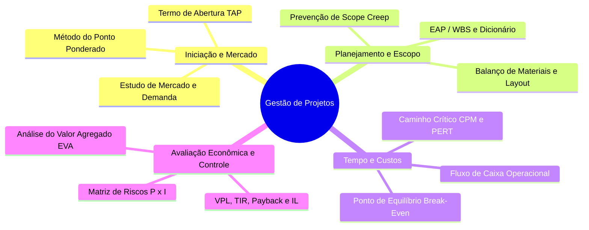

<div style="display: flex; justify-content: space-between; align-items: center; padding: 10px 16px; background: var(--light, #f8fafc); border: 1px solid var(--lightgray, #e2e8f0); border-radius: 10px; margin: 1.5rem 0;">
  <div>⬅️ <b><a href="/pt-br/resource/engenharia-de-computação/6-periodo/gestao-de-projetos/anotacoes/aula-15-avaliacao-p2-e-apresentacao-do-plano-de-negocios-evte-final">Aula Anterior</a></b></div>
  <div>🏠 <b><a href="/pt-br/resource/engenharia-de-computação/6-periodo/gestao-de-projetos">Hub da Disciplina</a></b></div>
  <div>➡️ <span style="color: gray;">Última Aula</span></div>
</div>

> [!info] 📅 Informações da Aula
> - **Disciplina:** Gestão de Projetos (CSECBJI.49)
> - **Professor:** Hilton
> - **Data Realizada:** 17/12/2026
> - **Tópico Principal:** Prova Final de Gestão de Projetos e Fechamento
> - **Status:** Concluída e Revisada

> [!note] 📂 Material Complementar & Slides
> - 📄 **Slides Oficiais:** [[slide-16-gestao-de-projetos|Acessar Apresentação em PDF]]
> - 🎥 **Short Lecture / Gravação:** [[video-16-gestao-de-projetos|Assistir Síntese da Aula (Vídeo)]]

---

### 📑 Resumo das Seções
- [📌 1. Anotações do Quadro: Prova Final de Gestão de Projetos e Fechamento](#-anotações-do-quadro-prova-final-de-gestão-de-projetos-e-fechamento)
- [🧮 2. Formulação & Exemplo Prático Resolvido](#-formulação--exemplo-prático-resolvido)
- [📊 3. Esquema Visual & Fluxograma (Mermaid)](#-esquema-visual--fluxograma-mermaid)
- [🧠 4. Resumo Pessoal & Macetes do Professor](#-resumo-pessoal--macetes-do-professor)
- [📝 5. Dúvidas & Exercícios Recomendados para Casa](#-dúvidas--exercícios-recomendados-para-casa)

---

## 📌 Anotações do Quadro: Prova Final de Gestão de Projetos e Fechamento

### 16.1 Síntese Holística da Gestão de Projetos de Engenharia
A disciplina de Gestão de Projetos transforma o engenheiro técnico em um **gestor estratégico de recursos e negócios**:
```text
Ideia Tecnológica ──▶ EVTE & Mercado ──▶ EAP & Escopo ──▶ Cronograma CPM/PERT ──▶ Engenharia Econômica (VPL/TIR) ──▶ Controle EVA
```

### 16.2 Competências Profissionais e Certificações Globais
- **Certificações Profissionais:** PMP (*Project Management Professional* - PMI), CAPM, Scrum Master (PSM/CSM) e PMI-RMP (Gestão de Riscos).
- **Liderança em Engenharia:** Capacidade de gerenciar equipes multidisciplinares, negociar com fornecedores e defender investimentos de capital perante diretorias executivas.

---

## 🧮 Formulação & Exemplo Prático Resolvido

### ✏️ Fechamento do Semestre Letivo

1. **Revisão Final:** Média Semestral $= (P1 + P2) / 2 \ge 6.0$.
2. **Impacto no TCC:** Toda a metodologia de EAP, cronograma e viabilidade aprendida aqui será utilizada na elaboração da monografia e projeto do **Projeto Final de Curso I e II (9º e 10º períodos)**.

---

## 📊 Esquema Visual & Fluxograma (Mermaid)



---

## 🧠 Resumo Pessoal & Macetes do Professor

| Conceito-Chave | *Takeaway* do Professor | Dicas de Prova / Atenção |
| :--- | :--- | :--- |
| **Visão Holística da Engenharia** | Projetos tecnicamente brilhantes fracassam se não tiverem viabilidade financeira ou estourarem prazos de mercado; projetos simples bem gerenciados conquistam liderança mundial. | Equilibre sempre excelência técnica com rigor de gestão. |
| **Encerramento do Semestre** | Parabéns pela conclusão com louvor da disciplina de Gestão de Projetos! | Aplicação prática direta |

---

## 📝 Dúvidas & Exercícios Recomendados para Casa

1. Revisão geral dos compêndios teóricos para a Prova Final.
2. Consulte as referências clássicas recomendadas: Kerzner (Gestão de Projetos: Melhores Práticas) e Guia PMBOK (PMI).

---

<div style="display: flex; justify-content: space-between; align-items: center; padding: 10px 16px; background: var(--light, #f8fafc); border: 1px solid var(--lightgray, #e2e8f0); border-radius: 10px; margin: 1.5rem 0;">
  <div>⬅️ <b><a href="/pt-br/resource/engenharia-de-computação/6-periodo/gestao-de-projetos/anotacoes/aula-15-avaliacao-p2-e-apresentacao-do-plano-de-negocios-evte-final">Aula Anterior</a></b></div>
  <div>🏠 <b><a href="/pt-br/resource/engenharia-de-computação/6-periodo/gestao-de-projetos">Hub da Disciplina</a></b></div>
  <div>➡️ <span style="color: gray;">Última Aula</span></div>
</div>
