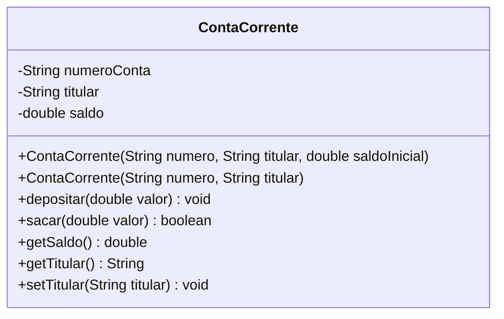

<div style="display: flex; justify-content: space-between; align-items: center; padding: 10px 16px; background: var(--light, #f8fafc); border: 1px solid var(--lightgray, #e2e8f0); border-radius: 10px; margin: 1.5rem 0;">
  <div>⬅️ <b><a href="/pt-br/resource/engenharia-de-computação/6-periodo/programacao-orientada-a-objetos-i/anotacoes/aula-01-classes-instanciacao-e-tipos-por-referencia-vs-valor">Aula Anterior</a></b></div>
  <div>🏠 <b><a href="/pt-br/resource/engenharia-de-computação/6-periodo/programacao-orientada-a-objetos-i">Hub da Disciplina</a></b></div>
  <div>➡️ <b><a href="/pt-br/resource/engenharia-de-computação/6-periodo/programacao-orientada-a-objetos-i/anotacoes/aula-03-relacionamentos-de-associacao-agregacao-e-composicao">Próxima Aula</a></b></div>
</div>

> [!info] 📅 Informações da Aula
> - **Disciplina:** Programação Orientada a Objetos I (CSECBJI.45)
> - **Professor:** Sérgio / Bruno
> - **Data Realizada:** 09/09/2026
> - **Tópico Principal:** Encapsulamento, Modificadores de Acesso e Construtores
> - **Status:** Concluída e Revisada

> [!note] 📂 Material Complementar & Slides
> - 📄 **Slides Oficiais:** [[slide-02-programacao-orientada-a-objetos-i|Acessar Apresentação em PDF]]
> - 🎥 **Short Lecture / Gravação:** [[video-02-programacao-orientada-a-objetos-i|Assistir Síntese da Aula (Vídeo)]]

---

### 📑 Resumo das Seções
- [📌 1. Anotações do Quadro: Encapsulamento, Modificadores de Acesso e Construtores](#-anotações-do-quadro-encapsulamento,-modificadores-de-acesso-e-construtores)
- [🧮 2. Formulação & Exemplo Prático Resolvido](#-formulação--exemplo-prático-resolvido)
- [📊 3. Esquema Visual & Fluxograma (Mermaid)](#-esquema-visual--fluxograma-mermaid)
- [🧠 4. Resumo Pessoal & Macetes do Professor](#-resumo-pessoal--macetes-do-professor)
- [📝 5. Dúvidas & Exercícios Recomendados para Casa](#-dúvidas--exercícios-recomendados-para-casa)

---

## 📌 Anotações do Quadro: Encapsulamento, Modificadores de Acesso e Construtores

### 2.1 O Princípio do Encapsulamento
O encapsulamento oculta os detalhes internos de implementação e o estado de um objeto, expondo apenas uma interface pública controlada e segura para o mundo externo.
- **Objetivo:** Proteger o estado do objeto contra corrupção direta e garantir invariantes de classe.

### 2.2 Modificadores de Acesso em Java

| Modificador | Na Própria Classe | No Mesmo Pacote | Em Subclasses (Herança) | Em Qualquer Lugar (Global) |
| :--- | :---: | :---: | :---: | :---: |
| `private` | **Sim** | Não | Não | Não |
| *(default / package-private)* | **Sim** | **Sim** | Não | Não |
| `protected` | **Sim** | **Sim** | **Sim** | Não |
| `public` | **Sim** | **Sim** | **Sim** | **Sim** |

### 2.3 Construtores e a Palavra-Chave `this`
- **Construtores:** Métodos especiais invocados no momento da instanciação (`new`) para inicializar o estado consistente do objeto. Não possuem tipo de retorno.
- **Sobrecarga de Construtores (*Overloading*):** Múltiplos construtores na mesma classe com listas de parâmetros distintas.
- **`this`:** Referência à própria instância atual do objeto. Utilizado para desambiguar atributos de parâmetros (`this.saldo = saldo`) e para encadear construtores (`this(saldo, 0.0)`).

---

## 🧮 Formulação & Exemplo Prático Resolvido

### ✏️ Implementação de Classe Encapsulada com Validação Estrita

```java
package br.edu.iff.engcomp.banco;

public class ContaCorrente {
    private final String numeroConta;
    private String titular;
    private double saldo;

    // Construtor principal
    public ContaCorrente(String numeroConta, String titular, double saldoInicial) {
        if (numeroConta == null || numeroConta.trim().isEmpty()) {
            throw new IllegalArgumentException("Número de conta inválido!");
        }
        if (saldoInicial < 0) {
            throw new IllegalArgumentException("Saldo inicial não pode ser negativo!");
        }
        this.numeroConta = numeroConta;
        this.titular = titular;
        this.saldo = saldoInicial;
    }

    // Construtor sobrecarregado (saldo inicial zero)
    public ContaCorrente(String numeroConta, String titular) {
        this(numeroConta, titular, 0.0);
    }

    public void depositar(double valor) {
        if (valor <= 0) throw new IllegalArgumentException("Valor de depósito deve ser positivo!");
        this.saldo += valor;
    }

    public boolean sacar(double valor) {
        if (valor > 0 && this.saldo >= valor) {
            this.saldo -= valor;
            return true;
        }
        return false;
    }

    public double getSaldo() { return this.saldo; }
    public String getNumeroConta() { return this.numeroConta; }
    public String getTitular() { return this.titular; }
    public void setTitular(String titular) { this.titular = titular; }
}
```

---

## 📊 Esquema Visual & Fluxograma (Mermaid)



---

## 🧠 Resumo Pessoal & Macetes do Professor

| Conceito-Chave | *Takeaway* do Professor | Dicas de Prova / Atenção |
| :--- | :--- | :--- |
| **Não Crie Getters e Setters Cegamente** | Encapsulamento não é apenas colocar todos os atributos `private` e criar getters e setters para tudo. Se um atributo não deve ser alterado (como `numeroConta`), NÃO crie o método `set`! | Evite 'anemia' de domínio. |
| **Construtor Padrão Desaparece** | Se você declarar QUALQUER construtor com parâmetros em uma classe Java, o compilador NÃO gerará o construtor padrão vazio `public Classe()` automaticamente. | Aplicação prática direta |

---

## 📝 Dúvidas & Exercícios Recomendados para Casa

1. Implemente uma classe `Data` encapsulada com validação completa para anos bissextos e quantidade correta de dias por mês.
2. Explique por que atributos públicos violam o encapsulamento e comprometem a manutenção de longo prazo de um sistema.

---

<div style="display: flex; justify-content: space-between; align-items: center; padding: 10px 16px; background: var(--light, #f8fafc); border: 1px solid var(--lightgray, #e2e8f0); border-radius: 10px; margin: 1.5rem 0;">
  <div>⬅️ <b><a href="/pt-br/resource/engenharia-de-computação/6-periodo/programacao-orientada-a-objetos-i/anotacoes/aula-01-classes-instanciacao-e-tipos-por-referencia-vs-valor">Aula Anterior</a></b></div>
  <div>🏠 <b><a href="/pt-br/resource/engenharia-de-computação/6-periodo/programacao-orientada-a-objetos-i">Hub da Disciplina</a></b></div>
  <div>➡️ <b><a href="/pt-br/resource/engenharia-de-computação/6-periodo/programacao-orientada-a-objetos-i/anotacoes/aula-03-relacionamentos-de-associacao-agregacao-e-composicao">Próxima Aula</a></b></div>
</div>
