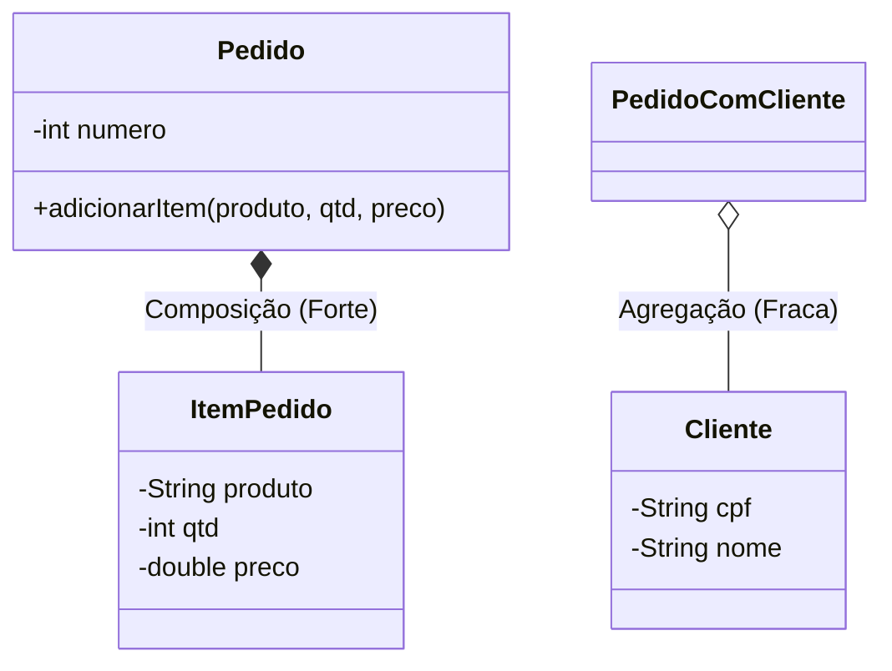

<div style="display: flex; justify-content: space-between; align-items: center; padding: 10px 16px; background: var(--light, #f8fafc); border: 1px solid var(--lightgray, #e2e8f0); border-radius: 10px; margin: 1.5rem 0;">
  <div>⬅️ <b><a href="/pt-br/resource/engenharia-de-computação/6-periodo/programacao-orientada-a-objetos-i/anotacoes/aula-02-encapsulamento-modificadores-de-acesso-e-construtores">Aula Anterior</a></b></div>
  <div>🏠 <b><a href="/pt-br/resource/engenharia-de-computação/6-periodo/programacao-orientada-a-objetos-i">Hub da Disciplina</a></b></div>
  <div>➡️ <b><a href="/pt-br/resource/engenharia-de-computação/6-periodo/programacao-orientada-a-objetos-i/anotacoes/aula-04-heranca-reutilizacao-de-codigo-e-o-principio-de-substituicao">Próxima Aula</a></b></div>
</div>

> [!info] 📅 Informações da Aula
> - **Disciplina:** Programação Orientada a Objetos I (CSECBJI.45)
> - **Professor:** Sérgio / Bruno
> - **Data Realizada:** 16/09/2026
> - **Tópico Principal:** Relacionamentos de Associação, Agregação e Composição
> - **Status:** Concluída e Revisada

> [!note] 📂 Material Complementar & Slides
> - 📄 **Slides Oficiais:** [[slide-03-programacao-orientada-a-objetos-i|Acessar Apresentação em PDF]]
> - 🎥 **Short Lecture / Gravação:** [[video-03-programacao-orientada-a-objetos-i|Assistir Síntese da Aula (Vídeo)]]

---

### 📑 Resumo das Seções
- [📌 1. Anotações do Quadro: Relacionamentos de Associação, Agregação e Composição](#-anotações-do-quadro-relacionamentos-de-associação,-agregação-e-composição)
- [🧮 2. Formulação & Exemplo Prático Resolvido](#-formulação--exemplo-prático-resolvido)
- [📊 3. Esquema Visual & Fluxograma (Mermaid)](#-esquema-visual--fluxograma-mermaid)
- [🧠 4. Resumo Pessoal & Macetes do Professor](#-resumo-pessoal--macetes-do-professor)
- [📝 5. Dúvidas & Exercícios Recomendados para Casa](#-dúvidas--exercícios-recomendados-para-casa)

---

## 📌 Anotações do Quadro: Relacionamentos de Associação, Agregação e Composição

### 3.1 Relacionamentos entre Objetos
Sistemas orientados a objetos são compostos por redes de objetos que colaboram através de mensagens:
1. **Dependência / Uso (*Uses-a*):** Relacionamento transitório onde uma classe recebe outra como parâmetro de método (acoplamento mais fraco).
2. **Associação Simples (*Knows-a*):** Uma classe mantém uma referência persistente para outra em seus atributos.

### 3.2 Agregação vs Composição (Todo-Parte)
- **Agregação (Todo-Parte Fraca / Compartilhada):**
  - O objeto "Parte" tem ciclo de vida **independente** do objeto "Todo".
  - Se o objeto Todo for destruído, a Parte continua existindo.
  - Exemplo: Uma `Universidade` e seus `Professores`. Se a universidade fechar, os professores continuam existindo e podem lecionar em outra instituição.
- **Composição (Todo-Parte Forte / Exclusiva):**
  - O objeto "Parte" pertence exclusivamente ao objeto "Todo" e seu ciclo de vida é **estritamente subordinado** ao Todo.
  - Se o objeto Todo for destruído, todas as suas Partes são destruídas junto.
  - A instanciação da Parte é tipicamente controlada dentro do próprio construtor do Todo.
  - Exemplo: Uma `NotaFiscal` e seus `ItensDeNota`.

---

## 🧮 Formulação & Exemplo Prático Resolvido

### ✏️ Implementação em Java de Agregação vs Composição

```java
// COMPOSIÇÃO: O ItemPedido nasce e morre com o Pedido
public class Pedido {
    private final int numero;
    private final List<ItemPedido> itens; // Composição forte

    public Pedido(int numero) {
        this.numero = numero;
        this.itens = new ArrayList<>();
    }

    public void adicionarItem(String produto, int qtd, double preco) {
        // A própria classe Todo instancia a Parte (ciclo de vida acoplado)
        this.itens.add(new ItemPedido(produto, qtd, preco));
    }
}

// AGREGAÇÃO: O Cliente existe antes e independentemente do Pedido
public class PedidoComCliente {
    private Cliente cliente; // Agregação fraca

    public PedidoComCliente(Cliente clienteExistente) {
        this.cliente = clienteExistente; // Recebe objeto já existente
    }

    public void setCliente(Cliente outroCliente) {
        this.cliente = outroCliente;
    }
}
```

---

## 📊 Esquema Visual & Fluxograma (Mermaid)



---

## 🧠 Resumo Pessoal & Macetes do Professor

| Conceito-Chave | *Takeaway* do Professor | Dicas de Prova / Atenção |
| :--- | :--- | :--- |
| **Dica Rápida de UML** | Losango Preenchido (Preto) = **Composição** (morte conjunta); Losango Vazio (Branco) = **Agregação** (ciclo de vida independente). | A ponta do losango sempre aponta para o objeto TODO. |
| **Favoreça Composição sobre Herança** | Princípio clássico da engenharia de software (*GoF*): prefira compor objetos com funcionalidades necessárias em vez de criar hierarquias profundas e rígidas de herança. | Aplicação prática direta |

---

## 📝 Dúvidas & Exercícios Recomendados para Casa

1. Modele e implemente em Java a relação de Composição entre `Carro` e `Motor`, e a relação de Agregação entre `Carro` e `Motorista`.
2. Explique o impacto do Garbage Collector sobre objetos associados por agregação e por composição.

---

<div style="display: flex; justify-content: space-between; align-items: center; padding: 10px 16px; background: var(--light, #f8fafc); border: 1px solid var(--lightgray, #e2e8f0); border-radius: 10px; margin: 1.5rem 0;">
  <div>⬅️ <b><a href="/pt-br/resource/engenharia-de-computação/6-periodo/programacao-orientada-a-objetos-i/anotacoes/aula-02-encapsulamento-modificadores-de-acesso-e-construtores">Aula Anterior</a></b></div>
  <div>🏠 <b><a href="/pt-br/resource/engenharia-de-computação/6-periodo/programacao-orientada-a-objetos-i">Hub da Disciplina</a></b></div>
  <div>➡️ <b><a href="/pt-br/resource/engenharia-de-computação/6-periodo/programacao-orientada-a-objetos-i/anotacoes/aula-04-heranca-reutilizacao-de-codigo-e-o-principio-de-substituicao">Próxima Aula</a></b></div>
</div>
