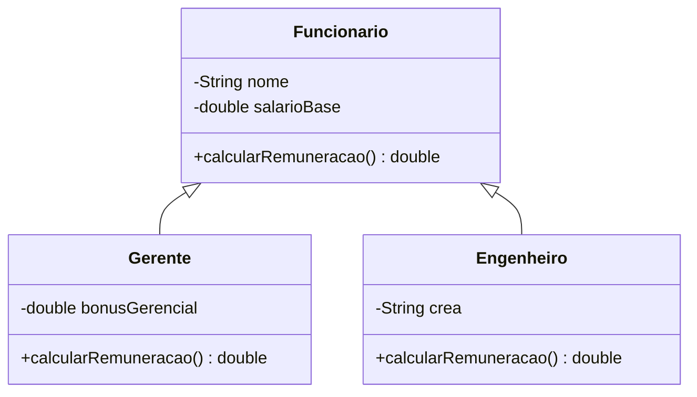

<div style="display: flex; justify-content: space-between; align-items: center; padding: 10px 16px; background: var(--light, #f8fafc); border: 1px solid var(--lightgray, #e2e8f0); border-radius: 10px; margin: 1.5rem 0;">
  <div>⬅️ <b><a href="/pt-br/resource/engenharia-de-computação/6-periodo/programacao-orientada-a-objetos-i/anotacoes/aula-03-relacionamentos-de-associacao-agregacao-e-composicao">Aula Anterior</a></b></div>
  <div>🏠 <b><a href="/pt-br/resource/engenharia-de-computação/6-periodo/programacao-orientada-a-objetos-i">Hub da Disciplina</a></b></div>
  <div>➡️ <b><a href="/pt-br/resource/engenharia-de-computação/6-periodo/programacao-orientada-a-objetos-i/anotacoes/aula-05-polimorfismo-dinamico-sobrescrita-de-metodos-e-late-binding">Próxima Aula</a></b></div>
</div>

> [!info] 📅 Informações da Aula
> - **Disciplina:** Programação Orientada a Objetos I (CSECBJI.45)
> - **Professor:** Sérgio / Bruno
> - **Data Realizada:** 23/09/2026
> - **Tópico Principal:** Herança, Reutilização de Código e o Princípio de Substituição
> - **Status:** Concluída e Revisada

> [!note] 📂 Material Complementar & Slides
> - 📄 **Slides Oficiais:** [[slide-04-programacao-orientada-a-objetos-i|Acessar Apresentação em PDF]]
> - 🎥 **Short Lecture / Gravação:** [[video-04-programacao-orientada-a-objetos-i|Assistir Síntese da Aula (Vídeo)]]

---

### 📑 Resumo das Seções
- [📌 1. Anotações do Quadro: Herança, Reutilização de Código e o Princípio de Substituição](#-anotações-do-quadro-herança,-reutilização-de-código-e-o-princípio-de-substituição)
- [🧮 2. Formulação & Exemplo Prático Resolvido](#-formulação--exemplo-prático-resolvido)
- [📊 3. Esquema Visual & Fluxograma (Mermaid)](#-esquema-visual--fluxograma-mermaid)
- [🧠 4. Resumo Pessoal & Macetes do Professor](#-resumo-pessoal--macetes-do-professor)
- [📝 5. Dúvidas & Exercícios Recomendados para Casa](#-dúvidas--exercícios-recomendados-para-casa)

---

## 📌 Anotações do Quadro: Herança, Reutilização de Código e o Princípio de Substituição

### 4.1 O Mecanismo de Herança em Java
A herança permite que uma subclasse (classe derivada/especializada) herde todos os atributos e métodos acessíveis de uma superclasse (classe base/generalizada) através da palavra-chave `extends`:
- Java suporta estritamente **Herança Simples de Classes** (uma classe pode herdar de apenas uma única superclasse direta), eliminando a ambiguidade do *Diamond Problem* do C++.
- Todas as classes em Java herdam implicitamente da classe raiz `java.lang.Object`.

### 4.2 Construtores e a Invocação com `super()`
- O construtor da subclasse DEVE invocar um construtor da superclasse na sua primeira linha através de `super(argumentos)`.
- Se omitido, o compilador insere uma chamada implícita a `super()` (construtor padrão sem argumentos).

### 4.3 O Princípio de Substituição de Liskov (LSP)
Se $S$ é uma subclasse de $T$, então objetos do tipo $T$ podem ser substituídos por objetos do tipo $S$ sem alterar a corretude do programa:
```java
Funcionario f = new Gerente("Carlos", 15000.0, "TI"); // Totalmente válido!
```

### 4.4 Modificador `final`
- Em métodos: Impede que o método seja sobrescrito por subclasses.
- Em classes: Impede que a classe seja herdada (ex: a classe `java.lang.String` é `public final class String`).

---

## 🧮 Formulação & Exemplo Prático Resolvido

### ✏️ Hierarquia de Classes: Funcionário e Gerente

```java
public class Funcionario {
    private String nome;
    private double salarioBase;

    public Funcionario(String nome, double salarioBase) {
        this.nome = nome;
        this.salarioBase = salarioBase;
    }

    public double calcularRemuneracao() {
        return this.salarioBase;
    }

    public String getNome() { return nome; }
}

public class Gerente extends Funcionario {
    private double bonusGerencial;

    public Gerente(String nome, double salarioBase, double bonus) {
        super(nome, salarioBase); // Invoca construtor da superclasse
        this.bonusGerencial = bonus;
    }

    @Override
    public double calcularRemuneracao() {
        // Reutiliza o cálculo da superclasse somando o bônus
        return super.calcularRemuneracao() + this.bonusGerencial;
    }
}
```

---

## 📊 Esquema Visual & Fluxograma (Mermaid)



---

## 🧠 Resumo Pessoal & Macetes do Professor

| Conceito-Chave | *Takeaway* do Professor | Dicas de Prova / Atenção |
| :--- | :--- | :--- |
| **Anotação @Override Obrigatória na Prática** | Sempre use `@Override` ao sobrescrever métodos. Ela instrui o compilador a verificar se o método realmente existe na superclasse, evitando erros sutis de digitação na assinatura. | Evita que você crie uma sobrecarga acidental em vez de sobrescrita. |
| **Protected vs Private** | Mantenha atributos `private` e forneça métodos de acesso `protected` ou `public` para que subclasses não violem o encapsulamento interno da classe base. | Aplicação prática direta |

---

## 📝 Dúvidas & Exercícios Recomendados para Casa

1. Crie uma hierarquia de contas bancárias com `ContaCorrente` (com taxa de manutenção) e `ContaPoupanca` (com rendimento mensal) herdando de `Conta`.
2. Demonstre o funcionamento do LSP criando uma lista de `Conta` que processe saques polimorficamente.

---

<div style="display: flex; justify-content: space-between; align-items: center; padding: 10px 16px; background: var(--light, #f8fafc); border: 1px solid var(--lightgray, #e2e8f0); border-radius: 10px; margin: 1.5rem 0;">
  <div>⬅️ <b><a href="/pt-br/resource/engenharia-de-computação/6-periodo/programacao-orientada-a-objetos-i/anotacoes/aula-03-relacionamentos-de-associacao-agregacao-e-composicao">Aula Anterior</a></b></div>
  <div>🏠 <b><a href="/pt-br/resource/engenharia-de-computação/6-periodo/programacao-orientada-a-objetos-i">Hub da Disciplina</a></b></div>
  <div>➡️ <b><a href="/pt-br/resource/engenharia-de-computação/6-periodo/programacao-orientada-a-objetos-i/anotacoes/aula-05-polimorfismo-dinamico-sobrescrita-de-metodos-e-late-binding">Próxima Aula</a></b></div>
</div>
