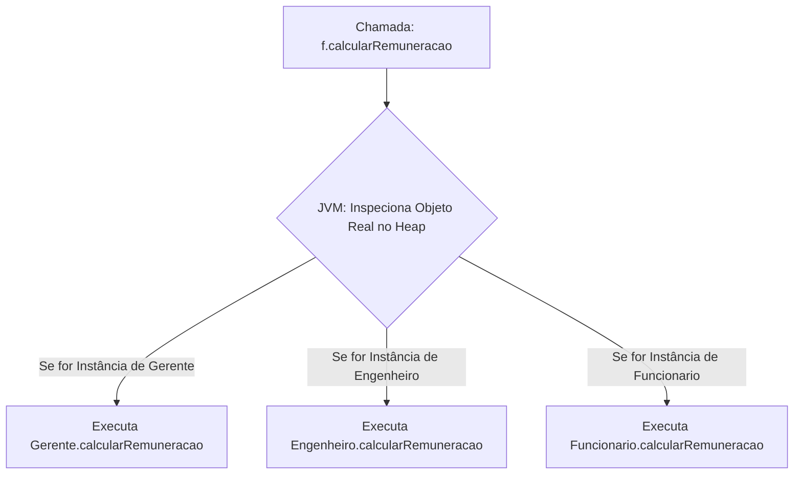

<div style="display: flex; justify-content: space-between; align-items: center; padding: 10px 16px; background: var(--light, #f8fafc); border: 1px solid var(--lightgray, #e2e8f0); border-radius: 10px; margin: 1.5rem 0;">
  <div>⬅️ <b><a href="/pt-br/resource/engenharia-de-computação/6-periodo/programacao-orientada-a-objetos-i/anotacoes/aula-04-heranca-reutilizacao-de-codigo-e-o-principio-de-substituicao">Aula Anterior</a></b></div>
  <div>🏠 <b><a href="/pt-br/resource/engenharia-de-computação/6-periodo/programacao-orientada-a-objetos-i">Hub da Disciplina</a></b></div>
  <div>➡️ <b><a href="/pt-br/resource/engenharia-de-computação/6-periodo/programacao-orientada-a-objetos-i/anotacoes/aula-06-classes-abstratas-e-interfaces-como-contratos-de-software">Próxima Aula</a></b></div>
</div>

> [!info] 📅 Informações da Aula
> - **Disciplina:** Programação Orientada a Objetos I (CSECBJI.45)
> - **Professor:** Sérgio / Bruno
> - **Data Realizada:** 30/09/2026
> - **Tópico Principal:** Polimorfismo Dinâmico, Sobrescrita de Métodos e Late Binding
> - **Status:** Concluída e Revisada

> [!note] 📂 Material Complementar & Slides
> - 📄 **Slides Oficiais:** [[slide-05-programacao-orientada-a-objetos-i|Acessar Apresentação em PDF]]
> - 🎥 **Short Lecture / Gravação:** [[video-05-programacao-orientada-a-objetos-i|Assistir Síntese da Aula (Vídeo)]]

---

### 📑 Resumo das Seções
- [📌 1. Anotações do Quadro: Polimorfismo Dinâmico, Sobrescrita de Métodos e Late Binding](#-anotações-do-quadro-polimorfismo-dinâmico,-sobrescrita-de-métodos-e-late-binding)
- [🧮 2. Formulação & Exemplo Prático Resolvido](#-formulação--exemplo-prático-resolvido)
- [📊 3. Esquema Visual & Fluxograma (Mermaid)](#-esquema-visual--fluxograma-mermaid)
- [🧠 4. Resumo Pessoal & Macetes do Professor](#-resumo-pessoal--macetes-do-professor)
- [📝 5. Dúvidas & Exercícios Recomendados para Casa](#-dúvidas--exercícios-recomendados-para-casa)

---

## 📌 Anotações do Quadro: Polimorfismo Dinâmico, Sobrescrita de Métodos e Late Binding

### 5.1 O Conceito de Polimorfismo Dinâmico
O **Polimorfismo** ("muitas formas") permite tratar objetos de diferentes subclasses através de uma referência comum da superclasse, delegando a execução do comportamento correto para o tipo real do objeto em tempo de execução.

### 5.2 Ligação Tardia (*Late Binding / Dynamic Dispatch*)
Em linguagens estáticas clássicas (como C), as chamadas de funções são resolvidas em tempo de compilação (*Early Binding*). Em Java, todos os métodos não-estáticos e não-finais utilizam **Ligação Tardia**:
- A JVM consulta a **Tabela de Métodos Virtuais (vtable)** do objeto real no Heap para determinar qual implementação sobrescrita deve ser executada.

### 5.3 Conversão de Tipos (*Casting*) e Verificação Segura
- **Upcasting (Promoção Implícita):** Tratar subclasse como superclasse (`Funcionario f = new Gerente(...)`). Sempre seguro e automático.
- **Downcasting (Conversão Explícita):** Tratar referência da superclasse como subclasse (`Gerente g = (Gerente) f`). Pode lançar `ClassCastException` se o objeto real não for daquele tipo.
- **Pattern Matching para `instanceof` (Java 16+):**
  ```java
  if (f instanceof Gerente g) {
      System.out.println("Bônus: " + g.getBonusGerencial()); // Já converte para 'g'!
  }
  ```

---

## 🧮 Formulação & Exemplo Prático Resolvido

### ✏️ Folha de Pagamento Polimórfica

```java
public class FolhaPagamento {
    public static double calcularTotal(List<Funcionario> funcionarios) {
        double total = 0.0;
        for (Funcionario f : funcionarios) {
            // Chamada polimórfica: a JVM invoca a versão exata de cada subclasse em runtime!
            total += f.calcularRemuneracao();
        }
        return total;
    }
}
```

Se adicionarmos 10 novos tipos de funcionários no futuro (Diretor, Estagiário, Terceirizado), a classe `FolhaPagamento` **não precisará de nenhuma alteração de código**! (Princípio Aberto/Fechado - OCP).

---

## 📊 Esquema Visual & Fluxograma (Mermaid)



---

## 🧠 Resumo Pessoal & Macetes do Professor

| Conceito-Chave | *Takeaway* do Professor | Dicas de Prova / Atenção |
| :--- | :--- | :--- |
| **Métodos Estáticos NÃO São Polimórficos** | Métodos `static` são vinculados à CLASSE em tempo de compilação (*Method Hiding*) e não ao objeto no Heap. Eles NÃO sofrem dynamic dispatch! | Sobrescrever método estático não produz polimorfismo. |
| **Atributos NÃO São Polimórficos** | Acesso direto a campos de atributos é resolvido pelo tipo da variável de referência e não pelo objeto real. | Aplicação prática direta |

---

## 📝 Dúvidas & Exercícios Recomendados para Casa

1. Crie uma hierarquia de figuras geométricas (`Figura` com subclasses `Circulo`, `Retangulo`, `Triangulo`) com método polimórfico `calcularArea()`.
2. Implemente uma função que receba uma lista de `Figura` e calcule a soma total das áreas de todas as formas.

---

<div style="display: flex; justify-content: space-between; align-items: center; padding: 10px 16px; background: var(--light, #f8fafc); border: 1px solid var(--lightgray, #e2e8f0); border-radius: 10px; margin: 1.5rem 0;">
  <div>⬅️ <b><a href="/pt-br/resource/engenharia-de-computação/6-periodo/programacao-orientada-a-objetos-i/anotacoes/aula-04-heranca-reutilizacao-de-codigo-e-o-principio-de-substituicao">Aula Anterior</a></b></div>
  <div>🏠 <b><a href="/pt-br/resource/engenharia-de-computação/6-periodo/programacao-orientada-a-objetos-i">Hub da Disciplina</a></b></div>
  <div>➡️ <b><a href="/pt-br/resource/engenharia-de-computação/6-periodo/programacao-orientada-a-objetos-i/anotacoes/aula-06-classes-abstratas-e-interfaces-como-contratos-de-software">Próxima Aula</a></b></div>
</div>
