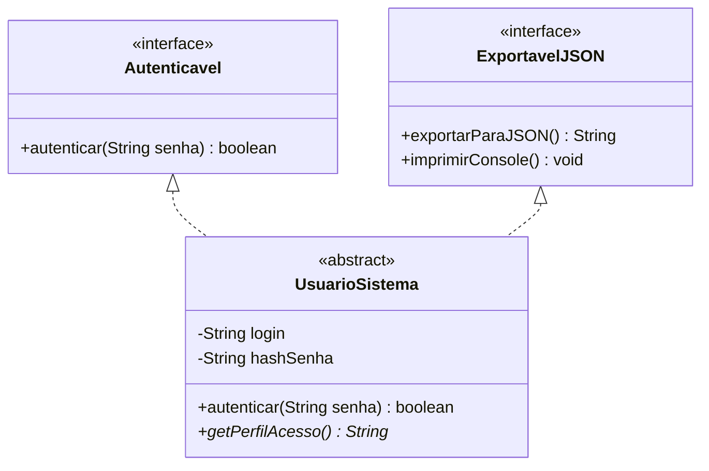

<div style="display: flex; justify-content: space-between; align-items: center; padding: 10px 16px; background: var(--light, #f8fafc); border: 1px solid var(--lightgray, #e2e8f0); border-radius: 10px; margin: 1.5rem 0;">
  <div>⬅️ <b><a href="/pt-br/resource/engenharia-de-computação/6-periodo/programacao-orientada-a-objetos-i/anotacoes/aula-05-polimorfismo-dinamico-sobrescrita-de-metodos-e-late-binding">Aula Anterior</a></b></div>
  <div>🏠 <b><a href="/pt-br/resource/engenharia-de-computação/6-periodo/programacao-orientada-a-objetos-i">Hub da Disciplina</a></b></div>
  <div>➡️ <b><a href="/pt-br/resource/engenharia-de-computação/6-periodo/programacao-orientada-a-objetos-i/anotacoes/aula-07-avaliacao-pratica-em-laboratorio-p1">Próxima Aula</a></b></div>
</div>

> [!info] 📅 Informações da Aula
> - **Disciplina:** Programação Orientada a Objetos I (CSECBJI.45)
> - **Professor:** Sérgio / Bruno
> - **Data Realizada:** 07/10/2026
> - **Tópico Principal:** Classes Abstratas e Interfaces como Contratos de Software
> - **Status:** Concluída e Revisada

> [!note] 📂 Material Complementar & Slides
> - 📄 **Slides Oficiais:** [[slide-06-programacao-orientada-a-objetos-i|Acessar Apresentação em PDF]]
> - 🎥 **Short Lecture / Gravação:** [[video-06-programacao-orientada-a-objetos-i|Assistir Síntese da Aula (Vídeo)]]

---

### 📑 Resumo das Seções
- [📌 1. Anotações do Quadro: Classes Abstratas e Interfaces como Contratos de Software](#-anotações-do-quadro-classes-abstratas-e-interfaces-como-contratos-de-software)
- [🧮 2. Formulação & Exemplo Prático Resolvido](#-formulação--exemplo-prático-resolvido)
- [📊 3. Esquema Visual & Fluxograma (Mermaid)](#-esquema-visual--fluxograma-mermaid)
- [🧠 4. Resumo Pessoal & Macetes do Professor](#-resumo-pessoal--macetes-do-professor)
- [📝 5. Dúvidas & Exercícios Recomendados para Casa](#-dúvidas--exercícios-recomendados-para-casa)

---

## 📌 Anotações do Quadro: Classes Abstratas e Interfaces como Contratos de Software

### 6.1 Classes Abstratas (`abstract class`)
Uma classe abstrata é uma classe que não pode ser instanciada diretamente com `new`, servindo exclusivamente como molde para subclasses:
- Pode conter **métodos abstratos** (apenas a assinatura, sem corpo/implementação) que forçam as subclasses concretas a fornecerem a implementação obrigatória.
- Pode conter atributos de instância normais, construtores e métodos concretos já implementados.

### 6.2 Interfaces (`interface`) como Contratos de Software
Uma interface define um **contrato puro de capacidades e comportamentos** que uma classe deve cumprir:
- Uma classe pode implementar **múltiplas interfaces** (`implements Autenticavel, Serializavel, Imprimivel`), contornando a restrição de herança simples de classes.
- Todos os métodos em uma interface tradicional são implicitamente `public abstract` e todos os atributos são `public static final` (constantes).

### 6.3 Recursos Modernos em Interfaces (Java 8+)
- **Métodos `default`:** Permitem fornecer uma implementação padrão na interface sem quebrar classes clientes legadas.
- **Métodos `static`:** Métodos utilitários de fábrica ou suporte vinculados à interface.

---

## 🧮 Formulação & Exemplo Prático Resolvido

### ✏️ Implementação de Sistema de Autenticação e Exportação

```java
public interface Autenticavel {
    boolean autenticar(String senha);
}

public interface ExportavelJSON {
    String exportarParaJSON();
    
    // Método default utilitário
    default void imprimirConsole() {
        System.out.println(exportarParaJSON());
    }
}

// Classe abstrata base
public abstract class UsuarioSistema implements Autenticavel, ExportavelJSON {
    private String login;
    private String hashSenha;

    public UsuarioSistema(String login, String senha) {
        this.login = login;
        this.hashSenha = gerarHash(senha);
    }

    @Override
    public boolean autenticar(String senhaInformada) {
        return this.hashSenha.equals(gerarHash(senhaInformada));
    }

    public abstract String getPerfilAcesso(); // Método abstrato obrigatório
    
    private String gerarHash(String s) { return "hash_" + s; }
}
```

---

## 📊 Esquema Visual & Fluxograma (Mermaid)



---

## 🧠 Resumo Pessoal & Macetes do Professor

| Conceito-Chave | *Takeaway* do Professor | Dicas de Prova / Atenção |
| :--- | :--- | :--- |
| **Classe Abstrata vs Interface: Quando Usar?** | Use **Classe Abstrata** quando houver forte relacionamento de identidade *É-UM* com compartilhamento de atributos e código de suporte comum; Use **Interface** para definir capacidades (*Capaz-De*, ex: `Comparable`, `AutoCloseable`, `Serializable`). | Pergunta favorita em entrevistas de emprego. |
| **Conflito de Métodos Default Múltiplos** | Se uma classe implementar duas interfaces com o mesmo método default, a classe DEVE sobrescrever o método para desambiguar a chamada. | Aplicação prática direta |

---

## 📝 Dúvidas & Exercícios Recomendados para Casa

1. Implemente a interface nativa do Java `Comparable<Funcionario>` para permitir ordenação de funcionários por salário.
2. Crie um repositório genérico utilizando uma interface `Repositorio<T>` com métodos `salvar(T obj)`, `buscarPorId(int id)` e `listarTodos()`.

---

<div style="display: flex; justify-content: space-between; align-items: center; padding: 10px 16px; background: var(--light, #f8fafc); border: 1px solid var(--lightgray, #e2e8f0); border-radius: 10px; margin: 1.5rem 0;">
  <div>⬅️ <b><a href="/pt-br/resource/engenharia-de-computação/6-periodo/programacao-orientada-a-objetos-i/anotacoes/aula-05-polimorfismo-dinamico-sobrescrita-de-metodos-e-late-binding">Aula Anterior</a></b></div>
  <div>🏠 <b><a href="/pt-br/resource/engenharia-de-computação/6-periodo/programacao-orientada-a-objetos-i">Hub da Disciplina</a></b></div>
  <div>➡️ <b><a href="/pt-br/resource/engenharia-de-computação/6-periodo/programacao-orientada-a-objetos-i/anotacoes/aula-07-avaliacao-pratica-em-laboratorio-p1">Próxima Aula</a></b></div>
</div>
