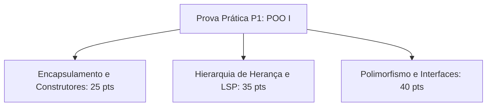

  
⬅️ <b><a href="/pt-br/resource/engenharia-de-computação/6-periodo/programacao-orientada-a-objetos-i/anotacoes/aula-06-classes-abstratas-e-interfaces-como-contratos-de-software">Aula Anterior</a></b>

  
🏠 <b><a href="/pt-br/resource/engenharia-de-computação/6-periodo/programacao-orientada-a-objetos-i">Hub da Disciplina</a></b>

  
➡️ <b><a href="/pt-br/resource/engenharia-de-computação/6-periodo/programacao-orientada-a-objetos-i/anotacoes/aula-08-tipos-genericos-generics-e-parametrizacao-de-classes">Próxima Aula</a></b>

> [!info] 📅 Informações da Aula
> - **Disciplina:** Programação Orientada a Objetos I (CSECBJI.45)
> - **Professor:** Sérgio / Bruno
> - **Data Realizada:** 14/10/2026
> - **Tópico Principal:** Avaliação Prática em Laboratório P1
> - **Status:** Concluída e Revisada

> [!note] 📂 Material Complementar & Slides
> - 📄 **Slides Oficiais:** [[slide-07-programacao-orientada-a-objetos-i|Acessar Apresentação em PDF]]
> - 🎥 **Short Lecture / Gravação:** [[video-07-programacao-orientada-a-objetos-i|Assistir Síntese da Aula (Vídeo)]]

---

### 📑 Resumo das Seções
- [📌 1. Anotações do Quadro: Avaliação Prática em Laboratório P1](#-anotações-do-quadro-avaliação-prática-em-laboratório-p1)
- [🧮 2. Formulação & Exemplo Prático Resolvido](#-formulação--exemplo-prático-resolvido)
- [📊 3. Esquema Visual & Fluxograma (Mermaid)](#-esquema-visual--fluxograma-mermaid)
- [🧠 4. Resumo Pessoal & Macetes do Professor](#-resumo-pessoal--macetes-do-professor)
- [📝 5. Dúvidas & Exercícios Recomendados para Casa](#-dúvidas--exercícios-recomendados-para-casa)

---

## 📌 Anotações do Quadro: Avaliação Prática em Laboratório P1

### 7.1 Síntese Conceitual para Avaliação Parcial P1
Revisão integrada dos fundamentos de Programação Orientada a Objetos:
1. **Ambiente e Tipos:** Stack vs Heap, tipos primitivos vs referências, ciclo de vida de objetos.
2. **Encapsulamento:** Modificadores de acesso, getters/setters robustos e sobrecarga de construtores.
3. **Relacionamentos:** Associação, Agregação (fraca) e Composição (forte).
4. **Herança:** Reutilização, `super()`, modificador `final` e Princípio de Substituição de Liskov.
5. **Polimorfismo:** Ligação tardia (*Dynamic Dispatch*), sobrescrita de métodos e testes com `instanceof`.
6. **Contratos:** Classes Abstratas e Interfaces múltiplas.

---

## 🧮 Formulação & Exemplo Prático Resolvido

### ✏️ Estudo de Caso de Prova: Sistema de E-Commerce

**Requisitos da Avaliação:**
- Implementar uma classe abstrata `Produto` com subclasses `Livro` e `Eletronico`.
- Implementar a interface `Tributavel` com método `calcularImposto()`.
- Criar a classe `CarrinhoCompras` que armazene uma lista de `Produto` e calcule o total da compra e total de impostos de forma puramente polimórfica.
- Proteger todas as variáveis contra estados negativos ou nulos através de exceções.

---

## 📊 Esquema Visual & Fluxograma (Mermaid)

---

## 🧠 Resumo Pessoal & Macetes do Professor

| Conceito-Chave | *Takeaway* do Professor | Dicas de Prova / Atenção |
| :--- | :--- | :--- |
| **Checklist de Código em Prova** | 1. Todos os atributos estão `private`? 2. Usou `@Override` em todos os métodos sobrescritos? 3. Validou parâmetros no construtor? 4. Usou polimorfismo em vez de longos blocos `if/else`? | Garante nota máxima na avaliação. |
| **Clean Code** | Nomes de variáveis significativos e métodos pequenos e coesos. | Aplicação prática direta |

---

## 📝 Dúvidas & Exercícios Recomendados para Casa

1. Revise todos os exercícios práticos das listas 1 a 6.
2. Implemente o sistema de E-Commerce completo no Eclipse/IntelliJ e crie testes unitários com método `main`.

---

  
⬅️ <b><a href="/pt-br/resource/engenharia-de-computação/6-periodo/programacao-orientada-a-objetos-i/anotacoes/aula-06-classes-abstratas-e-interfaces-como-contratos-de-software">Aula Anterior</a></b>

  
🏠 <b><a href="/pt-br/resource/engenharia-de-computação/6-periodo/programacao-orientada-a-objetos-i">Hub da Disciplina</a></b>

  
➡️ <b><a href="/pt-br/resource/engenharia-de-computação/6-periodo/programacao-orientada-a-objetos-i/anotacoes/aula-08-tipos-genericos-generics-e-parametrizacao-de-classes">Próxima Aula</a></b>

