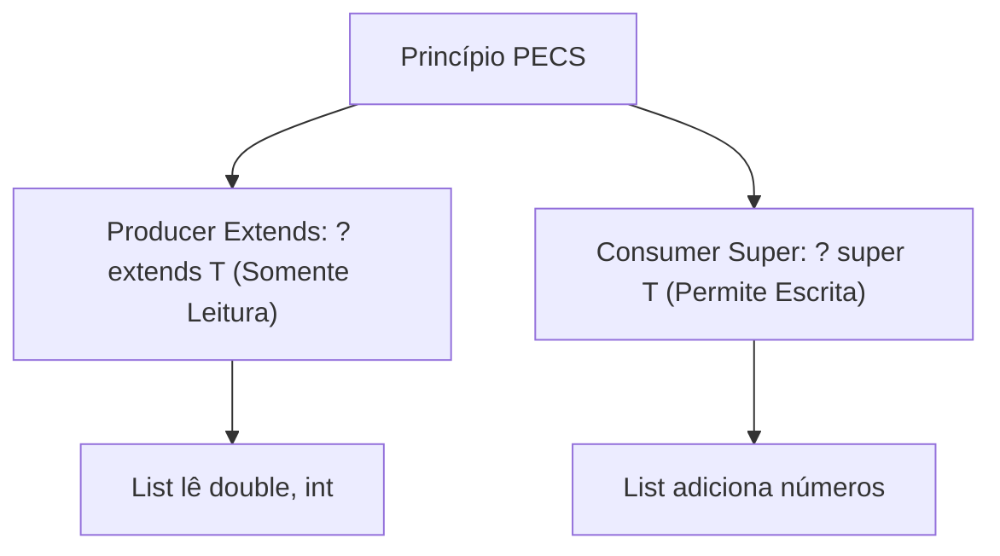

<div style="display: flex; justify-content: space-between; align-items: center; padding: 10px 16px; background: var(--light, #f8fafc); border: 1px solid var(--lightgray, #e2e8f0); border-radius: 10px; margin: 1.5rem 0;">
  <div>⬅️ <b><a href="/pt-br/resource/engenharia-de-computação/6-periodo/programacao-orientada-a-objetos-i/anotacoes/aula-07-avaliacao-pratica-em-laboratorio-p1">Aula Anterior</a></b></div>
  <div>🏠 <b><a href="/pt-br/resource/engenharia-de-computação/6-periodo/programacao-orientada-a-objetos-i">Hub da Disciplina</a></b></div>
  <div>➡️ <b><a href="/pt-br/resource/engenharia-de-computação/6-periodo/programacao-orientada-a-objetos-i/anotacoes/aula-09-tratamento-robusto-de-excecoes">Próxima Aula</a></b></div>
</div>

> [!info] 📅 Informações da Aula
> - **Disciplina:** Programação Orientada a Objetos I (CSECBJI.45)
> - **Professor:** Sérgio / Bruno
> - **Data Realizada:** 21/10/2026
> - **Tópico Principal:** Tipos Genéricos (Generics) e Parametrização de Classes
> - **Status:** Concluída e Revisada

> [!note] 📂 Material Complementar & Slides
> - 📄 **Slides Oficiais:** [[slide-08-programacao-orientada-a-objetos-i|Acessar Apresentação em PDF]]
> - 🎥 **Short Lecture / Gravação:** [[video-08-programacao-orientada-a-objetos-i|Assistir Síntese da Aula (Vídeo)]]

---

### 📑 Resumo das Seções
- [📌 1. Anotações do Quadro: Tipos Genéricos (Generics) e Parametrização de Classes](#-anotações-do-quadro-tipos-genéricos-generics-e-parametrização-de-classes)
- [🧮 2. Formulação & Exemplo Prático Resolvido](#-formulação--exemplo-prático-resolvido)
- [📊 3. Esquema Visual & Fluxograma (Mermaid)](#-esquema-visual--fluxograma-mermaid)
- [🧠 4. Resumo Pessoal & Macetes do Professor](#-resumo-pessoal--macetes-do-professor)
- [📝 5. Dúvidas & Exercícios Recomendados para Casa](#-dúvidas--exercícios-recomendados-para-casa)

---

## 📌 Anotações do Quadro: Tipos Genéricos (Generics) e Parametrização de Classes

### 8.1 Por que Tipos Genéricos (*Generics*)?
Antes do Java 5, coleções armazenavam referências genéricas do tipo `Object`, exigindo conversões explícitas (*Casting*) manuais e causando erros fatais de `ClassCastException` em tempo de execução.
- **Generics:** Permitem parametrizar classes, interfaces e métodos com tipos formais (`<T, E, K, V>`), garantindo **Type Safety em tempo de compilação**.

### 8.2 Apagamento de Tipos (*Type Erasure*)
Para manter compatibilidade retroativa com código legado, o compilador Java substitui todos os parâmetros genéricos pelo seu limite (*bound*, geralmente `Object`) no Bytecode final e insere os casts adequados automaticamente.
- *Consequência:* Não é possível instanciar arrays genéricos (`new T[10]`) nem verificar tipos genéricos em runtime (`instanceof List<String>`).

### 8.3 Curingas (*Wildcards*) e o Princípio PECS
- `List<?>`: Lista de tipo desconhecido (somente leitura).
- `List<? extends T>`: Limite superior (*Upper Bound* - covariância). Aceita $T$ ou qualquer subclasse.
- `List<? super T>`: Limite inferior (*Lower Bound* - contravariância). Aceita $T$ ou qualquer superclasse.
- **Regra Mnemônica PECS (*Producer Extends, Consumer Super*):**
  - Se a coleção **produz** dados para leitura, use `? extends T`.
  - Se a coleção **consome** dados para escrita, use `? super T`.

---

## 🧮 Formulação & Exemplo Prático Resolvido

### ✏️ Implementação de uma Estrutura de Pilha Genérica `<T>`

```java
public class PilhaGenerica<T> {
    private final List<T> elementos = new ArrayList<>();

    public void push(T elemento) {
        if (elemento == null) throw new IllegalArgumentException("Elemento nulo!");
        elementos.add(elemento);
    }

    public T pop() {
        if (isEmpty()) throw new IllegalStateException("Pilha vazia!");
        return elementos.remove(elementos.size() - 1);
    }

    public boolean isEmpty() { return elementos.isEmpty(); }
    public int tamanho() { return elementos.size(); }
    
    // Método genérico com Wildcard PECS para copiar de outra coleção produtora
    public void pushTodos(Iterable<? extends T> fonte) {
        for (T item : fonte) {
            push(item);
        }
    }
}
```

---

## 📊 Esquema Visual & Fluxograma (Mermaid)



---

## 🧠 Resumo Pessoal & Macetes do Professor

| Conceito-Chave | *Takeaway* do Professor | Dicas de Prova / Atenção |
| :--- | :--- | :--- |
| **PECS Simplificado** | Use `extends` quando você estiver tirando itens da lista; use `super` quando você estiver inserindo itens na lista. | A regra definitiva de Generics em Java. |
| **Tipos Primitivos em Generics** | Generics não aceitam tipos primitivos (`List<int>` é inválido). Use as classes empacotadoras (*Wrapper Classes*): `List<Integer>`, `List<Double>`. | Aplicação prática direta |

---

## 📝 Dúvidas & Exercícios Recomendados para Casa

1. Escreva um método genérico estático `<T> void trocar(T[] array, int i, int j)` que troque dois elementos de posição em qualquer array.
2. Implemente uma classe `Par<F, S>` que armazene dois objetos de tipos genéricos diferentes.

---

<div style="display: flex; justify-content: space-between; align-items: center; padding: 10px 16px; background: var(--light, #f8fafc); border: 1px solid var(--lightgray, #e2e8f0); border-radius: 10px; margin: 1.5rem 0;">
  <div>⬅️ <b><a href="/pt-br/resource/engenharia-de-computação/6-periodo/programacao-orientada-a-objetos-i/anotacoes/aula-07-avaliacao-pratica-em-laboratorio-p1">Aula Anterior</a></b></div>
  <div>🏠 <b><a href="/pt-br/resource/engenharia-de-computação/6-periodo/programacao-orientada-a-objetos-i">Hub da Disciplina</a></b></div>
  <div>➡️ <b><a href="/pt-br/resource/engenharia-de-computação/6-periodo/programacao-orientada-a-objetos-i/anotacoes/aula-09-tratamento-robusto-de-excecoes">Próxima Aula</a></b></div>
</div>
