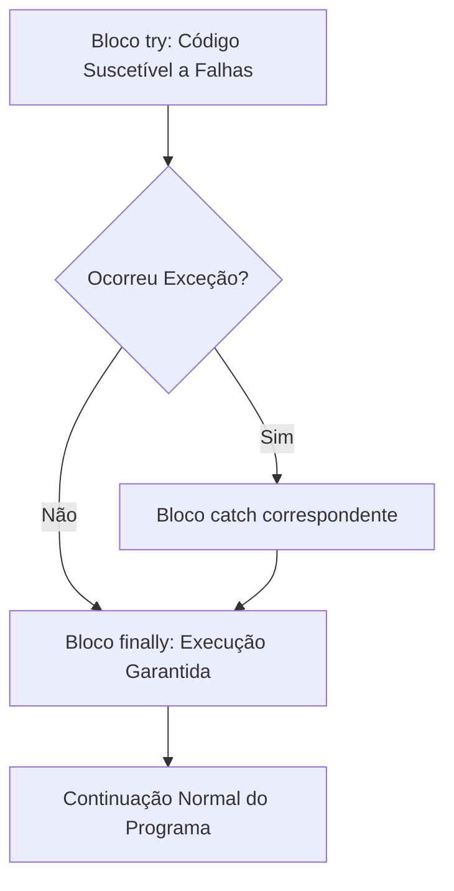

<div style="display: flex; justify-content: space-between; align-items: center; padding: 10px 16px; background: var(--light, #f8fafc); border: 1px solid var(--lightgray, #e2e8f0); border-radius: 10px; margin: 1.5rem 0;">
  <div>⬅️ <b><a href="/pt-br/resource/engenharia-de-computação/6-periodo/programacao-orientada-a-objetos-i/anotacoes/aula-08-tipos-genericos-generics-e-parametrizacao-de-classes">Aula Anterior</a></b></div>
  <div>🏠 <b><a href="/pt-br/resource/engenharia-de-computação/6-periodo/programacao-orientada-a-objetos-i">Hub da Disciplina</a></b></div>
  <div>➡️ <b><a href="/pt-br/resource/engenharia-de-computação/6-periodo/programacao-orientada-a-objetos-i/anotacoes/aula-10-o-java-collections-framework-listas-e-conjuntos">Próxima Aula</a></b></div>
</div>

> [!info] 📅 Informações da Aula
> - **Disciplina:** Programação Orientada a Objetos I (CSECBJI.45)
> - **Professor:** Sérgio / Bruno
> - **Data Realizada:** 28/10/2026
> - **Tópico Principal:** Tratamento Robusto de Exceções
> - **Status:** Concluída e Revisada

> [!note] 📂 Material Complementar & Slides
> - 📄 **Slides Oficiais:** [[slide-09-programacao-orientada-a-objetos-i|Acessar Apresentação em PDF]]
> - 🎥 **Short Lecture / Gravação:** [[video-09-programacao-orientada-a-objetos-i|Assistir Síntese da Aula (Vídeo)]]

---

### 📑 Resumo das Seções
- [📌 1. Anotações do Quadro: Tratamento Robusto de Exceções](#-anotações-do-quadro-tratamento-robusto-de-exceções)
- [🧮 2. Formulação & Exemplo Prático Resolvido](#-formulação--exemplo-prático-resolvido)
- [📊 3. Esquema Visual & Fluxograma (Mermaid)](#-esquema-visual--fluxograma-mermaid)
- [🧠 4. Resumo Pessoal & Macetes do Professor](#-resumo-pessoal--macetes-do-professor)
- [📝 5. Dúvidas & Exercícios Recomendados para Casa](#-dúvidas--exercícios-recomendados-para-casa)

---

## 📌 Anotações do Quadro: Tratamento Robusto de Exceções

### 9.1 Hierarquia de Exceções em Java
Em Java, todas as condições de erro são representadas por objetos derivados da classe raiz `java.lang.Throwable`:
```text
                     Throwable
                    /         \
              Exception        Error (Falhas irrecuperáveis da JVM: OutOfMemory, StackOverflow)
             /         \
    RuntimeException    Exceções Checadas (Checked: IOException, SQLException)
    (Unchecked)
```

- **Exceções Checadas (*Checked Exceptions*):** Subclasses diretas de `Exception`. O compilador **obriga** o desenvolvedor a tratá-las explicitamente com `try-catch` ou declarar o repasse na assinatura com `throws`. Representam condições externas recuperáveis.
- **Exceções Não-Checadas (*Unchecked Exceptions*):** Subclasses de `RuntimeException` (ex: `NullPointerException`, `IllegalArgumentException`, `IndexOutOfBoundsException`). Representam erros lógicos de programação.

### 9.2 O Bloco `try-with-resources` e `AutoCloseable`
Introduzido no Java 7 para garantir o fechamento automático e seguro de recursos que consomem descritores de sistema (arquivos, sockets, conexões de banco):
```java
try (BufferedReader br = new BufferedReader(new FileReader("dados.txt"))) {
    String linha = br.readLine();
} // br.close() é invocado automaticamente aqui, mesmo em caso de erro!
```

---

## 🧮 Formulação & Exemplo Prático Resolvido

### ✏️ Criação e Tratamento de Exceções Customizadas de Negócio

```java
// Exceção de domínio checada
public class SaldoInsuficienteException extends Exception {
    private final double saldoAtual;
    private final double valorTentativa;

    public SaldoInsuficienteException(String msg, double saldoAtual, double valorTentativa) {
        super(msg);
        this.saldoAtual = saldoAtual;
        this.valorTentativa = valorTentativa;
    }

    public double getSaldoAtual() { return saldoAtual; }
    public double getValorTentativa() { return valorTentativa; }
}

public class Conta {
    private double saldo;

    public void sacar(double valor) throws SaldoInsuficienteException {
        if (valor > this.saldo) {
            throw new SaldoInsuficienteException("Saldo insuficiente!", this.saldo, valor);
        }
        this.saldo -= valor;
    }
}
```

---

## 📊 Esquema Visual & Fluxograma (Mermaid)



---

## 🧠 Resumo Pessoal & Macetes do Professor

| Conceito-Chave | *Takeaway* do Professor | Dicas de Prova / Atenção |
| :--- | :--- | :--- |
| **Nunca Capture `Exception` ou `Throwable` de Forma Genérica** | Capturar `catch (Exception e) {}` silenciosamente mascara bugs graves e impede a detecção de erros. | Capture sempre a exceção específica esperada e registre o log de erro. |
| **Ordem dos Blocos Catch** | Subclasses de exceções mais específicas devem vir ANTES de exceções mais genéricas na lista de blocos catch. | Aplicação prática direta |

---

## 📝 Dúvidas & Exercícios Recomendados para Casa

1. Escreva um programa que leia um arquivo de texto usando `try-with-resources` e trate especificamente as exceções `FileNotFoundException` e `IOException`.
2. Diferencie conceitualmente quando utilizar uma Checked Exception e quando utilizar uma Unchecked Exception.

---

<div style="display: flex; justify-content: space-between; align-items: center; padding: 10px 16px; background: var(--light, #f8fafc); border: 1px solid var(--lightgray, #e2e8f0); border-radius: 10px; margin: 1.5rem 0;">
  <div>⬅️ <b><a href="/pt-br/resource/engenharia-de-computação/6-periodo/programacao-orientada-a-objetos-i/anotacoes/aula-08-tipos-genericos-generics-e-parametrizacao-de-classes">Aula Anterior</a></b></div>
  <div>🏠 <b><a href="/pt-br/resource/engenharia-de-computação/6-periodo/programacao-orientada-a-objetos-i">Hub da Disciplina</a></b></div>
  <div>➡️ <b><a href="/pt-br/resource/engenharia-de-computação/6-periodo/programacao-orientada-a-objetos-i/anotacoes/aula-10-o-java-collections-framework-listas-e-conjuntos">Próxima Aula</a></b></div>
</div>
