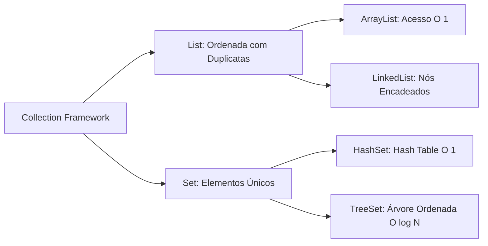

<div style="display: flex; justify-content: space-between; align-items: center; padding: 10px 16px; background: var(--light, #f8fafc); border: 1px solid var(--lightgray, #e2e8f0); border-radius: 10px; margin: 1.5rem 0;">
  <div>⬅️ <b><a href="/pt-br/resource/engenharia-de-computação/6-periodo/programacao-orientada-a-objetos-i/anotacoes/aula-09-tratamento-robusto-de-excecoes">Aula Anterior</a></b></div>
  <div>🏠 <b><a href="/pt-br/resource/engenharia-de-computação/6-periodo/programacao-orientada-a-objetos-i">Hub da Disciplina</a></b></div>
  <div>➡️ <b><a href="/pt-br/resource/engenharia-de-computação/6-periodo/programacao-orientada-a-objetos-i/anotacoes/aula-11-mapas-e-tabelas-de-dispersao">Próxima Aula</a></b></div>
</div>

> [!info] 📅 Informações da Aula
> - **Disciplina:** Programação Orientada a Objetos I (CSECBJI.45)
> - **Professor:** Sérgio / Bruno
> - **Data Realizada:** 04/11/2026
> - **Tópico Principal:** O Java Collections Framework: Listas e Conjuntos
> - **Status:** Concluída e Revisada

> [!note] 📂 Material Complementar & Slides
> - 📄 **Slides Oficiais:** [[slide-10-programacao-orientada-a-objetos-i|Acessar Apresentação em PDF]]
> - 🎥 **Short Lecture / Gravação:** [[video-10-programacao-orientada-a-objetos-i|Assistir Síntese da Aula (Vídeo)]]

---

### 📑 Resumo das Seções
- [📌 1. Anotações do Quadro: O Java Collections Framework: Listas e Conjuntos](#-anotações-do-quadro-o-java-collections-framework-listas-e-conjuntos)
- [🧮 2. Formulação & Exemplo Prático Resolvido](#-formulação--exemplo-prático-resolvido)
- [📊 3. Esquema Visual & Fluxograma (Mermaid)](#-esquema-visual--fluxograma-mermaid)
- [🧠 4. Resumo Pessoal & Macetes do Professor](#-resumo-pessoal--macetes-do-professor)
- [📝 5. Dúvidas & Exercícios Recomendados para Casa](#-dúvidas--exercícios-recomendados-para-casa)

---

## 📌 Anotações do Quadro: O Java Collections Framework: Listas e Conjuntos

### 10.1 Arquitetura do Java Collections Framework (JCF)
O JCF padroniza estruturas de dados fundamentais através de interfaces genéricas:
```text
                 Iterable<E>
                     │
               Collection<E>
              /             \
          List<E>          Set<E>
          /     \         /      \
  ArrayList  LinkedList HashSet TreeSet
```

### 10.2 Listas: `ArrayList` vs `LinkedList`
- **`ArrayList<E>`:** Baseada em um array dinâmico redimensionável.
  - Acesso aleatório por índice (`get(i)`): $O(1)$ constante ultrarrápido.
  - Inserção/Remoção no final: $O(1)$ amortizado. Inserção no meio/início: $O(N)$ (deslocamento de memória).
  - Estrutura preferida para $95\%$ dos casos de uso.
- **`LinkedList<E>`:** Baseada em lista duplamente encadeada.
  - Acesso por índice: $O(N)$ lento. Inserção/Remoção conhecendo o nó: $O(1)$.

### 10.3 Conjuntos (`Set<E>`): Não Permitem Elementos Duplicados
- **`HashSet<E>`:** Baseado em Tabela Hash. Busca, inserção e remoção em $O(1)$ médio. Não garante nenhuma ordem de iteração.
  - **Requisito Obrigatório:** A classe dos elementos DEVE sobrescrever coerentemente `hashCode()` e `equals()`!
- **`TreeSet<E>`:** Baseado em Árvore Rubro-Negra balanceada. Mantém os elementos **rigorosamente ordenados** em tempo $O(\log N)$. Exige que a classe implemente `Comparable<E>` ou receba um `Comparator`.

---

## 🧮 Formulação & Exemplo Prático Resolvido

### ✏️ O Contrato Fundamental entre `equals()` e `hashCode()`

Se dois objetos são iguais pelo método `equals()`, eles **DEVEM obrigatoriamente retornar o mesmo valor numérico no `hashCode()`**:

```java
public class Aluno implements Comparable<Aluno> {
    private String matricula;
    private String nome;
    private double cra;

    @Override
    public boolean equals(Object o) {
        if (this == o) return true;
        if (o == null || getClass() != o.getClass()) return false;
        Aluno aluno = (Aluno) o;
        return Objects.equals(matricula, aluno.matricula);
    }

    @Override
    public int hashCode() {
        return Objects.hash(matricula);
    }

    @Override
    public int compareTo(Aluno outro) {
        // Ordenação natural por nome alfabético
        return this.nome.compareToIgnoreCase(outro.nome);
    }
}
```

---

## 📊 Esquema Visual & Fluxograma (Mermaid)



---

## 🧠 Resumo Pessoal & Macetes do Professor

| Conceito-Chave | *Takeaway* do Professor | Dicas de Prova / Atenção |
| :--- | :--- | :--- |
| **Se Sobrescrever `equals`, Sobrescreva `hashCode`!** | Se você sobrescrever apenas `equals` e esquecer `hashCode`, o objeto será duplicado dentro de um `HashSet` e não será encontrado em um `HashMap`! | Um dos bugs mais clássicos de Java. |
| **Comparable vs Comparator** | `Comparable` define a ordem *natural* única da própria classe (`compareTo`); `Comparator` permite criar múltiplas ordens de classificação externas personalizadas. | Aplicação prática direta |

---

## 📝 Dúvidas & Exercícios Recomendados para Casa

1. Implemente um programa que leia 1000 números aleatórios e utilize um `Set` para remover duplicatas e exibi-los em ordem crescente.
2. Compare o tempo de execução de 100.000 buscas em um `ArrayList` versus um `HashSet`.

---

<div style="display: flex; justify-content: space-between; align-items: center; padding: 10px 16px; background: var(--light, #f8fafc); border: 1px solid var(--lightgray, #e2e8f0); border-radius: 10px; margin: 1.5rem 0;">
  <div>⬅️ <b><a href="/pt-br/resource/engenharia-de-computação/6-periodo/programacao-orientada-a-objetos-i/anotacoes/aula-09-tratamento-robusto-de-excecoes">Aula Anterior</a></b></div>
  <div>🏠 <b><a href="/pt-br/resource/engenharia-de-computação/6-periodo/programacao-orientada-a-objetos-i">Hub da Disciplina</a></b></div>
  <div>➡️ <b><a href="/pt-br/resource/engenharia-de-computação/6-periodo/programacao-orientada-a-objetos-i/anotacoes/aula-11-mapas-e-tabelas-de-dispersao">Próxima Aula</a></b></div>
</div>
