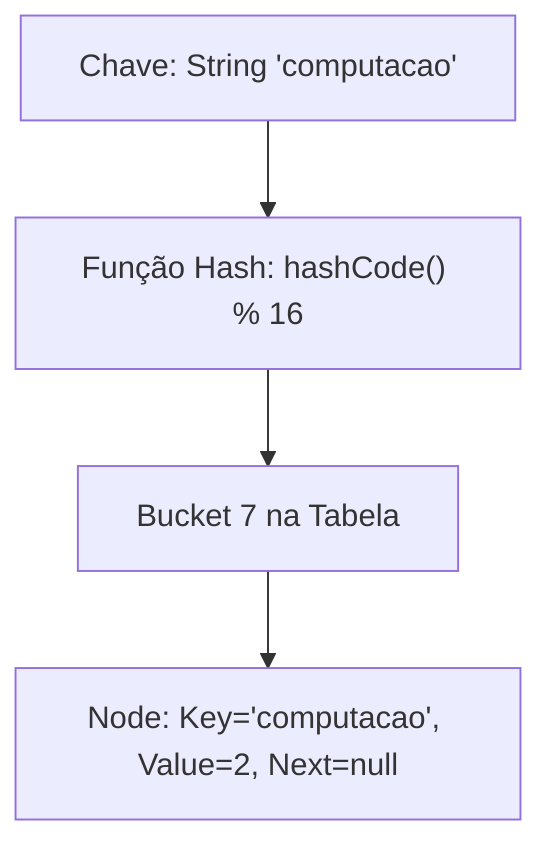

<div style="display: flex; justify-content: space-between; align-items: center; padding: 10px 16px; background: var(--light, #f8fafc); border: 1px solid var(--lightgray, #e2e8f0); border-radius: 10px; margin: 1.5rem 0;">
  <div>⬅️ <b><a href="/pt-br/resource/engenharia-de-computação/6-periodo/programacao-orientada-a-objetos-i/anotacoes/aula-10-o-java-collections-framework-listas-e-conjuntos">Aula Anterior</a></b></div>
  <div>🏠 <b><a href="/pt-br/resource/engenharia-de-computação/6-periodo/programacao-orientada-a-objetos-i">Hub da Disciplina</a></b></div>
  <div>➡️ <b><a href="/pt-br/resource/engenharia-de-computação/6-periodo/programacao-orientada-a-objetos-i/anotacoes/aula-12-fluxos-de-entrada-e-saida-i-o-e-serializacao-de-objetos">Próxima Aula</a></b></div>
</div>

> [!info] 📅 Informações da Aula
> - **Disciplina:** Programação Orientada a Objetos I (CSECBJI.45)
> - **Professor:** Sérgio / Bruno
> - **Data Realizada:** 11/11/2026
> - **Tópico Principal:** Mapas e Tabelas de Dispersão
> - **Status:** Concluída e Revisada

> [!note] 📂 Material Complementar & Slides
> - 📄 **Slides Oficiais:** [[slide-11-programacao-orientada-a-objetos-i|Acessar Apresentação em PDF]]
> - 🎥 **Short Lecture / Gravação:** [[video-11-programacao-orientada-a-objetos-i|Assistir Síntese da Aula (Vídeo)]]

---

### 📑 Resumo das Seções
- [📌 1. Anotações do Quadro: Mapas e Tabelas de Dispersão](#-anotações-do-quadro-mapas-e-tabelas-de-dispersão)
- [🧮 2. Formulação & Exemplo Prático Resolvido](#-formulação--exemplo-prático-resolvido)
- [📊 3. Esquema Visual & Fluxograma (Mermaid)](#-esquema-visual--fluxograma-mermaid)
- [🧠 4. Resumo Pessoal & Macetes do Professor](#-resumo-pessoal--macetes-do-professor)
- [📝 5. Dúvidas & Exercícios Recomendados para Casa](#-dúvidas--exercícios-recomendados-para-casa)

---

## 📌 Anotações do Quadro: Mapas e Tabelas de Dispersão

### 11.1 A Interface `Map<K, V>`
Um **Map** armazena associações chave-valor (*Key-Value Pairs*), onde cada chave única mapeia para exatamente um valor.
- Não herda da interface `Collection`, mas é parte integral do JCF.

### 11.2 Implementações Principais de Map
1. **`HashMap<K, V>`:**
   - Implementado internamente como um array de buckets com encadeamento de nós.
   - Operações `put(k, v)`, `get(k)`, `containsKey(k)` em tempo $O(1)$ médio.
   - Desde o Java 8, se um bucket sofrer muitas colisões ($> 8$ elementos), o bucket converte a lista encadeada em uma **Árvore Rubro-Negra (*Treeify*)**, garantindo desempenho $O(\log N)$ no pior caso.
2. **`TreeMap<K, V>`:**
   - Mantém as chaves ordenadas via árvore balanceada em tempo $O(\log N)$.
3. **`LinkedHashMap<K, V>`:**
   - Mantém a ordem de inserção original das chaves através de uma lista encadeada dupla adicional.

---

## 🧮 Formulação & Exemplo Prático Resolvido

### ✏️ Processamento e Contagem de Frequência de Palavras com Map

```java
public class ContadorPalavras {
    public static Map<String, Integer> contarFrequencias(String texto) {
        Map<String, Integer> mapaFrequencia = new HashMap<>();
        String[] palavras = texto.toLowerCase().split("\\W+");

        for (String p : palavras) {
            if (!p.isEmpty()) {
                // Java 8: getOrDefault simplifica o incremento atômico
                mapaFrequencia.put(p, mapaFrequencia.getOrDefault(p, 0) + 1);
            }
        }
        return mapaFrequencia;
    }

    public static void main(String[] args) {
        String texto = "Engenharia de Computação é incrível. Computação é o futuro da Engenharia!";
        Map<String, Integer> contagem = contarFrequencias(texto);

        // Iteração eficiente sobre o entrySet
        for (Map.Entry<String, Integer> entrada : contagem.entrySet()) {
            System.out.printf("Palavra '%s': %d ocorrência(s)\n", entrada.getKey(), entrada.getValue());
        }
    }
}
```

---

## 📊 Esquema Visual & Fluxograma (Mermaid)



---

## 🧠 Resumo Pessoal & Macetes do Professor

| Conceito-Chave | *Takeaway* do Professor | Dicas de Prova / Atenção |
| :--- | :--- | :--- |
| **Iteração Eficiente com `entrySet()`** | Nunca itere sobre `keySet()` fazendo `map.get(key)` a cada laço (custo $2 	imes$ maior). Use sempre `for (Map.Entry<K, V> e : map.entrySet())` para acessar chave e valor juntos em um único passo. | Dica profissional de desempenho. |
| **Chaves Imutáveis** | Sempre utilize objetos imutáveis (como `String` ou `Integer`) como chaves de um `HashMap`. Se a chave mudar de estado após a inserção, seu hash mudará e o objeto ficará perdido na tabela! | Aplicação prática direta |

---

## 📝 Dúvidas & Exercícios Recomendados para Casa

1. Implemente um sistema de cache simples utilizando `LinkedHashMap` configurado com política de remoção LRU (*Least Recently Used*).
2. Crie um dicionário bilíngue Português-Inglês que permita mapear uma palavra para múltiplos significados (`Map<String, Set<String>>`).

---

<div style="display: flex; justify-content: space-between; align-items: center; padding: 10px 16px; background: var(--light, #f8fafc); border: 1px solid var(--lightgray, #e2e8f0); border-radius: 10px; margin: 1.5rem 0;">
  <div>⬅️ <b><a href="/pt-br/resource/engenharia-de-computação/6-periodo/programacao-orientada-a-objetos-i/anotacoes/aula-10-o-java-collections-framework-listas-e-conjuntos">Aula Anterior</a></b></div>
  <div>🏠 <b><a href="/pt-br/resource/engenharia-de-computação/6-periodo/programacao-orientada-a-objetos-i">Hub da Disciplina</a></b></div>
  <div>➡️ <b><a href="/pt-br/resource/engenharia-de-computação/6-periodo/programacao-orientada-a-objetos-i/anotacoes/aula-12-fluxos-de-entrada-e-saida-i-o-e-serializacao-de-objetos">Próxima Aula</a></b></div>
</div>
