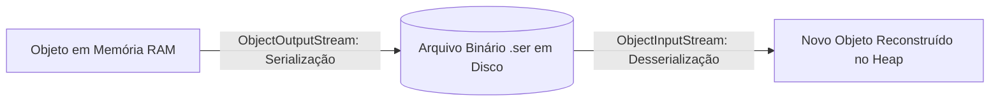

<div style="display: flex; justify-content: space-between; align-items: center; padding: 10px 16px; background: var(--light, #f8fafc); border: 1px solid var(--lightgray, #e2e8f0); border-radius: 10px; margin: 1.5rem 0;">
  <div>⬅️ <b><a href="/pt-br/resource/engenharia-de-computação/6-periodo/programacao-orientada-a-objetos-i/anotacoes/aula-11-mapas-e-tabelas-de-dispersao">Aula Anterior</a></b></div>
  <div>🏠 <b><a href="/pt-br/resource/engenharia-de-computação/6-periodo/programacao-orientada-a-objetos-i">Hub da Disciplina</a></b></div>
  <div>➡️ <b><a href="/pt-br/resource/engenharia-de-computação/6-periodo/programacao-orientada-a-objetos-i/anotacoes/aula-13-expressoes-lambda-e-streams-api">Próxima Aula</a></b></div>
</div>

> [!info] 📅 Informações da Aula
> - **Disciplina:** Programação Orientada a Objetos I (CSECBJI.45)
> - **Professor:** Sérgio / Bruno
> - **Data Realizada:** 18/11/2026
> - **Tópico Principal:** Fluxos de Entrada e Saída (I/O) e Serialização de Objetos
> - **Status:** Concluída e Revisada

> [!note] 📂 Material Complementar & Slides
> - 📄 **Slides Oficiais:** [[slide-12-programacao-orientada-a-objetos-i|Acessar Apresentação em PDF]]
> - 🎥 **Short Lecture / Gravação:** [[video-12-programacao-orientada-a-objetos-i|Assistir Síntese da Aula (Vídeo)]]

---

### 📑 Resumo das Seções
- [📌 1. Anotações do Quadro: Fluxos de Entrada e Saída (I/O) e Serialização de Objetos](#-anotações-do-quadro-fluxos-de-entrada-e-saída-i/o-e-serialização-de-objetos)
- [🧮 2. Formulação & Exemplo Prático Resolvido](#-formulação--exemplo-prático-resolvido)
- [📊 3. Esquema Visual & Fluxograma (Mermaid)](#-esquema-visual--fluxograma-mermaid)
- [🧠 4. Resumo Pessoal & Macetes do Professor](#-resumo-pessoal--macetes-do-professor)
- [📝 5. Dúvidas & Exercícios Recomendados para Casa](#-dúvidas--exercícios-recomendados-para-casa)

---

## 📌 Anotações do Quadro: Fluxos de Entrada e Saída (I/O) e Serialização de Objetos

### 12.1 Fluxos de Entrada e Saída (I/O Streams)
A biblioteca `java.io` organiza a comunicação com arquivos e dispositivos em fluxos unidirecionais de dados:
- **Streams de Bytes (8 bits):** `InputStream` e `OutputStream` (ex: `FileInputStream`, `FileOutputStream`). Utilizados para arquivos binários (imagens, PDFs, executáveis).
- **Streams de Caracteres (Unicode 16 bits):** `Reader` e `Writer` (ex: `FileReader`, `FileWriter`). Utilizados para arquivos de texto com suporte a charsets (UTF-8).
- **Streams com Buffer (*Buffered*):** `BufferedReader` e `BufferedWriter`. Minimizam chamadas de sistema lendo/escrevendo blocos grandes na memória.

### 12.2 A API Moderna `java.nio.file` (NIO.2)
Substitui a classe legada `java.io.File` com abstrações mais robustas:
- `Path`: Representação de caminhos no sistema de arquivos.
- `Files`: Métodos utilitários estáticos de alta performance (`Files.readAllLines()`, `Files.writeString()`, `Files.exists()`).

### 12.3 Serialização de Objetos
Processo de converter o grafo de estado de um objeto em memória em uma sequência linear de bytes para gravação em disco ou envio pela rede.
- A classe DEVE implementar a interface marcadora `java.io.Serializable`.
- **`serialVersionUID`:** Identificador de versão da classe para validar compatibilidade na desserialização.
- **Modificador `transient`:** Marca campos que **NÃO devem ser serializados** (senhas, ponteiros temporários).

---

## 🧮 Formulação & Exemplo Prático Resolvido

### ✏️ Serialização e Desserialização Segura de Objetos

```java
public class ConfiguracaoSistema implements Serializable {
    private static final long serialVersionUID = 1L;

    private String tema;
    private int tamanhoFonte;
    private transient String tokenSessaoTemporario; // Não gravado em disco!

    public ConfiguracaoSistema(String tema, int tamanhoFonte, String token) {
        this.tema = tema;
        this.tamanhoFonte = tamanhoFonte;
        this.tokenSessaoTemporario = token;
    }

    public void salvarEmArquivo(String caminho) throws IOException {
        try (ObjectOutputStream oos = new ObjectOutputStream(new FileOutputStream(caminho))) {
            oos.writeObject(this);
        }
    }

    public static ConfiguracaoSistema carregar(String caminho) throws IOException, ClassNotFoundException {
        try (ObjectInputStream ois = new ObjectInputStream(new FileInputStream(caminho))) {
            return (ConfiguracaoSistema) ois.readObject();
        }
    }
}
```

---

## 📊 Esquema Visual & Fluxograma (Mermaid)



---

## 🧠 Resumo Pessoal & Macetes do Professor

| Conceito-Chave | *Takeaway* do Professor | Dicas de Prova / Atenção |
| :--- | :--- | :--- |
| **Declarar explicitamente serialVersionUID** | Se você não declarar `serialVersionUID`, a JVM gerará um hash automático baseado na estrutura da classe. Qualquer modificação futura em um método impedirá a leitura de arquivos antigos gravados! | Sempre declare `private static final long serialVersionUID = 1L;`. |
| **UTF-8 Obrigatório** | Sempre especifique `StandardCharsets.UTF_8` ao ler e gravar arquivos de texto para evitar corrupção de caracteres acentuados entre Windows e Linux. | Aplicação prática direta |

---

## 📝 Dúvidas & Exercícios Recomendados para Casa

1. Implemente um programa que faça a cópia de um arquivo binário grande (ex: imagem de 10 MB) utilizando buffer de bytes e compare a velocidade com a leitura byte a byte.
2. Demonstre o funcionamento do modificador `transient` serializando um objeto com senha.

---

<div style="display: flex; justify-content: space-between; align-items: center; padding: 10px 16px; background: var(--light, #f8fafc); border: 1px solid var(--lightgray, #e2e8f0); border-radius: 10px; margin: 1.5rem 0;">
  <div>⬅️ <b><a href="/pt-br/resource/engenharia-de-computação/6-periodo/programacao-orientada-a-objetos-i/anotacoes/aula-11-mapas-e-tabelas-de-dispersao">Aula Anterior</a></b></div>
  <div>🏠 <b><a href="/pt-br/resource/engenharia-de-computação/6-periodo/programacao-orientada-a-objetos-i">Hub da Disciplina</a></b></div>
  <div>➡️ <b><a href="/pt-br/resource/engenharia-de-computação/6-periodo/programacao-orientada-a-objetos-i/anotacoes/aula-13-expressoes-lambda-e-streams-api">Próxima Aula</a></b></div>
</div>
