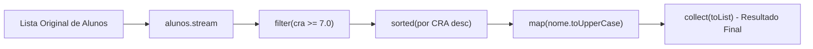

<div style="display: flex; justify-content: space-between; align-items: center; padding: 10px 16px; background: var(--light, #f8fafc); border: 1px solid var(--lightgray, #e2e8f0); border-radius: 10px; margin: 1.5rem 0;">
  <div>⬅️ <b><a href="/pt-br/resource/engenharia-de-computação/6-periodo/programacao-orientada-a-objetos-i/anotacoes/aula-12-fluxos-de-entrada-e-saida-i-o-e-serializacao-de-objetos">Aula Anterior</a></b></div>
  <div>🏠 <b><a href="/pt-br/resource/engenharia-de-computação/6-periodo/programacao-orientada-a-objetos-i">Hub da Disciplina</a></b></div>
  <div>➡️ <b><a href="/pt-br/resource/engenharia-de-computação/6-periodo/programacao-orientada-a-objetos-i/anotacoes/aula-14-desenvolvimento-de-interface-grafica-e-arquitetura-modular">Próxima Aula</a></b></div>
</div>

> [!info] 📅 Informações da Aula
> - **Disciplina:** Programação Orientada a Objetos I (CSECBJI.45)
> - **Professor:** Sérgio / Bruno
> - **Data Realizada:** 25/11/2026
> - **Tópico Principal:** Expressões Lambda e Streams API
> - **Status:** Concluída e Revisada

> [!note] 📂 Material Complementar & Slides
> - 📄 **Slides Oficiais:** [[slide-13-programacao-orientada-a-objetos-i|Acessar Apresentação em PDF]]
> - 🎥 **Short Lecture / Gravação:** [[video-13-programacao-orientada-a-objetos-i|Assistir Síntese da Aula (Vídeo)]]

---

### 📑 Resumo das Seções
- [📌 1. Anotações do Quadro: Expressões Lambda e Streams API](#-anotações-do-quadro-expressões-lambda-e-streams-api)
- [🧮 2. Formulação & Exemplo Prático Resolvido](#-formulação--exemplo-prático-resolvido)
- [📊 3. Esquema Visual & Fluxograma (Mermaid)](#-esquema-visual--fluxograma-mermaid)
- [🧠 4. Resumo Pessoal & Macetes do Professor](#-resumo-pessoal--macetes-do-professor)
- [📝 5. Dúvidas & Exercícios Recomendados para Casa](#-dúvidas--exercícios-recomendados-para-casa)

---

## 📌 Anotações do Quadro: Expressões Lambda e Streams API

### 13.1 Programação Funcional em Java e Expressões Lambda
Introduzidas no Java 8, as expressões lambda permitem tratar funções como cidadãos de primeira classe, passando blocos de código concisos como parâmetros.
- Sintaxe: `(parametros) -> { corpo }`

### 13.2 Interfaces Funcionais (`@FunctionalInterface`)
Uma interface com **exatamente um único método abstrato**:
1. **`Predicate<T>`:** `boolean test(T t)` (Filtros e validações lógicas).
2. **`Function<T, R>`:** `R apply(T t)` (Mapeamento e transformação de tipos).
3. **`Consumer<T>`:** `void accept(T t)` (Processamento com efeito colateral, ex: `System.out.println`).
4. **`Supplier<T>`:** `T get()` (Fábrica de instâncias sem argumentos).

### 13.3 A Streams API (`java.util.stream`)
Permite processar sequências de elementos de coleções de forma declarativa e paralelizável:
- **Operações Intermediárias (Lazy / Preguiçosas):** Retornam uma nova Stream (`filter`, `map`, `sorted`, `distinct`, `limit`).
- **Operações Terminais (Eager / Executam o Pipeline):** Consomem a Stream e produzem um resultado final (`collect`, `forEach`, `reduce`, `count`, `anyMatch`).

---

## 🧮 Formulação & Exemplo Prático Resolvido

### ✏️ Pipeline com Streams: Filtragem, Mapeamento e Estatísticas

```java
public class ProcessamentoAlunos {
    public static void main(String[] args) {
        List<Aluno> alunos = List.of(
            new Aluno("101", "Ana Silva", 9.2),
            new Aluno("102", "Bruno Lima", 6.5),
            new Aluno("103", "Carlos Souza", 8.7),
            new Aluno("104", "Daniela Rocha", 5.8),
            new Aluno("105", "Eduardo Castro", 9.5)
        );

        // Pipeline funcional: Alunos aprovados (CRA >= 7.0) com nomes em maiúsculas ordenados
        List<String> destaques = alunos.stream()
            .filter(a -> a.getCra() >= 7.0)                  // Predicate
            .sorted(Comparator.comparing(Aluno::getCra).reversed()) // Ordena por CRA decrescente
            .map(a -> a.getNome().toUpperCase())            // Function
            .collect(Collectors.toList());                  // Operação Terminal

        System.out.println("Alunos Destaque: " + destaques);

        // Cálculo da média geral de CRA com mapToDouble
        double mediaCRA = alunos.stream()
            .mapToDouble(Aluno::getCra)
            .average()
            .orElse(0.0);

        System.out.printf("Média de CRA da Turma: %.2f\n", mediaCRA);
    }
}
```

---

## 📊 Esquema Visual & Fluxograma (Mermaid)



---

## 🧠 Resumo Pessoal & Macetes do Professor

| Conceito-Chave | *Takeaway* do Professor | Dicas de Prova / Atenção |
| :--- | :--- | :--- |
| **Streams Não Podem Ser Reutilizadas** | Uma vez que uma operação terminal (como `collect` ou `count`) for executada em uma Stream, ela é consumida e fechada. Tentar invocar outra operação disparará `IllegalStateException`! | Crie uma nova stream a partir da coleção original. |
| **Method Reference (`Class::method`)** | Abreviações elegantes para lambdas: `a -> a.getNome()` vira `Aluno::getNome`; `s -> System.out.println(s)` vira `System.out::println`. | Aplicação prática direta |

---

## 📝 Dúvidas & Exercícios Recomendados para Casa

1. Dado um catálogo de produtos, utilize a Streams API para agrupar produtos por categoria (`Collectors.groupingBy`) e somar o valor total de estoque de cada categoria.
2. Refatore um laço imperativo tradicional com múltiplos `if`s para um pipeline declarativo utilizando Streams.

---

<div style="display: flex; justify-content: space-between; align-items: center; padding: 10px 16px; background: var(--light, #f8fafc); border: 1px solid var(--lightgray, #e2e8f0); border-radius: 10px; margin: 1.5rem 0;">
  <div>⬅️ <b><a href="/pt-br/resource/engenharia-de-computação/6-periodo/programacao-orientada-a-objetos-i/anotacoes/aula-12-fluxos-de-entrada-e-saida-i-o-e-serializacao-de-objetos">Aula Anterior</a></b></div>
  <div>🏠 <b><a href="/pt-br/resource/engenharia-de-computação/6-periodo/programacao-orientada-a-objetos-i">Hub da Disciplina</a></b></div>
  <div>➡️ <b><a href="/pt-br/resource/engenharia-de-computação/6-periodo/programacao-orientada-a-objetos-i/anotacoes/aula-14-desenvolvimento-de-interface-grafica-e-arquitetura-modular">Próxima Aula</a></b></div>
</div>
