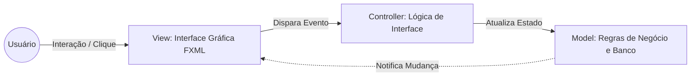

<div style="display: flex; justify-content: space-between; align-items: center; padding: 10px 16px; background: var(--light, #f8fafc); border: 1px solid var(--lightgray, #e2e8f0); border-radius: 10px; margin: 1.5rem 0;">
  <div>⬅️ <b><a href="/pt-br/resource/engenharia-de-computação/6-periodo/programacao-orientada-a-objetos-i/anotacoes/aula-13-expressoes-lambda-e-streams-api">Aula Anterior</a></b></div>
  <div>🏠 <b><a href="/pt-br/resource/engenharia-de-computação/6-periodo/programacao-orientada-a-objetos-i">Hub da Disciplina</a></b></div>
  <div>➡️ <b><a href="/pt-br/resource/engenharia-de-computação/6-periodo/programacao-orientada-a-objetos-i/anotacoes/aula-15-avaliacao-pratica-p2-e-apresentacao-do-projeto-integrador">Próxima Aula</a></b></div>
</div>

> [!info] 📅 Informações da Aula
> - **Disciplina:** Programação Orientada a Objetos I (CSECBJI.45)
> - **Professor:** Sérgio / Bruno
> - **Data Realizada:** 02/12/2026
> - **Tópico Principal:** Desenvolvimento de Interface Gráfica e Arquitetura Modular
> - **Status:** Concluída e Revisada

> [!note] 📂 Material Complementar & Slides
> - 📄 **Slides Oficiais:** [[slide-14-programacao-orientada-a-objetos-i|Acessar Apresentação em PDF]]
> - 🎥 **Short Lecture / Gravação:** [[video-14-programacao-orientada-a-objetos-i|Assistir Síntese da Aula (Vídeo)]]

---

### 📑 Resumo das Seções
- [📌 1. Anotações do Quadro: Desenvolvimento de Interface Gráfica e Arquitetura Modular](#-anotações-do-quadro-desenvolvimento-de-interface-gráfica-e-arquitetura-modular)
- [🧮 2. Formulação & Exemplo Prático Resolvido](#-formulação--exemplo-prático-resolvido)
- [📊 3. Esquema Visual & Fluxograma (Mermaid)](#-esquema-visual--fluxograma-mermaid)
- [🧠 4. Resumo Pessoal & Macetes do Professor](#-resumo-pessoal--macetes-do-professor)
- [📝 5. Dúvidas & Exercícios Recomendados para Casa](#-dúvidas--exercícios-recomendados-para-casa)

---

## 📌 Anotações do Quadro: Desenvolvimento de Interface Gráfica e Arquitetura Modular

### 14.1 Interfaces Gráficas Desktop (JavaFX / Swing)
O desenvolvimento de aplicações desktop orientadas a eventos baseia-se no desacoplamento entre interface visual, lógica de controle e modelo de dados.

### 14.2 O Padrão Arquitetural MVC (Model-View-Controller)
1. **Model (Modelo):** Classes de domínio e regras de negócio puras (ex: `Conta`, `Aluno`), totalmente independentes de bibliotecas gráficas.
2. **View (Visão):** Telas, botões, tabelas e layouts gráficos (FXML no JavaFX ou componentes Swing `JFrame`, `JButton`).
3. **Controller (Controlador):** O intermediário que escuta os eventos disparados pelo usuário na View (cliques de botão, digitação) e comanda alterações no Model, atualizando a View em seguida.

### 14.3 Tratamento de Eventos com Listeners
A interface gráfica opera sobre uma **Thread de Despacho de Eventos (EDT / JavaFX Application Thread)**.
- Handlers de eventos são associados aos componentes gráficos via expressões lambda:
  ```java
  botaoSalvar.setOnAction(event -> controller.salvarRegistro());
  ```

---

## 🧮 Formulação & Exemplo Prático Resolvido

### ✏️ Aplicação JavaFX Modular com Tratamento de Eventos

```java
public class CadastroAlunoController {
    @FXML private TextField campoNome;
    @FXML private TextField campoCRA;
    @FXML private Label labelStatus;
    
    private final RepositorioAluno repositorio = new RepositorioAluno();

    @FXML
    public void onBotaoSalvarClique(ActionEvent event) {
        try {
            String nome = campoNome.getText();
            double cra = Double.parseDouble(campoCRA.getText());
            
            Aluno novoAluno = new Aluno(UUID.randomUUID().toString(), nome, cra);
            repositorio.salvar(novoAluno);
            
            labelStatus.setText("Aluno cadastrado com sucesso!");
            campoNome.clear();
            campoCRA.clear();
        } catch (NumberFormatException e) {
            labelStatus.setText("Erro: CRA deve ser um número válido!");
        } catch (Exception e) {
            labelStatus.setText("Erro ao salvar: " + e.getMessage());
        }
    }
}
```

---

## 📊 Esquema Visual & Fluxograma (Mermaid)



---

## 🧠 Resumo Pessoal & Macetes do Professor

| Conceito-Chave | *Takeaway* do Professor | Dicas de Prova / Atenção |
| :--- | :--- | :--- |
| **Nunca Trave a Thread de Interface Gráfica** | Operações demoradas (como consultas pesadas a banco de dados ou download de arquivos de rede) NUNCA devem rodar na thread de interface (EDT), sob pena de congelar a tela da aplicação. | Utilize `Task` ou `CompletableFuture` para rodar tarefas em background. |
| **Desacoplamento Rigoroso no MVC** | A classe Model NUNCA deve importar classes de UI (Swing ou JavaFX). | Aplicação prática direta |

---

## 📝 Dúvidas & Exercícios Recomendados para Casa

1. Desenvolva uma tela de cadastro e listagem em tabela de alunos utilizando JavaFX e MVC.
2. Implemente validação de campos em tempo real exibindo mensagens de erro dinâmicas.

---

<div style="display: flex; justify-content: space-between; align-items: center; padding: 10px 16px; background: var(--light, #f8fafc); border: 1px solid var(--lightgray, #e2e8f0); border-radius: 10px; margin: 1.5rem 0;">
  <div>⬅️ <b><a href="/pt-br/resource/engenharia-de-computação/6-periodo/programacao-orientada-a-objetos-i/anotacoes/aula-13-expressoes-lambda-e-streams-api">Aula Anterior</a></b></div>
  <div>🏠 <b><a href="/pt-br/resource/engenharia-de-computação/6-periodo/programacao-orientada-a-objetos-i">Hub da Disciplina</a></b></div>
  <div>➡️ <b><a href="/pt-br/resource/engenharia-de-computação/6-periodo/programacao-orientada-a-objetos-i/anotacoes/aula-15-avaliacao-pratica-p2-e-apresentacao-do-projeto-integrador">Próxima Aula</a></b></div>
</div>
