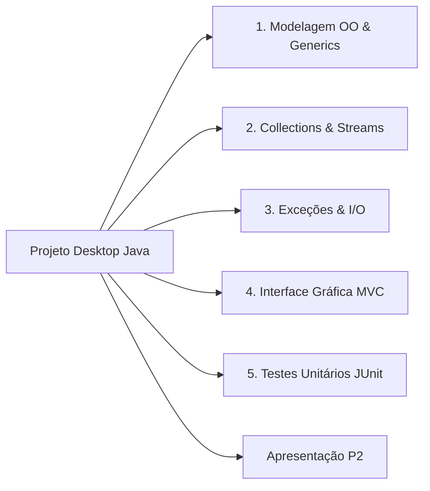

<div style="display: flex; justify-content: space-between; align-items: center; padding: 10px 16px; background: var(--light, #f8fafc); border: 1px solid var(--lightgray, #e2e8f0); border-radius: 10px; margin: 1.5rem 0;">
  <div>⬅️ <b><a href="/pt-br/resource/engenharia-de-computação/6-periodo/programacao-orientada-a-objetos-i/anotacoes/aula-14-desenvolvimento-de-interface-grafica-e-arquitetura-modular">Aula Anterior</a></b></div>
  <div>🏠 <b><a href="/pt-br/resource/engenharia-de-computação/6-periodo/programacao-orientada-a-objetos-i">Hub da Disciplina</a></b></div>
  <div>➡️ <b><a href="/pt-br/resource/engenharia-de-computação/6-periodo/programacao-orientada-a-objetos-i/anotacoes/aula-16-prova-final-de-poo-i-e-fechamento">Próxima Aula</a></b></div>
</div>

> [!info] 📅 Informações da Aula
> - **Disciplina:** Programação Orientada a Objetos I (CSECBJI.45)
> - **Professor:** Sérgio / Bruno
> - **Data Realizada:** 09/12/2026
> - **Tópico Principal:** Avaliação Prática P2 e Apresentação do Projeto Integrador
> - **Status:** Concluída e Revisada

> [!note] 📂 Material Complementar & Slides
> - 📄 **Slides Oficiais:** [[slide-15-programacao-orientada-a-objetos-i|Acessar Apresentação em PDF]]
> - 🎥 **Short Lecture / Gravação:** [[video-15-programacao-orientada-a-objetos-i|Assistir Síntese da Aula (Vídeo)]]

---

### 📑 Resumo das Seções
- [📌 1. Anotações do Quadro: Avaliação Prática P2 e Apresentação do Projeto Integrador](#-anotações-do-quadro-avaliação-prática-p2-e-apresentação-do-projeto-integrador)
- [🧮 2. Formulação & Exemplo Prático Resolvido](#-formulação--exemplo-prático-resolvido)
- [📊 3. Esquema Visual & Fluxograma (Mermaid)](#-esquema-visual--fluxograma-mermaid)
- [🧠 4. Resumo Pessoal & Macetes do Professor](#-resumo-pessoal--macetes-do-professor)
- [📝 5. Dúvidas & Exercícios Recomendados para Casa](#-dúvidas--exercícios-recomendados-para-casa)

---

## 📌 Anotações do Quadro: Avaliação Prática P2 e Apresentação do Projeto Integrador

### 15.1 Critérios de Avaliação e Apresentação do Projeto Integrador
A avaliação prática P2 consiste na apresentação e defesa do software desktop corporativo desenvolvido em Java pelas equipes:
1. Modelagem Orientada a Objetos completa (Encapsulamento estrito, herança e interfaces).
2. Persistência de dados em arquivos ou banco relacional com tratamento de exceções.
3. Uso intensivo do Java Collections Framework e Streams API para relatórios analíticos.
4. Interface gráfica desacoplada seguindo rigorosamente o padrão MVC.
5. Cobertura de testes unitários com JUnit 5.

---

## 🧮 Formulação & Exemplo Prático Resolvido

### ✏️ Teste Unitário Automatizado com JUnit 5

```java
import org.junit.jupiter.api.BeforeEach;
import org.junit.jupiter.api.Test;
import static org.junit.jupiter.api.Assertions.*;

public class ContaCorrenteTest {
    private ContaCorrente conta;

    @BeforeEach
    public void setup() {
        conta = new ContaCorrente("12345", "Pedro Andrade", 1000.0);
    }

    @Test
    public void devePermitirSaqueComSaldoSuficiente() {
        boolean sucesso = conta.sacar(400.0);
        assertTrue(sucesso);
        assertEquals(600.0, conta.getSaldo(), 0.001);
    }

    @Test
    public void deveRecusarSaqueMaiorQueSaldo() {
        boolean sucesso = conta.sacar(1500.0);
        assertFalse(sucesso);
        assertEquals(1000.0, conta.getSaldo(), 0.001);
    }
}
```

---

## 📊 Esquema Visual & Fluxograma (Mermaid)



---

## 🧠 Resumo Pessoal & Macetes do Professor

| Conceito-Chave | *Takeaway* do Professor | Dicas de Prova / Atenção |
| :--- | :--- | :--- |
| **Dica de Apresentação P2** | Demonstre o tratamento gracioso de erros digitando dados inválidos na tela para provar que a aplicação não quebra. | Mostre os testes do JUnit passando com barra verde. |
| **Código Limpo** | Elimine código comentado e imports não utilizados antes do commit final. | Aplicação prática direta |

---

## 📝 Dúvidas & Exercícios Recomendados para Casa

1. Execute a suite de testes unitários JUnit com relatório de cobertura de código.
2. Gere o pacote executável JAR com todas as dependências embutidas (`fat JAR` via Maven ou Gradle).

---

<div style="display: flex; justify-content: space-between; align-items: center; padding: 10px 16px; background: var(--light, #f8fafc); border: 1px solid var(--lightgray, #e2e8f0); border-radius: 10px; margin: 1.5rem 0;">
  <div>⬅️ <b><a href="/pt-br/resource/engenharia-de-computação/6-periodo/programacao-orientada-a-objetos-i/anotacoes/aula-14-desenvolvimento-de-interface-grafica-e-arquitetura-modular">Aula Anterior</a></b></div>
  <div>🏠 <b><a href="/pt-br/resource/engenharia-de-computação/6-periodo/programacao-orientada-a-objetos-i">Hub da Disciplina</a></b></div>
  <div>➡️ <b><a href="/pt-br/resource/engenharia-de-computação/6-periodo/programacao-orientada-a-objetos-i/anotacoes/aula-16-prova-final-de-poo-i-e-fechamento">Próxima Aula</a></b></div>
</div>
