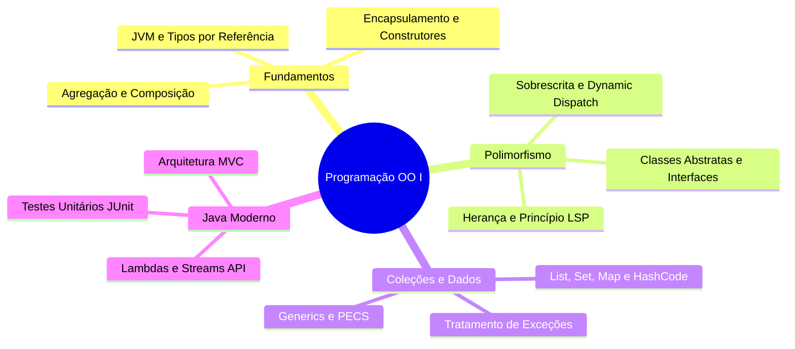

<div style="display: flex; justify-content: space-between; align-items: center; padding: 10px 16px; background: var(--light, #f8fafc); border: 1px solid var(--lightgray, #e2e8f0); border-radius: 10px; margin: 1.5rem 0;">
  <div>⬅️ <b><a href="/pt-br/resource/engenharia-de-computação/6-periodo/programacao-orientada-a-objetos-i/anotacoes/aula-15-avaliacao-pratica-p2-e-apresentacao-do-projeto-integrador">Aula Anterior</a></b></div>
  <div>🏠 <b><a href="/pt-br/resource/engenharia-de-computação/6-periodo/programacao-orientada-a-objetos-i">Hub da Disciplina</a></b></div>
  <div>➡️ <span style="color: gray;">Última Aula</span></div>
</div>

> [!info] 📅 Informações da Aula
> - **Disciplina:** Programação Orientada a Objetos I (CSECBJI.45)
> - **Professor:** Sérgio / Bruno
> - **Data Realizada:** 16/12/2026
> - **Tópico Principal:** Prova Final de POO I e Fechamento
> - **Status:** Concluída e Revisada

> [!note] 📂 Material Complementar & Slides
> - 📄 **Slides Oficiais:** [[slide-16-programacao-orientada-a-objetos-i|Acessar Apresentação em PDF]]
> - 🎥 **Short Lecture / Gravação:** [[video-16-programacao-orientada-a-objetos-i|Assistir Síntese da Aula (Vídeo)]]

---

### 📑 Resumo das Seções
- [📌 1. Anotações do Quadro: Prova Final de POO I e Fechamento](#-anotações-do-quadro-prova-final-de-poo-i-e-fechamento)
- [🧮 2. Formulação & Exemplo Prático Resolvido](#-formulação--exemplo-prático-resolvido)
- [📊 3. Esquema Visual & Fluxograma (Mermaid)](#-esquema-visual--fluxograma-mermaid)
- [🧠 4. Resumo Pessoal & Macetes do Professor](#-resumo-pessoal--macetes-do-professor)
- [📝 5. Dúvidas & Exercícios Recomendados para Casa](#-dúvidas--exercícios-recomendados-para-casa)

---

## 📌 Anotações do Quadro: Prova Final de POO I e Fechamento

### 16.1 Síntese Holística da Programação Orientada a Objetos
A disciplina de POO I consolida o paradigma que estrutura a imensa maioria dos sistemas corporativos do mundo:
```text
Classes e Encapsulamento ──▶ Herança e LSP ──▶ Polimorfismo e Interfaces ──▶ Generics e Collections ──▶ Streams e MVC
```

### 16.2 Transição Curricular e Mercado de Trabalho
- **Java Moderno:** Padrão industrial dominante em backend de alta performance, microsserviços (Spring Boot, Quarkus), sistemas bancários e Big Data (Apache Spark/Kafka).
- **Continuidade:** Esta base é o pré-requisito mandatório e imediato para **Programação Orientada a Objetos II (7ºP)** e **Projeto de Software OO (7ºP)**.

---

## 🧮 Formulação & Exemplo Prático Resolvido

### ✏️ Fechamento das Médias e Próximos Passos

1. **Revisão das Notas:** Média Final $= (P1 + P2) / 2 \ge 6.0$.
2. **Recomendação de Leitura Permanente:** *Effective Java* (Joshua Bloch) e *Clean Code* (Robert C. Martin).

---

## 📊 Esquema Visual & Fluxograma (Mermaid)



---

## 🧠 Resumo Pessoal & Macetes do Professor

| Conceito-Chave | *Takeaway* do Professor | Dicas de Prova / Atenção |
| :--- | :--- | :--- |
| **Conhecimento Duradouro** | O paradigma orientado a objetos, quando dominado com rigor arquitetural e princípios de responsabilidade única, torna o desenvolvimento de software escalável, modular e sustentável. | Pratique construindo projetos autorais. |
| **Encerramento do Semestre** | Parabéns pela conclusão com excelência da disciplina de POO I! | Aplicação prática direta |

---

## 📝 Dúvidas & Exercícios Recomendados para Casa

1. Revisão final de todos os compêndios teóricos para a Prova Final.
2. Consulte as referências clássicas recomendadas: Deitel (Java: Como Programar) e Joshua Bloch (Java Efetivo).

---

<div style="display: flex; justify-content: space-between; align-items: center; padding: 10px 16px; background: var(--light, #f8fafc); border: 1px solid var(--lightgray, #e2e8f0); border-radius: 10px; margin: 1.5rem 0;">
  <div>⬅️ <b><a href="/pt-br/resource/engenharia-de-computação/6-periodo/programacao-orientada-a-objetos-i/anotacoes/aula-15-avaliacao-pratica-p2-e-apresentacao-do-projeto-integrador">Aula Anterior</a></b></div>
  <div>🏠 <b><a href="/pt-br/resource/engenharia-de-computação/6-periodo/programacao-orientada-a-objetos-i">Hub da Disciplina</a></b></div>
  <div>➡️ <span style="color: gray;">Última Aula</span></div>
</div>
