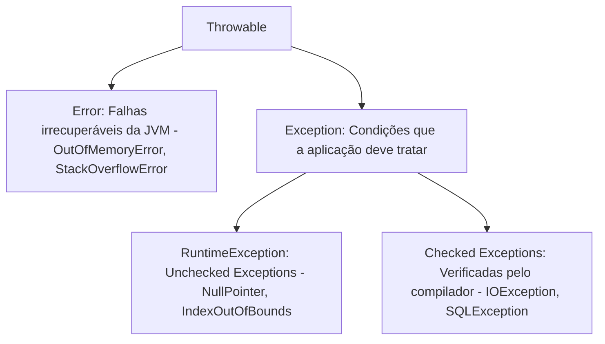
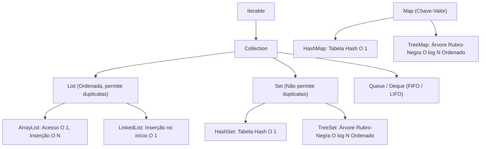

# ☕ Short Lecture — Programação Orientada a Objetos I

> [!abstract] 📌 Visão Geral da Disciplina
> * **Código:** `CSECBJI.45` | **Carga Horária:** 60 h/a | **Período:** 6º Período
> * **Pré-requisitos:** [[02 - Áreas/Acadêmico/IFF - Engenharia de Computação/02 - Periodo/13 - Algoritmos e Técnicas de Programação/Ementa - Algoritmos e Técnicas de Programação|Algoritmos e Técnicas de Programação (CSECBJI.13)]], [[02 - Áreas/Acadêmico/IFF - Engenharia de Computação/05 - Periodo/38 - Paradigmas de Linguagem de Programação/Ementa - Paradigmas de Linguagem de Programação|Paradigmas de Linguagem de Programação (CSECBJI.38)]]
> * **Tranca:** [[02 - Áreas/Acadêmico/IFF - Engenharia de Computação/07 - Periodo/51 - Programação Orientada a Objetos II/Ementa - Programação Orientada a Objetos II|Programação Orientada a Objetos II (CSECBJI.51)]]
> * **Ementa Síntese:** Desenvolvimento de software em Java; Classes, objetos, estado e encapsulamento; Herança, polimorfismo e interfaces; Tratamento robusto de exceções; Java Collections Framework e estruturas encadeadas; Entrada/Saída (I/O) e serialização de objetos.

---

## 🗺️ Mapa Conceitual da Disciplina

```mermaid
flowchart TD
    A[Paradigma OO em Java] --> B[Classes, Objetos & Encapsulamento]
    B --> B1[Stack vs Heap Memory & Garbage Collection]
    B --> B2[Modificadores de Acesso & Invariantes]
    A --> C[Herança & Polimorfismo]
    C --> C1[Princípio de Substituição de Liskov - LSP]
    C --> C2[Dynamic Dispatch & Classes Abstratas]
    C --> C3[Interfaces & Contratos Múltiplos]
    A --> D[Tratamento Robusto de Exceções]
    D --> D1[Hierarquia Throwable: Checked vs Unchecked]
    D --> D2[try-with-resources & Custom Exceptions]
    A --> E[Java Collections Framework]
    E --> E1[List: ArrayList vs LinkedList]
    E --> E2[Set: HashSet vs TreeSet]
    E --> E3[Map: HashMap vs TreeMap]
    E --> E4[Contratos equals() & hashCode()]
    A --> F[I/O Streams & Serialização]
```

---

## 🏛️ Módulo 1: Classes, Objetos e Gerenciamento de Memória

### 1.1 O Modelo de Execução da JVM: Stack vs Heap
Em Java, a memória de tempo de execução é dividida em duas áreas principais:

```mermaid
flowchart LR
    subgraph Stack [Stack Memory (Por Thread)]
        S1["Frame Método main()"]
        S2["ref: conta1 (Ponteiro 0x1A2B)"]
        S3["int valor = 500 (Primitivo)"]
    end
    subgraph Heap [Heap Memory (Compartilhada)]
        H1["Instância ContaBancaria @ 0x1A2B
        -------------------------
        - numero: 1001
        - titular: 'Pedro'
        - saldo: 15000.00"]
    end
    S2 -->|Aponta para| H1
```

- **Stack (Pilha):** Armazena chamadas de métodos (*frames*), variáveis locais de tipos primitivos (`int`, `double`, `boolean`) e as referências de ponteiros de memória para objetos.
- **Heap (Monte):** Armazena todas as instâncias de objetos e arrays. O gerenciamento de descarte de objetos sem referências ativas é realizado automaticamente pelo **Garbage Collector (GC)**.

### 1.2 Encapsulamento e Modificadores de Acesso
O encapsulamento protege o estado interno do objeto contra manipulação arbitrária, garantindo que o objeto permaneça sempre em um estado consistente (invariante de classe).

| Modificador | Própria Classe | Mesmo Pacote | Subclasse (Outro Pacote) | Qualquer Lugar |
|---|:---:|:---:|:---:|:---:|
| `private` | Sim | Não | Não | Não |
| *(default / package)* | Sim | Sim | Não | Não |
| `protected` | Sim | Sim | Sim | Não |
| `public` | Sim | Sim | Sim | Sim |

---

## 🧬 Módulo 2: Herança, Polimorfismo e Interfaces

### 2.1 Herança e o Princípio de Substituição de Liskov (LSP)
A herança estabelece uma relação de generalização/especialização do tipo **"é-um"** (*is-a*).
- **LSP (Liskov Substitution Principle):** Se $S$ é um subtipo de $T$, objetos do tipo $T$ podem ser substituídos por objetos do tipo $S$ sem alterar a corretude do programa.

### 2.2 Polimorfismo e Ligação Dinâmica (*Dynamic Dispatch*)
O polimorfismo permite que uma mesma mensagem invoque comportamentos diferentes dependendo do tipo concreto do objeto receptor em tempo de execução.

```java
// Contrato abstrato
public abstract class Funcionario {
    private String nome;
    private double salarioBase;

    public Funcionario(String nome, double salarioBase) {
        this.nome = nome;
        this.salarioBase = salarioBase;
    }

    public String getNome() { return nome; }
    public double getSalarioBase() { return salarioBase; }

    // Método abstrato: subclasses DEVEM implementar
    public abstract double calcularRemuneracao();
}

// Especialização concreta
public class Desenvolvedor extends Funcionario {
    private double bonusProdutividade;

    public Desenvolvedor(String nome, double salarioBase, double bonus) {
        super(nome, salarioBase);
        this.bonusProdutividade = bonus;
    }

    @Override
    public double calcularRemuneracao() {
        return getSalarioBase() + bonusProdutividade;
    }
}
```

### 2.3 Classes Abstratas vs Interfaces
- **Classe Abstrata:** Pode conter estado (atributos de instância), construtores e métodos com implementação concreta. Usada para compartilhar código e modelo conceitual rígido.
- **Interface:** Define um contrato puro de capacidades (*can-do*). Permite que classes de hierarquias completamente distintas compartilhem uma mesma assinatura de métodos.

```java
public interface Autenticavel {
    boolean autenticar(String senha);
    
    // Default method (Java 8+)
    default void registrarLogAcesso() {
        System.out.println("Acesso registrado em: " + java.time.LocalDateTime.now());
    }
}
```

---

## ⚠️ Módulo 3: Tratamento Robusto de Exceções

### 3.1 A Árvore Hierárquica de `Throwable`



- **Checked Exceptions (`Exception` direta):** Obrigam o desenvolvedor a tratá-las explicitamente via `try-catch` ou declará-las na assinatura com `throws`. Representam falhas de ambiente esperadas (arquivo não encontrado, rede indisponível).
- **Unchecked Exceptions (`RuntimeException`):** Erros de lógica do programador (acesso a ponteiro nulo, divisão por zero). Não exigem declaração obrigatória.

### 3.2 Try-with-Resources e Exceções Customizadas
```java
// Exceção de domínio de negócio
public class SaldoInsuficienteException extends Exception {
    private final double saldoAtual;
    private final double valorTentado;

    public SaldoInsuficienteException(double saldoAtual, double valorTentado) {
        super(String.format("Saldo insuficiente! Atual: R$%.2f, Solicitado: R$%.2f", saldoAtual, valorTentado));
        this.saldoAtual = saldoAtual;
        this.valorTentado = valorTentado;
    }
}

// Uso com Try-with-resources (AutoCloseable)
public class LeitorArquivoService {
    public void processarLog(String caminho) {
        try (BufferedReader reader = Files.newBufferedReader(Paths.get(caminho))) {
            String linha;
            while ((linha = reader.readLine()) != null) {
                System.out.println("Processando: " + linha);
            }
        } catch (IOException e) {
            System.err.println("Erro na leitura física: " + e.getMessage());
        }
    }
}
```

---

## 📦 Módulo 4: Java Collections Framework & Estruturas de Dados



### 4.1 O Contrato Sagrado: `equals()` e `hashCode()`
Para que coleções baseadas em Hashing (`HashSet`, `HashMap`) funcionem corretamente:
> [!important] Regra de Consistência
> 1. Se `a.equals(b) == true`, então obrigatoriamente `a.hashCode() == b.hashCode()`.
> 2. Se dois objetos têm hashes diferentes, eles são garantidamente diferentes. Hashes iguais podem indicar uma colisão de buckets.

```java
public class Aluno implements Comparable<Aluno> {
    private String matricula;
    private String nome;
    private double cra;

    @Override
    public boolean equals(Object o) {
        if (this == o) return true;
        if (o == null || getClass() != o.getClass()) return false;
        Aluno aluno = (Aluno) o;
        return Objects.equals(matricula, aluno.matricula);
    }

    @Override
    public int hashCode() {
        return Objects.hash(matricula);
    }

    @Override
    public int compareTo(Aluno outro) {
        return this.matricula.compareTo(outro.matricula);
    }
}
```

### 4.2 Implementação Didática de Lista Simplesmente Encadeada
```java
public class ListaEncadeadaSimples<T> {
    private static class Node<T> {
        T dado;
        Node<T> proximo;
        Node(T dado) { this.dado = dado; }
    }

    private Node<T> cabeca;
    private int tamanho = 0;

    public void adicionarInicio(T elemento) {
        Node<T> novo = new Node<>(elemento);
        novo.proximo = cabeca;
        cabeca = novo;
        tamanho++;
    }

    public void listar() {
        Node<T> atual = cabeca;
        while (atual != null) {
            System.out.print(atual.dado + " -> ");
            atual = atual.proximo;
        }
        System.out.println("null");
    }
}
```

---

## 💾 Módulo 5: Entrada/Saída (I/O) & Serialização

### 5.1 Serialização de Objetos
A interface marcadora `Serializable` sinaliza à JVM que o grafo de objetos pode ser serializado em um fluxo de bytes para armazenamento em arquivo ou transmissão via rede:
```java
public class RelatorioFinanceiro implements Serializable {
    private static final long serialVersionUID = 1L;
    
    private String titulo;
    private double valorTotal;
    
    // Atributo transiente: NÃO será salvo na serialização
    private transient Connection conexaoBanco;
}
```

---

## 🧪 Resumo Executivo / Cheat Sheet para Provas & Projetos

1. **Stack vs Heap:** Stack armazena variáveis primitivas e referências locais; Heap armazena o objeto real.
2. **Polimorfismo:** `@Override` garante que a versão especializada do método seja chamada em tempo de execução via Dynamic Dispatch.
3. **Exceções:** Trate `Checked` para recuperar o fluxo de execução; deixe `Unchecked` revelar bugs lógicos.
4. **Collections:** `ArrayList` para acesso randômico rápido; `HashSet` para buscas sem duplicatas em $O(1)$; `HashMap` para pares chave-valor em $O(1)$.
5. **equals & hashCode:** Sempre sobrescreva ambos em conjunto se o objeto for chave em mapas ou elementos em conjuntos.

---

## 🔗 Referências e Conexões no Cofre
* [[02 - Áreas/Acadêmico/IFF - Engenharia de Computação/06 - Periodo/45 - Programação Orientada a Objetos I/Ementa - Programação Orientada a Objetos I|📄 Ementa Oficial de POO I]]
* [[02 - Áreas/Acadêmico/IFF - Engenharia de Computação/02 - Periodo/13 - Algoritmos e Técnicas de Programação/Ementa - Algoritmos e Técnicas de Programação|Algoritmos e Técnicas de Programação (CSECBJI.13)]]
* [[02 - Áreas/Acadêmico/IFF - Engenharia de Computação/00 - Documentos/PPC_EngComp_Completo_Ementario|📜 PPC & Ementário Geral]]
* Livros Base:
  * BLOCH, Joshua. *Java Efetivo: As Melhores Práticas para a Plataforma Java*. 3ª Edição. Alta Books, 2019.
  * DEITEL, P. J.; DEITEL, H. M. *Java: Como Programar*. 10ª Edição. Pearson, 2016.
  * SIERRA, Kathy; BATES, Bert. *Use a Cabeça! Java*. 2ª Edição. Alta Books, 2007.
