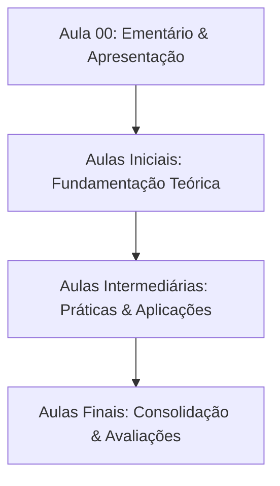

  
⬅️ <b><a href="/pt-br/resource/engenharia-de-computação/8-periodo/seguranca-e-higiene-do-trabalho">Aula Anterior</a></b>

  
🏠 <b><a href="/pt-br/resource/engenharia-de-computação/8-periodo/seguranca-e-higiene-do-trabalho">Anotações da Disciplina</a></b>

  
➡️ <b><a href="/pt-br/resource/engenharia-de-computação/8-periodo/seguranca-e-higiene-do-trabalho/anotacoes/aula-01-introdução-à-segurança-no-trabalho">Próxima Aula</a></b>

> [!info] 📌 Informações Gerais do Plano de Ensino
> - **Disciplina:** Segurança e Higiene do Trabalho (`CSECBJI.60`)
> - **Docente Responsável:** Gardoni
> - **Carga Horária Total:** —
> - **Tópico da Sessão:** Apresentação da Matriz Curricular, Ementário e Critérios de Avaliação

> [!note] 📦 Material Didático e Recursos Institucionais
> ### 📑 Material da Aula
> - 📄 **[Plano de Ensino Oficial em PDF](/assets/disciplinas/plano-de-ensino-CSECBJI.60.pdf)**
> - 📄 **[Projeto Pedagógico do Curso (PPC)](/assets/disciplinas/PPC_Engenharia_Computacao.pdf)**

## 📋 Sumário Interativo
- [📍 1. Ementário Oficial da Disciplina](#-1-ementário-oficial-da-disciplina)
- [🎯 2. Objetivos Pedagógicos & Competências](#-2-objetivos-pedagógicos--competências)
- [📊 3. Mapa de Desenvolvimento dos Tópicos (Mermaid)](#-3-mapa-de-desenvolvimento-dos-tópicos-mermaid)
- [🧠 4. Critérios de Avaliação & Metodologia](#-4-critérios-de-avaliação--metodologia)
- [📝 5. Atividades Iniciais e Leitura Recomendada](#-5-atividades-iniciais-e-leitura-recomendada)

---

## 📌 1. Ementário Oficial da Disciplina

> [!note] 📖 Síntese Ementária Institucional
> Segurança no Trabalho, Comissão Interna de Prevenção de Acidentes – Cipa (NR-5), Serviços Especializados em Engenharia de Segurança e em Medicina do Trabalho – Sesmt (NR-4), Equipamento de Proteção Individual (NR-6), Programa de Controle Médico de Saúde Ocupacional – Pcmso (NR-7), Programa de Prevenção de Riscos Ambientais – Ppra (NR-9), Segurança em Instalações e Serviços em Eletricidade (NR-10), Atividades e Operações Insalubres (NR-15), Atividades e Operações Perigosas (NR-16), Proteção Contra Incêndio (NR23).

---

## 🎯 2. Objetivos Pedagógicos & Competências

- Identificar os conceitos básicos de Higiene e Segurança do Trabalho, bem como sua aplicação tanto em estudo de casos como em situações cotidianas;
- Demonstrar a importância das Normas e Legislações pertinentes à HST.

---

## 📊 3. Mapa de Desenvolvimento dos Tópicos (Mermaid)

---

## 🧠 4. Critérios de Avaliação & Metodologia

| Componente | Peso | Descrição |
| :--- | :--- | :--- |
| **Provas Escritas (P1 / P2)** | 60% | Avaliação formal dos conceitos teóricos e práticos |
| **Trabalhos & Projetos** | 30% | Implementações e relatórios técnicos em laboratório |
| **Participação & Listas** | 10% | Resolução de exercícios do quadro e frequência |

---

## 📝 5. Atividades Iniciais e Leitura Recomendada

- [ ] Ler a ementa completa e organizar o ambiente de estudos.
- [ ] Consultar a bibliografia básica no repositório da biblioteca.

  
⬅️ <b><a href="/pt-br/resource/engenharia-de-computação/8-periodo/seguranca-e-higiene-do-trabalho">Aula Anterior</a></b>

  
🏠 <b><a href="/pt-br/resource/engenharia-de-computação/8-periodo/seguranca-e-higiene-do-trabalho">Anotações da Disciplina</a></b>

  
➡️ <b><a href="/pt-br/resource/engenharia-de-computação/8-periodo/seguranca-e-higiene-do-trabalho/anotacoes/aula-01-introdução-à-segurança-no-trabalho">Próxima Aula</a></b>

