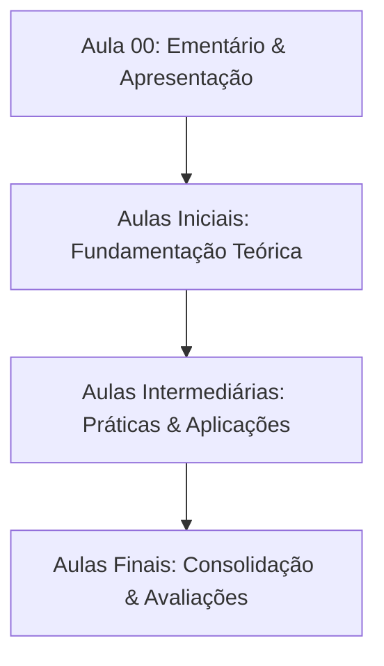

  
⬅️ <b><a href="/pt-br/resource/engenharia-de-computação/9-periodo/direito-etica-e-cidadania">Aula Anterior</a></b>

  
🏠 <b><a href="/pt-br/resource/engenharia-de-computação/9-periodo/direito-etica-e-cidadania">Anotações da Disciplina</a></b>

  
➡️ <b><a href="/pt-br/resource/engenharia-de-computação/9-periodo/direito-etica-e-cidadania/anotacoes/aula-01-introdução-ao-direito-estado-democrático">Próxima Aula</a></b>

> [!info] 📌 Informações Gerais do Plano de Ensino
> - **Disciplina:** Direito, Ética e Cidadania (`CSECBJI.69`)
> - **Docente Responsável:** Karina
> - **Carga Horária Total:** 60
> - **Tópico da Sessão:** Apresentação da Matriz Curricular, Ementário e Critérios de Avaliação

> [!note] 📦 Material Didático e Recursos Institucionais
> ### 📑 Material da Aula
> - 📄 **[Plano de Ensino Oficial em PDF](/assets/disciplinas/plano-de-ensino-csecbji.69.pdf)**
> - 📄 **[Projeto Pedagógico do Curso (PPC)](/assets/disciplinas/ppc-engenharia-computacao.pdf)**

## 📋 Sumário Interativo
- [📍 1. Ementário Oficial da Disciplina](#-1-ementário-oficial-da-disciplina)
- [🎯 2. Objetivos Pedagógicos & Competências](#-2-objetivos-pedagógicos--competências)
- [📊 3. Mapa de Desenvolvimento dos Tópicos (Mermaid)](#-3-mapa-de-desenvolvimento-dos-tópicos-mermaid)
- [🧠 4. Critérios de Avaliação & Metodologia](#-4-critérios-de-avaliação--metodologia)
- [📝 5. Atividades Iniciais e Leitura Recomendada](#-5-atividades-iniciais-e-leitura-recomendada)

---

## 📌 1. Ementário Oficial da Disciplina

> [!note] 📖 Síntese Ementária Institucional
> Estudo sobre o desenvolvimento do direito digital e eletrônico. Investigação dos novos aspectos e relações jurídicas da sociedade da informação. Análise das principais manifestações do direito digital e eletrônico nos ramos do direito. Introdução aos mecanismos de governança da internet no Brasil e no mundo. Regulação do ambiente online e o Marco Civil da Internet. Direitos e deveres no ciberespaço. Responsabilidade de usuários, provedores e governo. Inovação nas tecnologias de informação e comunicação. Propriedade intelectual na era digital. Acessibilidade, inclusão digital e ciberativismo. Profissional de computação. Princípios de conduta ética e profissional do engenheiro de software. Propriedade intelectual e pirataria. Privacidade. Responsabilidade social. O que é ética; Código de ética da ACM e IEEE. Direitos autorais e estudos de casos sobre ética na computação. Ética na internet: liberdade de informação, privacidade e censura.

---

## 🎯 2. Objetivos Pedagógicos & Competências

- Correlacionar, de forma interdisciplinar, o Direito com a Engenharia de Computação, levando o estudante a compreender a presença do Direito em sua vida pessoal e profissional, assim como em questões contemporâneas que envolvem ética e cidadania;
- Aprofundar a reflexão sobre a ética, dedicando-se aos estudos sobre valores morais e princípios ideais do comportamento humano, abordando o caráter e a conduta humana, bem como a ética enquanto instrumento mediador das questões de relacionamento entre cidadãos;
- Capacitar o discente, enquanto cidadão, a reconhecer seus direitos e deveres, bem como a sua importância enquanto agente receptor mas também modificador de direitos, introduzindo-o no universo do Direito, da ética e da cidadania;
- Proporcionar a percepção do impacto e da influência que as transformações sociais e os instrumentos tecnológicos acarretam nas relações sociais que são regulamentadas pelo Direito, ressaltando situações concretas que envolvem Direito, ética, cidadania e computação;
- Tratar de leis e códigos de ética no âmbito da Engenharia de Computação, destacando os aspectos jurídicos (legais e jurisprudenciais) pertinentes, em consonância com as diretrizes constitucionais e seus princípios norteadores;
- Realizar palestras, rodas de conversa e seminários sobre situações concretas que envolvem Direito, ética, cidadania e computação.

---

## 📊 3. Mapa de Desenvolvimento dos Tópicos (Mermaid)

---

## 🧠 4. Critérios de Avaliação & Metodologia

| Componente | Peso | Descrição |
| :--- | :--- | :--- |
| **Provas Escritas (P1 / P2)** | 60% | Avaliação formal dos conceitos teóricos e práticos |
| **Trabalhos & Projetos** | 30% | Implementações e relatórios técnicos em laboratório |
| **Participação & Listas** | 10% | Resolução de exercícios do quadro e frequência |

---

## 📝 5. Atividades Iniciais e Leitura Recomendada

- [ ] Ler a ementa completa e organizar o ambiente de estudos.
- [ ] Consultar a bibliografia básica no repositório da biblioteca.

  
⬅️ <b><a href="/pt-br/resource/engenharia-de-computação/9-periodo/direito-etica-e-cidadania">Aula Anterior</a></b>

  
🏠 <b><a href="/pt-br/resource/engenharia-de-computação/9-periodo/direito-etica-e-cidadania">Anotações da Disciplina</a></b>

  
➡️ <b><a href="/pt-br/resource/engenharia-de-computação/9-periodo/direito-etica-e-cidadania/anotacoes/aula-01-introdução-ao-direito-estado-democrático">Próxima Aula</a></b>

