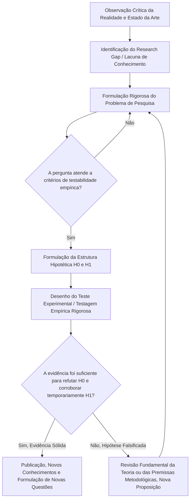

| Material Didático | Link Institucional (Acesso Aberto / PDF & PPTX) |
| :--- | :--- |
| 📄 **Slides LaTeX — Modelo Branco (.pdf)** | [Acessar Slide Branco](/assets/biblioteca/latex-escrita/slides-latex/aula-01-branco.pdf) |
| 📄 **Slides LaTeX — Modelo Preto (.pdf)** | [Acessar Slide Preto](/assets/biblioteca/latex-escrita/slides-latex/aula-01-preto.pdf) |
| 📄 **Notas de Aula Institucionais (.pdf)** | [Acessar Notas Institucionais](/assets/biblioteca/latex-escrita/notes-latex/aula-01.pdf) |
| 📊 **Slides PowerPoint — Modelo Branco (.pptx)** | [Acessar Slide PPTX Branco](/assets/biblioteca/latex-escrita/slides-pptx/aula-01-branco.pptx) |
| 📊 **Slides PowerPoint — Modelo Preto (.pptx)** | [Acessar Slide PPTX Preto](/assets/biblioteca/latex-escrita/slides-pptx/aula-01-preto.pptx) |

## 📋 Sumário da Aula
- 1. Introdução e Fundamentação Teórica
- 2. Normalização ABNT e Rigor Metodológico
- 3. Prática e Engenharia no Ecossistema ReLaTeX
- 4. Estudo de Caso Real e Resolução de Problemas
- 5. Síntese e Conclusão

## 1. Introdução à Epistemologia da Pesquisa

A Epistemologia estuda a natureza, a validade e os limites do conhecimento científico. Na elaboração de uma pesquisa acadêmica, a perspectiva epistemológica adotada moldará não apenas a lente teórica sob a qual o objeto de estudo é analisado, mas toda a arquitetura metodológica, desde a coleta de dados até as inferências finais. Trata-se da fundação intelectual de qualquer investigação séria de pós-graduação.

O método científico ocidental, historicamente, foi profundamente influenciado por correntes como o racionalismo e o empirismo indutivo. No entanto, o paradigma da verificabilidade constante foi fortemente desafiado por Karl Popper, em meados do século XX.

### O Falsificacionismo Popperiano
Segundo Popper, a ciência não avança por meio da verificação irrestrita (a busca obstinada por casos que apenas confirmem uma teoria), mas sim por meio da tentativa ativa e rigorosa de refutação das suas hipóteses. No falsificacionismo, uma teoria só pode ser legitimamente considerada científica se for passível de ser testada e, potencialmente, comprovada como falsa. O foco do pesquisador de alto nível muda: em vez de procurar cegamente o conforto do "viés de confirmação", elaboram-se testes severos de refutação.

## 2. A Centralidade da Problematização

Nenhuma pesquisa científica verdadeira tem origem no vácuo. Ela emerge impreterivelmente da identificação meticulosa de um problema para o qual não há, até o momento, uma resposta trivial ou consensualmente aceita no estado da arte. A problematização é o ato inquisitório primário. Trata-se de questionar a realidade empírica, a teoria prevalente, ou os procedimentos consolidados para extrair dali uma dúvida passível de investigação sistemática.

### Critérios de um Problema de Pesquisa Eficaz
Para que uma pergunta seja academicamente viável, ela deve atender a características rigorosas:
- **Clareza e Exatidão:** Não pode haver espaço para ambiguidade conceitual em seus termos, exigindo, muitas vezes, que os conceitos principais sejam exaustivamente definidos na introdução do projeto de pesquisa.
- **Testabilidade Empírica ou Lógica:** A resposta procurada deve repousar sobre bases que possam ser avaliadas via dados (qualitativos ou quantitativos). Questões meramente valorativas ou puramente morais, sem um componente de análise sistemática, geralmente escapam ao rigor metodológico.
- **Originalidade e Pertinência (Relevância):** Deve atacar ativamente uma lacuna do conhecimento já previamente diagnosticada na revisão de literatura.

- **Fato versus Problema Científico:** Uma distinção crucial. Um "fato" é, por exemplo, a constatação de que um determinado compilador atrasa sob carga pesada de processamento (algo que já se sabe). O "problema científico" seria investigar *quais os gargalos algorítmicos específicos* na hierarquia de memória ou *como a reestruturação da alocação via GPU impactaria essa métrica*.

## 3. Hipóteses: Respostas Provisórias Estruturadas

A hipótese é a conjectura ou explicação antecipada, formulada rigorosamente para responder provisoriamente à pergunta de pesquisa estabelecida na problematização. As hipóteses científicas devem ser testáveis, claras, e como defendido pela epistemologia de Popper, falsificáveis.

Na tradição quantitativa, é comum a operacionalização de pares de hipóteses:
- **Hipótese Nula ($H_0$):** Estabelece que as variáveis, fenômenos ou tratamentos avaliados não apresentam relação, diferença ou impacto estatisticamente significativo entre si. Representa, metodologicamente, o "ceticismo inicial" padrão.
- **Hipótese Alternativa ($H_1$):** É a hipótese que o pesquisador, baseado em sólida teoria e intuição fundamentada, geralmente espera que os dados sustentem. Afirma a existência de efeitos, relações, correlações ou impactos significativos. O trabalho científico é, na prática das ciências exatas, quase sempre uma tentativa de providenciar substrato estatístico suficientemente robusto para "rejeitar a hipótese nula", suportando, por corolário de exclusão, a alternativa (sempre recordando o princípio da provisoriedade do conhecimento científico).

## 4. Diagrama: A Arquitetura e o Ciclo Lógico da Pesquisa (Mermaid)

## 5. Estudo de Caso (Use Case Real e Detalhado)

**Contexto da Investigação:** A produção massiva de dissertações de mestrado em áreas STEM frequentemente exige a composição de diagramas técnicos de alta precisão vetorial (via linguagem TikZ/PGFPlots) embutidos em documentos LaTeX que muitas vezes ultrapassam as 200 páginas. O compilador padrão pdfLaTeX apresenta um limite de alocação de memória restrito (`main_memory`), o qual ocasionalmente resulta em exaustão e erros irreversíveis de compilação sem intervenção complexa (como expansão dos limites do `texmf.cnf`).

**Problema de Pesquisa Estruturado:** "De que forma e em que magnitude a adoção do compilador LuaLaTeX — que possui alocação dinâmica e arquitetura robustecida de memória — em detrimento do pdfLaTeX tradicional impacta positivamente o tempo total de compilação e a estabilidade na geração do arquivo PDF final, especificamente para teses contendo mais de mil nodos complexos de processamento gráfico gerados dinamicamente?"

**Hipóteses Operacionalizadas:**
- **$H_0$ (Hipótese Nula):** A substituição do pdfLaTeX pelo LuaLaTeX não resultará em variação estatisticamente significativa no tempo médio de compilação nem minimizará as falhas de _buffer overload_, dada a carga intrínseca do parser nativo do sistema TeX.
- **$H_1$ (Hipótese Alternativa):** A implementação do LuaLaTeX reduzirá o tempo total de compilação em pelo menos 25% (estabelecendo uma métrica mensurável) e extinguirá os erros de alocação de memória, devido ao gerenciamento avançado e não-limitado via memória swap do sistema hospedeiro.

**Contexto Epistemológico Associado:** A abordagem emprega indubitavelmente uma ótica positivista quantitativa e determinística, amparada por aferições empíricas metrificadas objetivamente em ciclos de clock, tempo em segundos e análise de logs do _stdout_ do processo de compilação.

## 6. Exercício Prático Estruturado

Instruções para o aluno (Tempo estimado para resolução, em grupo: 30 minutos):
1. Defina um problema de pesquisa claro, originário de sua atual área de investigação de tese ou dissertação. Assegure que as variáveis nele propostas sejam passíveis de quantificação ou averiguação empírica rigorosa.
2. Construa textualmente, seguindo os preceitos de precisão linguística abordados, a Hipótese Nula ($H_0$) e a Hipótese Alternativa ($H_1$) correlatas ao seu problema de pesquisa.
3. Descreva em um parágrafo denso: como os princípios estritos do Falsificacionismo Popperiano poderiam ser mobilizados na tentativa deliberada e metódica de encontrar vulnerabilidades lógicas na testagem da sua hipótese de pesquisa (H1), fortalecendo, pela resiliência, a robustez da validação?

## 7. Referências Bibliográficas (Formato ABNT)

- GIL, A. C. *Como elaborar projetos de pesquisa*. 6. ed. São Paulo: Atlas, 2017.
- KUHN, T. S. *A Estrutura das Revoluções Científicas*. 13. ed. São Paulo: Perspectiva, 2018.
- MARCONI, M. de A.; LAKATOS, E. M. *Fundamentos de metodologia científica*. 8. ed. São Paulo: Atlas, 2017.
- POPPER, K. R. *A lógica da pesquisa científica*. 2. ed. São Paulo: Cultrix, 2013.

## 🛠️ Recursos Adicionais e Material Suplementar

- **[🏛️ Guia Oficial de Modelos, Classes e Pacotes ReLaTeX](/pt-br/resource/latex/modelos-de-documento)** — Exemplos canônicos de código, classes (`ifftese.cls`, `slidesiffmodelo.cls`) e documentação interna.
- **[📅 Planejamento Letivo e Cronograma de Atividades](/pt-br/resource/latex/planejamento-e-cronograma)** — Matriz analítica de 80h (Terças, 14h30-17h30) e avaliação em 2 bimestres.
- **[📜 Código de Conduta e Diretrizes Acadêmicas](/pt-br/resource/latex/codigo-de-conduta-e-diretrizes)** — Regimento ético, normas CEP/CONEP e uso transparente de IA.
- **[CTAN (Comprehensive TeX Archive Network)](https://ctan.org/)** — Portal oficial mundial de pacotes LaTeX2e.
- **[ABNT Catálogo de Normas](https://www.abnt.org.br/)** — Acesso e consulta às normas técnicas vigentes.
- **[Overleaf Documentation](https://www.overleaf.com/learn)** — Base de conhecimento e guias práticos sobre compilação TeX.

