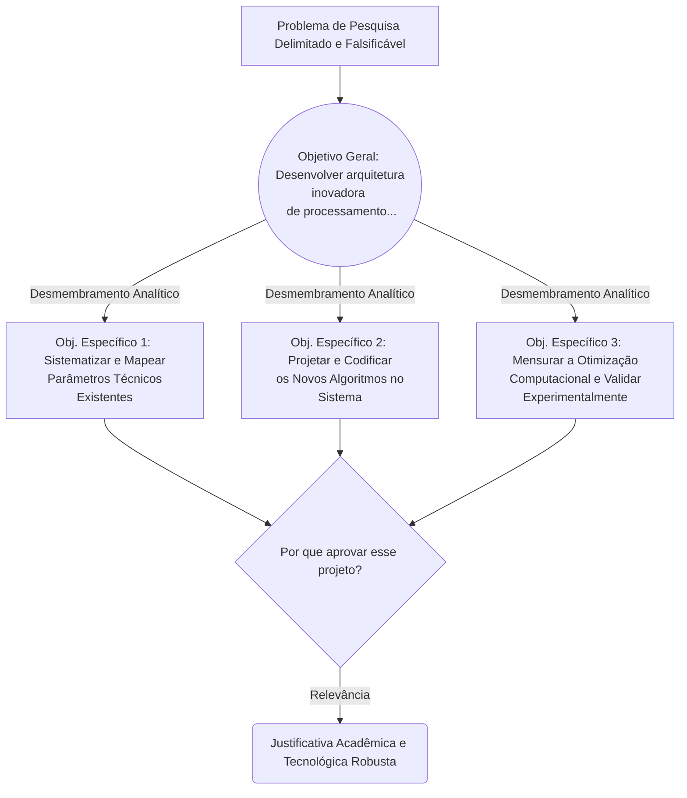

| Material Didático | Link Institucional (Acesso Aberto / PDF) |
| :--- | :--- |
| 📄 **Slides LaTeX — Modelo Branco (.pdf)** | [Acessar Slide Branco](/assets/biblioteca/latex-escrita/slides-latex/aula-02-branco.pdf) |
| 📄 **Slides LaTeX — Modelo Preto (.pdf)** | [Acessar Slide Preto](/assets/biblioteca/latex-escrita/slides-latex/aula-02-preto.pdf) |
| 📝 **Notas de Aula Institucionais (.pdf)** | [Acessar Notas Institucionais](/assets/biblioteca/latex-escrita/notes-latex/aula-02.pdf) |

## 📋 Sumário da Aula
- 1. Introdução e Fundamentação Teórica
- 2. Normalização ABNT e Rigor Metodológico
- 3. Prática e Engenharia no Ecossistema ReLaTeX
- 4. Estudo de Caso Real e Resolução de Problemas
- 5. Síntese e Conclusão

## 1. A Arquitetura Lógica dos Objetivos na Pesquisa

Uma vez consolidada a pergunta de pesquisa e as hipóteses norteadoras, o autor necessita de uma bússola inequívoca da direção exata da ação interventora do estudo. Esta direção materializa-se nos objetivos da pesquisa acadêmica. Sem eles, o delineamento metodológico perde ancoragem, resultando invariavelmente em investigações perdidas e desfocadas. Os objetivos definem categoricamente "o que", "com que fim" e "qual o escopo" do labor científico prolatado.

A estrutura é dicotômica na tradição metodológica:
- **Objetivo Geral:** Trata-se da enunciação macro da finalidade máxima do estudo, uma resposta projetada e assertiva que guarda correlação direta e biunívoca com o problema de pesquisa.
- **Objetivos Específicos:** Representam o desdobramento microanalítico do Objetivo Geral. São metas intermediárias, parciais e cumulativas, organizadas frequentemente em sequência cronológica e de complexidade analítica ascendente, as quais, somadas integralmente, propiciam e garantem o atingimento do alvo principal. Não se configuram como o detalhamento raso das metodologias — diferencie categoricamente um objetivo (meta finalística) de uma técnica metodológica (meio de alcance).

## 2. A Precisão Lexical: A Taxonomia Revisada de Bloom

Para redigir objetivos com a inexorável clareza reclamada pelo rigor científico e educacional, o uso do senso comum na escolha vocabular é proscrito. É mandatório o amparo na **Taxonomia de Bloom**, uma estrutura de classificação hierárquica robusta de objetivos educacionais e cognitivos em domínios de aprendizagem e ação analítica.

Na redação de dissertações e teses (que demandam, por força de lei acadêmica, níveis de originalidade, avaliação e criação substanciais), os verbos escolhidos no infinitivo devem se situar invariavelmente nos extratos superiores da hierarquia cognitiva ou no domínio analítico estrito.

### O Vetado Uso de Verbos Ambíguos
A subjetividade cognitiva dificulta brutalmente a validação de um projeto por uma banca examinadora. Sob nenhuma circunstância utilize verbos cuja aferição empírica seja turva ou inatingível objetivamente:
- **EVITE VEEMENTEMENTE:** _Compreender, saber, entender, conhecer, apreciar, internalizar, estar consciente, aprofundar, captar_.

### O Correto Uso de Verbos Analíticos (Exemplos das Categorias de Bloom):
- **Aplicação e Análise:** _Analisar, classificar, calcular, correlacionar, demonstrar, mapear, examinar, comparar, investigar_.
- **Avaliação e Síntese:** _Sintetizar, argumentar, criticar, avaliar, validar, medir, julgar, testar_.
- **Criação e Inovação (Ponto ótimo para Pós-Graduação):** _Desenvolver, projetar, propor, elaborar, arquitetar, estruturar, construir, conceber_.

## 3. A Justificativa: Defendendo a Pertinência da Pesquisa

Após delinear a engenharia do que se vai fazer, é vital provar à comunidade científica — e notadamente às agências de fomento (CAPES, CNPq, FAPERJ) — **por que** esse esforço demanda financiamento, alocação de tempo institucional e recursos do programa de pós-graduação. Esta é a função precípua da Justificativa. 

A Justificativa atua essencialmente como uma ferramenta de convencimento retórico assentado em evidências, operando em múltiplas camadas fundamentais:
- **Justificativa Técnico-Acadêmica:** Qual a magnitude da contribuição direta desta obra para o avanço no estado da arte da disciplina? Há alguma lacuna teórica flagrante (*research gap*) que está sendo suprida de maneira inovadora por essa pesquisa em específico?
- **Justificativa de Aplicabilidade / Social:** Onde se verificam os reflexos utilitaristas, sociais ou práticos dos achados resultantes do escopo delimitado da pesquisa? Em uma instituição de pendor tecnológico como a rede dos Institutos Federais, o peso do impacto tangencial voltado ao mundo do trabalho ou ao aprimoramento processual local ganha centralidade ímpar.
- **Justificativa Metodológica (quando aplicável):** Argumentação da validade em utilizar uma abordagem de investigação inédita para tratar problemas clássicos na seara do conhecimento.

## 4. Diagrama: O Alinhamento Estratégico Teleológico (Mermaid)

## 5. Estudo de Caso (Use Case Real e Detalhado)

**O Problema de Contexto:** A não padronização sistemática e as barreiras técnicas de aprendizagem na diagramação de documentos acadêmicos da pós-graduação institucional acarretam, historicamente, um desgaste imenso (horas de retrabalho manual) e altos índices reprobatórios por parte da comissão de validação de formatação de teses do IFF, dadas as severas não conformidades para com as disposições da Associação Brasileira de Normas Técnicas.

**Objetivo Geral da Pesquisa Subjacente:** "Projetar e validar exaustivamente uma classe documental LaTeX (pacote macro *ifftese*) estritamente aderente ao regramento da ABNT NBR 14724, com vistas a automatizar maciçamente as parametrizações bibliográficas, pré-textuais e de estilo estrutural no âmbito dos programas de Pós-Graduação."

**Objetivos Específicos Alinhados:**
1. Mapear sistematicamente as exigências e os requisitos técnicos imperativos da normatização ABNT NBR 14724, alinhando-as com o manual interno de normatização para trabalhos acadêmicos institucionais (Conhecimento/Compreensão e Análise, na Taxonomia de Bloom).
2. Codificar, testar rigorosamente e integrar rotinas em linguagem TeX/LaTeX (subjacentes ao projeto comunitário *abnTeX2*), consolidando macros parametrizáveis robustas voltadas à interface de entrada de dados discentes (Síntese e Aplicação).
3. Avaliar quantitativamente a eficiência produtiva desta ferramenta por meio da aplicação controlada de um survey de validação usável em uma amostra experimental aleatória compreendendo 45 dissertações finalizadas em softwares puramente WYSIWYG, parametrizando tempo dispendido no fluxo de compilação da entrega (Avaliação).

**Justificativa Substantiva:** O presente desenvolvimento detém massiva expressividade institucional (Justificativa Social/Local) por salvaguardar inúmeras horas de dedicação docente/discente despendidas em diagramação braçal, bem como preencher uma lacuna instrumental vital (Justificativa Técnico-Acadêmica) na automação rigorosa do compliance normativo, reduzindo estatisticamente o volume de ressubmissões decorrentes de anomalias formais nos documentos acadêmicos depositados.

## 6. Exercício Prático Estruturado

Instruções baseadas nos pilares ensinados (35 minutos de atividade individual):
1. A partir do problema de pesquisa e hipóteses rascunhados na **Aula 01**, estabeleça por escrito, de maneira clara e inconfundível, um **Objetivo Geral**. 
2. Construa pelo menos **três (03) Objetivos Específicos**, garantindo imperativamente que cada um dos verbos de ação selecionados advenha de estratos distintos e sucessivos, consultando formalmente a listagem recomendada da Taxonomia Revisada de Bloom.
3. Elabore um parágrafo que consolide, de forma clara, o núcleo da sua Justificativa Técnica (o impacto de inovação) visando defender sua pesquisa num comitê de ética ou para o seu orientador direto.

## 7. Referências Bibliográficas (Formato ABNT)

- BLOOM, B. S. et al. *Taxonomia de objetivos educacionais*: domínio cognitivo. Porto Alegre: Globo, 1973.
- CRESWELL, J. W. *Projeto de Pesquisa*: Métodos Qualitativo, Quantitativo e Misto. 3. ed. Porto Alegre: Artmed, 2010.
- LORENZATO, S. *O laboratório de ensino de matemática na formação de professores*. Campinas: Autores Associados, 2006. (Exemplo de aprofundamento taxonômico).
- MARCONI, M. de A.; LAKATOS, E. M. *Fundamentos de metodologia científica*. 8. ed. São Paulo: Atlas, 2017.

## 🛠️ Recursos Adicionais e Material Suplementar

- **[🏛️ Guia Oficial de Modelos, Classes e Pacotes ReLaTeX](/pt-br/resource/latex/modelos-de-documento)** — Exemplos canônicos de código, classes (`ifftese.cls`, `slidesiffmodelo.cls`) e documentação interna.
- **[📅 Planejamento Letivo e Cronograma de Atividades](/pt-br/resource/latex/planejamento-e-cronograma)** — Matriz analítica de 80h (Terças, 14h30-17h30) e avaliação em 2 bimestres.
- **[📜 Código de Conduta e Diretrizes Acadêmicas](/pt-br/resource/latex/codigo-de-conduta-e-diretrizes)** — Regimento ético, normas CEP/CONEP e uso transparente de IA.
- **[CTAN (Comprehensive TeX Archive Network)](https://ctan.org/)** — Portal oficial mundial de pacotes LaTeX2e.
- **[ABNT Catálogo de Normas](https://www.abnt.org.br/)** — Acesso e consulta às normas técnicas vigentes.
- **[Overleaf Documentation](https://www.overleaf.com/learn)** — Base de conhecimento e guias práticos sobre compilação TeX.

