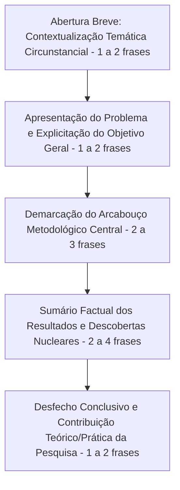

| Material Didático | Link Institucional (Acesso Aberto / PDF & PPTX) |
| :--- | :--- |
| 📄 **Slides LaTeX (52 slides - .pdf)** | [Acessar Slide LaTeX](/assets/biblioteca/latex-escrita/slides-latex/aula-03.pdf) |
| 📊 **Slides PPTX Institucional (.pptx)** | [Acessar Slide PPTX](/assets/biblioteca/latex-escrita/slides-pptx/aula-03.pptx) |
| 📝 **Notas de Aula LaTeX (100% .tex - .pdf)** | [Acessar Notas LaTeX](/assets/biblioteca/latex-escrita/notes-latex/aula-03.pdf) |

## 📋 Sumário da Aula
- 1. Introdução e Fundamentação Teórica
- 2. Normalização ABNT e Rigor Metodológico
- 3. Prática e Engenharia no Ecossistema ReLaTeX
- 4. Estudo de Caso Real e Resolução de Problemas
- 5. Síntese e Conclusão

## 1. O Resumo Acadêmico Sob o Prisma Normativo Moderno

O resumo de um trabalho de pós-graduação ou artigo científico é incomensuravelmente mais do que uma mera sinopse editorial ou sinopse comercial de livro. Trata-se da apresentação meticulosa, sumária, rigorosamente concisa e inteiramente objetiva dos pontos e achados mais decisivos de um documento. No paradigma comunicacional contemporâneo regido pelos metadados e indexações automatizadas das bases indexadoras e repositórios acadêmicos digitais, o resumo converteu-se na principal, senão na única, "vitrine textual" que atrai ou rechaça outros pesquisadores em sua prospecção de leitura.

Para amalgamar e balizar a uniformidade dessa estrutura crucial e elementar, vigora soberana no país a **ABNT NBR 6028**, recentemente revisada em maio de **2021** (uma atualização fundamental após a arcaica norma anterior datada de 2003, implementando modificações de grande impacto).

### As Cláusulas de Pedra da ABNT NBR 6028:2021
Todo aluno de programa formativo estrito senso deve internalizar que qualquer desvio nesta seção resultará na imediata rejeição protocolar da tese. A norma prescreve imperativamente as seguintes diretrizes fundacionais e estéticas para a escrita adequada dos resumos formativos indicativos e informativos:

1. **Restrições Extremas de Extensão Paramétrica (Contagem de Palavras):** 
   - Trabalhos acadêmicos de vulto maior (Teses de Doutorado, Dissertações de Mestrado e Projetos de Pesquisa densos) ou relatórios técnico-científicos: **Obrigatoriedade imperiosa de contenção entre 150 e 500 palavras**.
   - Para Artigos Científicos veiculados em periódicos acadêmicos rigorosos, monografias ou publicações curtas e seriadas: **A delimitação restringe-se ao intervalo de 100 a 250 palavras**.
   
2. **Formatação Estética Maciça (O Bloco Monolítico):** O texto obrigatoriamente deve ser diagramado e redigido na forma de **um único parágrafo fluido**, um bloco denso contínuo (jamais com quebras de linha que inaugurem novos parágrafos, tabulações ou enumerações de qualquer sorte).

3. **Restrições Estilísticas Profundas:** O texto não comporta divagações subjetivas. É mandatório o uso de redação em terceira pessoa do singular combinada estritamente com verbos na voz ativa de maneira preponderante (ex: "A pesquisa analisa" em vez de "O presente autor pesquisou" ou "Foi analisado pela pesquisa"). Evita-se totalmente a alocução na primeira pessoa ("eu fiz", "nós pesquisamos").
   - **IMPORTANTE:** Expressamente e irrestritamente proíbe-se a inclusão contígua de citações bibliográficas padrão, fórmulas físicas ou matemáticas elaboradas complexas, ilustrações, diagramas vetoriais ou dados não cruciais no escopo restrito do texto do resumo, ressalvada as excepcionalidades raríssimas nas quais toda a obra dependa fatalmente de uma única referência (neste caso, a referência completa em norma figurará acoplada ao próprio texto discursivo, sem notas de rodapé).

4. **Componentes Estruturais Mandatórios do Conteúdo (Sequenciamento de Redação):** O conteúdo tem que necessariamente contemplar, numa concatenação orgânica natural, os seguintes itens em ordem cronológica discursiva implícita: O cenário temático envolvente (breve), o objetivo imperativo de desenvolvimento da obra, a estratégia e arcabouço metodológico utilizado integralmente, as descobertas centrais pormenorizadas qualitativa ou quantitativamente (os resultados-chave) e, a remate, o desenlace analítico e confluência do estudo (conclusões ou contribuições diretas).

## 2. A Tradução Idiomática Indispensável: *Abstract* (O Resumo em Língua Estrangeira)

Tão elementar quanto o resumo vernáculo, a confecção do resumo traduzido meticulosamente para o léxico do idioma inglês (*Abstract*) (ou espanhol, francês, conforme os editais ou a vocação da revista/programa) é uma premissa básica da veiculação acadêmica moderna com miras à internacionalização de impacto. Esta tradução deve possuir caráter rigorosamente idiomático, preservando as nuanças do jargão técnico refinado próprio da disciplina. Ferramentas automatizadas sem moderação e revisão humana qualificada tendem a gerar catástrofes semânticas no registro de vocabulário específico setorial, arruinando a respeitabilidade do documento perante a academia global.

Em conformidade a NBR 14724 (que trata do trabalho final como um todo), a diagramação do abstract é equivalente à do resumo: apresenta-se em folha individual em separado, imediatamente sequenciada à folha dedicada ao resumo em língua vernácula pátria, também possuindo, em anexo à sua composição, palavras-chave fielmente traduzidas (*Keywords*).

## 3. As Palavras-Chave (Elementos Representativos de Recuperação Documental)

Situam-se obrigatoriamente dispostas, por regra gramatical e de normatização documentária, abaixo e destacadamente em sequência iminente ao bloco de texto principal (parágrafo único) do resumo (ou abstract, como *keywords*). Elas servem integralmente à premissa basal de facilitar o algorítmico resgate de informação (*Information Retrieval*). 
De acordo com a NBR 6028:2021, o modelo adotado prescreve que os termos-chave sejam precedidos expressamente pela locução exata "Palavras-chave:", com cada palavra em particular sendo dividida das subsequentes pelo emprego impositivo de ponto e vírgula, e o fechamento do bloco concluído categoricamente por um ponto final ordinário.
*Exemplo rigoroso:*
Palavras-chave: Latex avançado; Normatização acadêmica documental; ABNT NBR 6028.

## 4. Diagrama Analítico: Estrutura Interna Recomendada do Resumo (Mermaid)

## 5. Estudo de Caso Crítico (Use Case Prático na Redação)

**A Falha Comum na Documentação em LaTeX:** Dentre a imensa gama de calouros e discentes recém-admitidos na escrita utilizando o sistema de tipografia científica LaTeX, há o deslize costumeiro brutal em tentar compilar a documentação acadêmica fazendo uso do ambiente rudimentar nativo `\begin{abstract}` originário das primitivas classes fundamentais anglo-saxônicas tradicionais padrão (como `article`, `report`, ou `book`), os quais divergem brutalmente do layout ditado pelo órgão normatizador pátrio. Esses ambientes legados promovem um desastroso texto justificado mais estreito ou centralizado que subverte a rigidez exigida pela formatação oficial nacional. 
**A Solução Efetiva Empregada:** O advento salutar do projeto normativo robusto (pacote comunitário nacional `abnTeX2`, núcleo de classes institucionais especializadas como `ifftese`) sana, automatiza e padroniza este passivo. Ele provê, internamente, um ambiente macro altamente especializado parametrizado de nome `\begin{resumo}`, que automaticamente impõe a recusa assertiva de parágrafos suplementares errôneos, engessa as normativas visuais da regra corrente, adere à margem rigorosa correta exigida (alinhamento sem recuos), padroniza a formatação de título ("Resumo" centralizado, maiúsculo e negrito), facilitando maciçamente e inibindo desvios normativos graves do acadêmico inexperiente.

## 6. Exercício Prático Exigido

Instruções fundamentais (25 minutos de labor analítico intenso):
Recorra às bases de busca consolidadas em seu horizonte e ramo investigativo (Portal de Periódicos CAPES, Scielo, Google Acadêmico) e selecione o resumo e palavras-chave de um artigo científico balizador muito citado inerente ao tema de seu vindouro TCC/Dissertação. Analise e desconstrua ativamente as diretrizes perante o material.
1. Promova a contagem rígida de palavras. O documento selecionado aderiu de fato fielmente à regulação prescrita da ABNT sobre as dimensões ideais recomendadas ou o autor extrapolou grotescamente os ditames (sub/super dimensionamento)? 
2. Realize a desconstrução morfológica e estrutural das sentenças. Você é capaz de segmentar (com marca-texto ou digitalmente) nitidamente as cinco facetas nucleares constituintes que compõem o modelo perfeito (Contextualização, Demarcação, Método Adotado, Achados Empíricos e Contribuição/Desfecho)? Em caso negativo, discuta onde a redação falhou pela opacidade.

## 7. Referências Bibliográficas e Padrões Citados (Formato ABNT)

- ASSOCIAÇÃO BRASILEIRA DE NORMAS TÉCNICAS. *NBR 6028*: Informação e documentação - Resumo, resenha e recensão - Apresentação. Rio de Janeiro: ABNT, 2021.
- ASSOCIAÇÃO BRASILEIRA DE NORMAS TÉCNICAS. *NBR 14724*: Informação e documentação - Trabalhos acadêmicos - Apresentação. Rio de Janeiro: ABNT, 2011.
- FRANÇA, J. L. et al. *Manual para normalização de publicações técnico-científicas*. 9. ed. Belo Horizonte: Editora UFMG, 2013.

## 🛠️ Recursos Adicionais e Material Suplementar

- **[🏛️ Guia Oficial de Modelos, Classes e Pacotes ReLaTeX](/pt-br/resource/latex/modelos-de-documento)** — Exemplos canônicos de código, classes (`ifftese.cls`, `slidesiffmodelo.cls`) e documentação interna.
- **[📅 Planejamento Letivo e Cronograma de Atividades](/pt-br/resource/latex/planejamento-e-cronograma)** — Matriz analítica de 80h (Terças, 14h30-17h30) e avaliação em 2 bimestres.
- **[📜 Código de Conduta e Diretrizes Acadêmicas](/pt-br/resource/latex/codigo-de-conduta-e-diretrizes)** — Regimento ético, normas CEP/CONEP e uso transparente de IA.
- **[CTAN (Comprehensive TeX Archive Network)](https://ctan.org/)** — Portal oficial mundial de pacotes LaTeX2e.
- **[ABNT Catálogo de Normas](https://www.abnt.org.br/)** — Acesso e consulta às normas técnicas vigentes.
- **[Overleaf Documentation](https://www.overleaf.com/learn)** — Base de conhecimento e guias práticos sobre compilação TeX.

