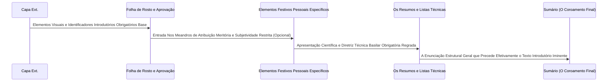

| Material Didático | Link Institucional (Acesso Aberto / PDF) |
| :--- | :--- |
| 📄 **Slides LaTeX — Modelo Branco (.pdf)** | [Acessar Slide Branco](/assets/biblioteca/latex-escrita/slides-latex/aula-04-branco.pdf) |
| 📄 **Slides LaTeX — Modelo Preto (.pdf)** | [Acessar Slide Preto](/assets/biblioteca/latex-escrita/slides-latex/aula-04-preto.pdf) |
| 📝 **Notas de Aula Institucionais (.pdf)** | [Acessar Notas Institucionais](/assets/biblioteca/latex-escrita/notes-latex/aula-04.pdf) |

## 📋 Sumário da Aula
- 1. Introdução e Fundamentação Teórica
- 2. Normalização ABNT e Rigor Metodológico
- 3. Prática e Engenharia no Ecossistema ReLaTeX
- 4. Estudo de Caso Real e Resolução de Problemas
- 5. Síntese e Conclusão

## 1. A Estrutura Macro do Documento (A Vigência da NBR 14724)

A espinha dorsal morfológica que regula as dimensões arquiteturais de toda a confecção de trabalhos de cunho puramente acadêmico institucional no território brasileiro (o que engloba de forma impositiva e basilar as Teses, Dissertações, Monografias e os Trabalhos de Conclusão de Curso diversos) fundamenta-se invariavelmente nas amarras da norma principal **ABNT NBR 14724** (em sua atualização consolidada em 2011).

Este documento-base seccionou radicalmente e determinou taxativamente a composição topográfica do texto-final em três dimensões modulares fixas em ordem de aparecimento: os Elementos Pré-Textuais (o introito cerimonial e informacional), os Elementos Textuais (o bojo intelectual central, da introdução basilar à conclusão do raciocínio da tese), e os Elementos Pós-Textuais (a ancoragem probatória documental com referências, anexos e apêndices cabíveis). O foco imersivo desta referida aula concentrar-se-á, com profundidade hermenêutica exaustiva e pormenorizada, exclusivamente nos meandros e regulamentações rigorosas pertinentes aos componentes pré-textuais da citada regulação.

### Os Elementos Pré-Textuais Imperativos (Obrigatórios por Força Normativa)

Qualquer entrega acadêmica formal submetida desprovida deste sequenciamento inquebrável, com omissões propositais nos elementos fixos de apresentação, resultará categoricamente no indeferimento imediato e liminar do depósito da mesma no acervo da biblioteca e não logrará chancela validatória da secretaria dos colegiados pertinentes:

1. **Capa (Frontispício Externo):** Configura-se pela barreira material primária ou face digital protetiva identificadora da obra. Comporta, de forma obrigatória estrita, os dados nominais da entidade financiadora e da academia onde atua o pesquisador, o nome completo de registro do discente, o título denso descritivo referendando fidedignamente o trabalho (com subtítulo, quando aplicável de modo inarredável), cidade de assento e sustentação perante banca avaliadora, e no fechamento o ano da emissão efetiva perante as secretarias e órgãos competentes.

2. **Folha de Rosto e sua Anatomia Singular:** Semelhante graficamente à capa, diferencia-se dela (e agrega robustez probatória) graças a um elemento central imperioso de composição complexa peculiar. Abaixo da metade visual do documento original e alinhado categoricamente a recuo milimétrico (estipulado por praxe do abnTeX2, geralmente 8 centímetros da margem da folha a partir de sua metade para o canto lateral leste inferior direito), deve constar o texto que elucida, perante terceiros, e valida categoricamente o objetivo prático acadêmico pretendido com a confecção e encadernação do calhamaço exaustivo da tese — declarando expressamente de quem para qual instituição com fins ao atingimento do grau, além do destaque expresso do prenome e dos sobrenomes notórios, titulações ostentadas da respectiva figura orientadora/coorientadora.

3. **Ficha Catalográfica (O Elemento Condicional Indissociável):** Documento redigido compulsoriamente (ou validado via metadados sob rigoroso processo de auditoria) por um profissional habilitado da área (bibliotecário catalogador com CRB) pautado rigorosamente em classificações e padrões decimais Dewey/CDU imersos nas bases internacionais de busca de acervo (Código de Catalogação Anglo-Americano etc). Obrigatoriamente posiciona-se em local inusitado por regra técnica basilar histórica, sendo imperioso figurar visualmente na extremidade verso (o dorso inferior) correspondente à exata retaguarda da própria e autêntica Folha de Rosto inicial de abertura supramencionada, em moldura métrica regulamentada padronizada internacional.

4. **Folha de Aprovação Solene:** Este constitui legal e administrativamente o elemento que atribui validação cabal oficial atestando que os examinadores presentes ratificaram a obra para outorga final. Contém, por padrão, o arranjo idêntico àquela declaração da natureza acadêmica disposta na folha de rosto, sucedida expressamente das titulações plenas, nomes civis rigorosamente completos, e campo físico para coleta individual oficial manuscrita via caneta de cor escura, ou digital (via ICP-Brasil, gov.br etc.) ou via assinaturas registradas da completude dos doutores componentes oficiais integrantes formalizados em comissão especial nomeada, juntamente com a data integral da defesa da dissertação.

5. **Resumo Redigido na Língua Vernácula e seu Equivalente e Mimetismo Exato Traduzido (Abstract):** Itens essenciais devidamente esmiuçados à exaustão em sessão acadêmica pretérita, sob os ditames da normatização anexa conexa vigente ABNT NBR 6028.

6. **Sumário Estruturado e Suas Matrizes Internas (ABNT NBR 6027:2012):** É estritamente a última folha elencada na enumeração progressiva do grupo pré-textual. Ele não pode se confundir jamais com um mero índice aleatório de nomenclaturas, devendo estampar incondicional e cronologicamente todas as numerações organizacionais sub-capitulares em formatação hierárquica tipográfica idêntica ou análoga ao próprio interior textual.

### Elementos Pré-Textuais Extensivos Discricionários (Facultativos)

1. **Errata (Casuística Excepcional):** Disposta no caso raro de verificação extrema em momento após à encadernação final consolidada do volume integral, comumente composta numa folha de anexo móvel adicional encartada em bloco subsequente imediato da própria capa ou resguardo principal. Tabela mapeando "onde se devia ler X, leia-se expressamente Y".
2. **Dedicatória Pessoal:** Destinada a preito e honraria restrita. Recomenda-se posicioná-la alinhada visualmente na terça parte inferior meridional extrema direita da lauda.
3. **Agradecimentos Formais e Informais (Reconhecimento Estrito):** Espaço consagrado ao pagamento moral devido às dívidas formadas a todos que cederam suor à empresa formativa. Imprescindível consignar o fomento estatal e apoio oriundo e angariado de órgãos federais e/ou estaduais propulsores, devidamente e pautadamente via numeração oficial do processo do auxílio. Por força de portarias governamentais impositivas vigentes do MEC, bolsas ofertadas ou fomentadas através de cota CAPES ou assemelhados detêm textualmente a exigência explícita e obrigatória a que todos os mestres obedeçam o fraseado padrão oficial, tal como a citação explícita do famigerado Código de Financiamento 001.
4. **Epígrafe(s) (Provérbio ou Pensamento Balizador):** Citação não-necessariamente exaustivamente detalhada numéricas nas referências com dados densos que orientou em caráter existencial o percurso formativo da dissertação. (Contendo apenas a menção honrosa ao originador autor).
5. **Listas Relacionais Discretas Específicas e Sequenciais Ordenadas:** Para Ilustrações generalistas (englobando quadros fotográficos gráficos esquemáticos e congêneres separadamente), de Tabelas tabuladas estatísticas (conforme padrão normativo IBGE de 1993, com aberturas laterais visíveis), da Siglagem complexa exaustivamente usada por toda obra, e dos Símbolos diversos exatos que não constam comumente nas tábuas normais (por exemplo, na seara vasta das subáreas das engenharias eletrônicas exatas ou computação quantitativa complexa em matemática pura elaborada). 

## 2. Diagramação Estrutural Lógica Cronológica: Sequenciamento Ordenado de Elementos Subsequentes (Mermaid)

## 3. O Desafio e Triunfo na Implementação Programática Automatizada via Ambiente TeX e Macro LaTeX Moderno

A tentativa persistente e hercúlea do processo penoso de elaboração manual e balizamento da margem estruturada destes densos elementos por vezes idiossincráticos revelaria inequivocamente um trabalho brutalmente moroso, penoso e sujeito ao fracasso tipográfico em processadores de edição estrita visual. Por tal aspecto e prisma analítico, impera gloriosamente a racionalidade pragmática por trás do uso contínuo de matrizes estruturais em linguagem compilada, de excelência global conhecida. A implementação contínua e adoção exaustiva do excelente e proeminente projeto livre integrador `abnTeX2` e das diretrizes e macros internas estritamente elaboradas e cristalizadas num pacote institucional consolidado (`ifftese.cls` e correlatos de formatação pátria), automatiza irrestritamente a geração paramétrica destas folhas exóticas e complexas. Todo este labor converte-se graciosamente na simples manipulação de variáveis primárias declaradas liminarmente na compilação do preâmbulo LaTeX do software ou script invocado, resultando assim em blocos de geração instanciada tais como a famosa diretriz `\imprimircapa`, a evocada `\imprimirfolhaderosto`, ou englobando o escopo estético no ambiente estrito regrado de um `egin{agradecimentos}`.

## 4. O Estudo de Caso Problemático: Regra Inexorável de Contagem vs Impressão Visual Numérica Arábica

**Mapeamento de Patologia de Formatação Institucional em Alta Reincidência:** Ao realizar análise rigorosa por intermédio das equipes das bibliotecas nas defesas passadas (na fase do arquivo consolidado .pdf protocolar), observou-se rotineiramente um passivo gritante onde um quarto alarmante do corpo discente fracassou redondamente em observar as excentricidades sobre a contabilização algarítmica na marcação das numerações inseridas visualmente no canto do papel (seja ele A4, no escopo das margens delimitadas e balizadas da NBR).

**A Solução Regulamentada Explícita imposta por NBR 14724:** Determina-se, de modo irrefutável e indiscutível aos moldes estritos, a regra em que: Todas as laudas constituintes que perfazem e consagram a massa do volume dos elementos pré-textuais — com ressalva notória em relação estrita e tão somente à capa visual do arquivo final, que absolutamente não figura na lista e cômputo da folhação geral (devendo a folha de rosto portanto, invariavelmente encabeçar a numeração, configurando exaustivamente o início ou número equivalente correspondente à cifra basilar de um) — devem, categoricamente e obrigatoriamente, figurar na contagem sequenciada linear matemática interna, **contudo e entretanto não se autoriza de maneira alguma e em hipótese remota nenhuma, que as mesmas exibam, em caráter visual físico grafado, qualquer indício da referida estampa algarítmica grafada**.
A numeração em formatação do numeral de arábico estampa-se, pela primeira ocasião visível e com inícios visuais gráficos (posicionados, por regra e balizamento à margem normatizadora, a exatos singelos e contados 2 centímetros das extremidades de delimitações e final de papel da folha visualizada numérica final de borda topográfica na extrema direita de canto superior), rigorosamente quando se ingressar, em definitivo e indissociavelmente, na página primária correspondente à Introdução da tese magna.

## 5. Dinâmica de Exercício Prático Instrumental Aplicado de Revisão Tipográfica Parametrizada em Template LaTeX

Consolidando conceitos vitais na parametrização algorítmica. Exame detido de código-fonte e compilação do output (.pdf):

1. Proceda, imbuído de extremo rigor, ao descarregamento da mais íntegra versão recente do respectivo template padronizado de modelo LaTeX institucional atual (`ifftese` em seu formato e pacote .zip ou acervo no _Overleaf_). 
2. Invada o arquivo macro principal e verifique exaustivamente se a caixa de texto referente e correspondente à nota declaratória do objetivo da titulação e nomeação correta ostensiva e exata do tutor ou professor orientador designado e a entidade e matriz atende com plena observância matemática e visual ao parâmetro fixo que estipula formalmente recuo e restrição da margem divisória partindo ao centro geográfico preciso de visualização simétrica na extensão da página A4 utilizada. 
3. Execute laboriosamente o carregamento de uma simulação do projeto compondo os ambientes prévios densos de sumário de figuras de imagem e tabela, e averigue empiricamente no seu documento-alvo e teste-final PDF gerado pela plataforma qual é verdadeiramente o instante primário irrefutável real da exibição do aparecimento gráfico correspondente aos números que orientarão sua lauda do corpo textual inicial.

## 6. Referências Bibliográficas Fundacionais Correlacionadas Comentadas (Formato ABNT)

- ASSOCIAÇÃO BRASILEIRA DE NORMAS TÉCNICAS. *NBR 14724*: Informação e documentação - Trabalhos acadêmicos - Apresentação. Rio de Janeiro: ABNT, 2011. (A bíblia principal do enquadramento do diploma acadêmico superior estrito).
- ASSOCIAÇÃO BRASILEIRA DE NORMAS TÉCNICAS. *NBR 6027*: Informação e documentação - Sumário - Apresentação. Rio de Janeiro: ABNT, 2012. 
- INSTITUTO BRASILEIRO DE GEOGRAFIA E ESTATÍSTICA (IBGE). *Normas de apresentação tabular*. 3. ed. Rio de Janeiro: IBGE, 1993. (Documento secular que norteia e impõe restrições a todos elementos e desenhos vetoriais baseados com fechamentos verticais de quadros de grades comparados às tabelas sem fronteiras na esquerda e à direta das abas).

## 🛠️ Recursos Adicionais e Material Suplementar

- **[🏛️ Guia Oficial de Modelos, Classes e Pacotes ReLaTeX](/pt-br/resource/latex/modelos-de-documento)** — Exemplos canônicos de código, classes (`ifftese.cls`, `slidesiffmodelo.cls`) e documentação interna.
- **[📅 Planejamento Letivo e Cronograma de Atividades](/pt-br/resource/latex/planejamento-e-cronograma)** — Matriz analítica de 80h (Terças, 14h30-17h30) e avaliação em 2 bimestres.
- **[📜 Código de Conduta e Diretrizes Acadêmicas](/pt-br/resource/latex/codigo-de-conduta-e-diretrizes)** — Regimento ético, normas CEP/CONEP e uso transparente de IA.
- **[CTAN (Comprehensive TeX Archive Network)](https://ctan.org/)** — Portal oficial mundial de pacotes LaTeX2e.
- **[ABNT Catálogo de Normas](https://www.abnt.org.br/)** — Acesso e consulta às normas técnicas vigentes.
- **[Overleaf Documentation](https://www.overleaf.com/learn)** — Base de conhecimento e guias práticos sobre compilação TeX.

