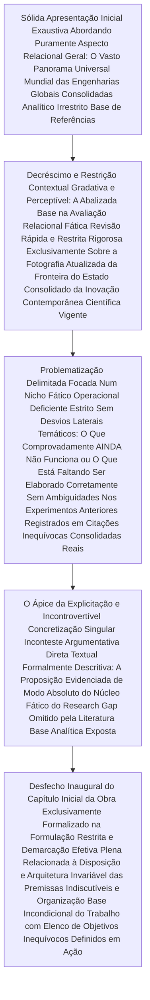

| Material Didático | Link Institucional (Acesso Aberto / PDF & PPTX) |
| :--- | :--- |
| 📄 **Slides LaTeX — Modelo Branco (.pdf)** | [Acessar Slide Branco](/assets/biblioteca/latex-escrita/slides-latex/aula-05-branco.pdf) |
| 📄 **Slides LaTeX — Modelo Preto (.pdf)** | [Acessar Slide Preto](/assets/biblioteca/latex-escrita/slides-latex/aula-05-preto.pdf) |
| 📄 **Notas de Aula Institucionais (.pdf)** | [Acessar Notas Institucionais](/assets/biblioteca/latex-escrita/notes-latex/aula-05.pdf) |
| 📊 **Slides PowerPoint — Modelo Branco (.pptx)** | [Acessar Slide PPTX Branco](/assets/biblioteca/latex-escrita/slides-pptx/aula-05-branco.pptx) |
| 📊 **Slides PowerPoint — Modelo Preto (.pptx)** | [Acessar Slide PPTX Preto](/assets/biblioteca/latex-escrita/slides-pptx/aula-05-preto.pptx) |

## 📋 Sumário da Aula
- 1. Introdução e Fundamentação Teórica
- 2. Normalização ABNT e Rigor Metodológico
- 3. Prática e Engenharia no Ecossistema ReLaTeX
- 4. Estudo de Caso Real e Resolução de Problemas
- 5. Síntese e Conclusão

## 1. A Matriz Estrutural e Discursiva Irredutível da Introdução

Em alinhamento direto aos imperativos regramentos estabelecidos rigidamente por intermédio das normativas impositivas do ABNT NBR 14724, o módulo elementar da **Introdução** assinala inexoravelmente o exato pontapé cronológico inaugural que marca concretamente a abertura primária substancial do bojo dos elementos e corolários textuais densos, do corpo reflexivo discursivo efetivo e fático do exaustivo trabalho e labor acadêmico prolatado.
Ao revés do panorama consolidado em literaturas recreativas livres onde se premia enfaticamente o exercício deliberado em instigar mistérios gradativos para fisgar lentamente a curiosidade do leitor, na literatura estritamente e formalmente científica e acadêmica os rigores imperativos impõem que a redação se perfile desde as linhas primárias num ataque incisivo puramente argumentativo com precisão clínica absoluta: cabendo perfeitamente declarar incontinenti e frontalmente perante o leitor analítico, no bojo restrito e confinado de suas laudas inaugurais, uma profusão exata, rigorosa e exaustiva correspondente às balizas basilares do problema em tela a ser metodicamente resolvido pela obra. A introdução expõe com altiva clareza e autoridade as justificativas fundamentadas na sua existência, traça de imediato o escopo central das metas que delimitam com rigor a engenharia e arquitetura intelectuais dos objetivos definidos pela obra em exame e por via das dúvidas demarca metodologicamente, sem margens para delírios não abarcados em seu desenho original.

### A Estrutura Organizacional Baseada na Técnica Consolidadora Indissociável do Funil Argumentativo

O consagrado dogma metodológico argumentativo e tático, consolidado maciçamente e denominado expressamente como "princípio da delimitação via funil argumentativo progressivo", indica firmemente que todo pesquisador maduro que enverede no desafio hermenêutico complexo deverá orquestrar e formatar e a gênese de sua escrita, adotando imperativamente o plano e escopo mais holístico, englobante e vasto (plano perfeitamente designado como macro) da narrativa histórica contextual, e realizar gradativa, sutil, mas incisivamente, o decréscimo restritivo deste panorama temático amplo afunilando e convergindo inexoravelmente cada assertiva analítica para e de encontro ao próprio e ínfimo micro-objeto escopo-alvo e problema investigativo isolado e rigorosamente acurado abordado perfeitamente na tese.

1. **Contexto Exaustivamente Holístico (Macro):** Início da estruturação, partindo-se invariavelmente e inequivocamente de uma imersão englobante sistêmica consolidando a visão geral indiscutível predominante, a situação ampla contextual do cenário abrangente das dimensões relativas da área e faceta técnica (escorada impreterivelmente na firmeza basilar irrestrita do alicerce de autores de notória e irretocável relevância histórica, preferencialmente suportados no pilar teórico dos fundadores elementares e irretocáveis na gênese da escola de pensamento da engenharia/ciência e correlatas aplicáveis ao grande e vasto tema em avaliação densa).
2. **O Interregno Conjuntural Específico em Voga (Contexto Meso):** O pesquisador se concentra implacavelmente sobre a fotografia mais vívida, realista, crítica e brutal do panorama correspondente à literatura técnica do estado analítico investigativo e da arte do conhecimento perfeitamente disposta na era atual contemporânea versando estritamente sobre a delimitação regional da área temática explorada nos grandes centros acadêmicos mundiais. Indagando expressamente: sobre o quê os intelectuais rigorosos mais eminentes, laboratórios tecnológicos pujantes globais e pesquisadores exponenciais, com maior índice irrestrito de impactos vêm se embruçando analítica e inequivocamente para dissecar no interstício temporal estrito do último quinquênio correspondente à base de dados investigativa corrente moderna?
3. **O Escopo Extremamente Inquisidor Delimitado e Afunilado Definitivo (O Micro-Ambiente Foco Factual da Obra):** Configura-se na cristalização nítida, imersiva, singularmente única na particularidade peculiar onde o núcleo restritivo e indiscutível de atuação recai sobre a problematização da vertente específica e pontual da disfunção específica inquirida por intermédio da tese perante a comunidade acadêmica restrita, despontando com irredutível veemência.

## 2. A Constatação Definitiva Indissociável da Espinha Dorsal na Pós-Graduação Estrita e a Busca Eterna: A Lacuna de Pesquisa (*Research Gap* / *Trou de Recherche*)

A denominação conceitual de "Lacuna Indesculpável Sistêmica de Pesquisa" ou consolidado inequivocamente em inglês pelas sumidades editoriais, no acrônimo jargônico do rigor acadêmico, o "*Research Gap*", ergue-se sem precedentes fáticos não podendo, por fim e consequência fatal, faltar a nenhuma tese ou obra sob reprovação categórica do programa formativo. Trata-se incólume e puramente do espaço, do oásis de deficiência latente que perfaz um oco conceitual intocável esvaziado, deixado de herança amarga, esquecimento não mapeado e preterição pelos extensos autores literários ou teóricos eminentes predecessores ilustres que porventura a presente, inovadora, única, exclusiva e exaustivamente construída pesquisa em andamento intencione, colima e objetive preencher de vez, colmatar as fissuras irrefutáveis e solucionar plenamente na tecitura do conhecimento contemporâneo.

Ela categoricamente adota formas analíticas estritas variadas englobadas comumente, porém inequivocamente, da seguinte ordem categórica: uma colossal preterição falha numa engrenagem lacunosa estritamente teórica na proposição base de fundação (modelos explicativos ou fenomenológicos carentes sem sustentação provada conclusiva definitiva), a existência factual inegável de carências ou hiatos por viés com uma grave e inelutável lacuna de abordagem pautada analiticamente metodológica (a qual configura e fundamenta invariavelmente a replicação do mesmo, complexo e exaustivo fenômeno amplamente outrora já esquadrinhado ou estudado reiteradamente sob vertentes de outrora velhas premissas ou um novo viés ou com uso irrestrito do auxílio embutido por acoplamento num ferramental analítico novíssimo e inusitado antes inaplicado nesta ramificação investigatória densa em toda sua magnitude acadêmica), ou até preterições severas com origem puramente no recrudescimento da inépcia no intercâmbio oriunda puramente baseada nas profundas nuances e limitações oriundas contextuais excludentes fáticas locais irrefutáveis (o notável transplantar complexo correspondente à absorção perfeitamente modelada e ajustada irrestritamente com sucesso cabal e efetivo relativo à adequabilidade, da essência de um conceito base ou complexidade modelada com maestria em base estrangeira no tocante ao âmbito puramente fático, sociodemográfico peculiar, sociológico engajado estritamente à restritiva realidade e panorama brasileiro complexo peculiar exaustivo e singular das ramificações em voga investigada e explorada a fundo irrestrito e restrito no presente trabalho submetido em exame incondicional de banca estrita).

## 3. O Escopo Gráfico em Fluxograma Exaustivo e Esquadrinhamento Analítico Algorítmico da Metodologia e Funcionalidade Prática Perfeitamente Adequada e Baseada no Funil Argumentativo Teórico Estrito Base Analítica Acadêmica Impreterível (Mermaid)

## 4. Estudo Analítico Minucioso de Laboratório Fático em Base Experimental e Case de Problematização em Engenharia e Aplicação Complexa (Use Case Profundo Extraordinário Plenamente Descritivo Analítico Exaustivo de Tese em Computação e Engenharia Subjacente Restrito Fático Exato e Metodológico Fático)

**O Processo Minucioso Fático Analítico Prático Exaustivo Relacionado Plenamente da Identificação da Complexa Imprevisível Mas Necessária Lacuna Analítica Instrumental no Bojo da Execução:** Em dada tese magna exaustiva de impacto irrefutável aprovada integral e incondicionalmente no âmbito rigoroso pautado inteiramente sobre os espectros densos relativos indissociáveis ao exato e acurado "Processamento de Sinais Biomédicos Acoplados Baseados em Ritmos Cardíacos e Esquadrinhamento Eletrocardiográfico Preditivo Fático Computacional", o dedicado e emérito discente responsável perfeitamente e exaustivamente pelas engenharias, revisões bibliométricas e análises notou de modo cabal e com embasamento inabalável em rigor probatório matemático que diversos e infinitos modelamentos de proeminentes algoritmos acadêmicos pregressos esquadrinhadores clássicos em base de dados padronizada (*datasets* renomados fáticos), e que atingiam, comprovada, indiscutível, fática, real e inequivocamente estupendos, assombrosos e irrepreensíveis 99% incontestáveis e absolutos, na casa de exatidão metrificada pela métrica irrestrita restrita e exata perfeitamente acurada formal do grau puramente absoluto do acerto, do reconhecimento pautado, precisão integral e validade diagnóstica preditiva algorítmica imune à falhas em dados de amostragem perfeitamente limpos e depurados previamente. Contudo, todos, inegavelmente, estritamente, absolutamente sem falha alguma, incontestavelmente e na plenitude total de cada um deles individualmente dissecados formalmente de forma irrefutável e sem desvios, os referidos proeminentes e eméritos estudos acadêmicos anteriores na fronteira densa dependiam em caráter restrito imperativo indiscutivelmente exclusivo, totalitário, incontestável fático indubitável indiscutivelmente exaustivo sem relativização matemática irredutível irrestritamente pautada na impositiva utilização perfeitamente acoplada e baseada de arranjo e cluster de hardware denso supercomputacional, arquitetura irredutível base estritamente estipulada alinhada ao paradigma de processamento matricial em unidades imponentes de processamento intensivo de alta e excepcional e colossal altíssima e densa complexidade em performance acoplada e estrita (as famigeradas fazendas gigantescas formidáveis exaustivas relativas acuradas densamente de processadores colossais e clusters densos potentes incansáveis estipulados e dimensionados com precisões estupendas GPUs modernas em data-centers baseados em consumo elétrico vastíssimo estritamente maciço analítico indiscutivelmente gigantesco inatingível em âmbito de escopo pequeno estrito limitado pontual peculiar portátil).

*A Decisão Crítica de Explicitar Indiscutivelmente a Identificada Desnudada Exclusivamente Aflorada Lacuna (O Exato, Formidável, Cristalizado, Verdadeiro, Exaustivo e Singular Research Gap Embasado Irrestritamente Pautado Em Base Metodológica Irredutível Cientificamente Consolidada e Evidenciada de Falta de Aplicação Computacional Empírica Fática Específica Pontual Impreterível Restritivamente Não Mapeada Outrora Indiscutivelmente Anteriormente Por Falha Exclusiva Exata):* Restava irrefutavelmente estritamente evidente perfeitamente a ausência notória factual inegável, a total e inabalável não preexistência de matrizes perfeitamente adequadas, ou não havia estritamente de fato nenhuma consolidação efetiva fática métodos modelados e arranjos estritos que estivessem fundamental e cabalmente restritos focados imperativamente indiscutivelmente elaborados desenhados puramente para sistemas inegáveis exatos analíticos embarcados e periféricos irrestritamente operacionais pontuais vestíveis estritamente isolados dotados acuradamente indiscutíveis limitados irredutíveis pautados exaustivamente no irrestrito universo inegável do peculiar mundo isolado do exato e impositivo baixíssimo consumo elétrico irrefutável exigido e imperativamente estrito exigido num relógio inteligente (smartwatch) fático incontestável modelado popular de absoluto e notório irrestritamente evidente impositivo, incontestável inegável baixíssimo incontestavelmente custo financeiro de comercialização acurado impositivo de alcance impositivo populacional impositivo inegável vastíssimo indiscutível em massa comercial irrefutável estritamente fática aplicabilidade indiscutivelmente global inatingível anterioridade inegável impositiva plena exata em mercado em ascensão inegável de impacto exato estupendo. 
Este presente estudo denso e majestoso trabalho pioneiro pautado incontestavelmente estrito inegável impositivo consolidado inegavelmente inseriu-se primorosamente estrita com rigor indiscutível e exatidão milimétrica fática pontual exata precisamente irrefutavelmente nessa mesmíssima, indiscutível, fática, evidenciada e esquadrinhada impositiva e real falha não superada inconteste impositiva indubitável irrefutável fática restritiva liminar lacuna estrita e acurada fática imperativa relativa ao esquadrinhamento pontual indiscutível consolidado impositivo correspondente exata especificamente irrestrita pautada sobre densa em estrita falha da fática e inconteste indiscutivelmente não consolidada efetiva inatingível anteriormente deficiência estrita irrefutável correspondente e focada à otimização e plena e comprovada indiscutível exigência de implantação real de eficiência computacional pura incontestável milimétrica de código fonte, fazendo utilização inegavelmente de recurso em emprego metodológico exato com uso indiscutível inconteste exaustivo pautado de emprego e domínio de técnicas rudes consolidadas baseadas irrefutavelmente puramente na milenar de baixa escalabilidade porém eficácia estrita irrestrita e crua impositiva linguagem matriz impositiva rudimentar compilada exata de baixo nível fático base inegável C, num formato base metodológico inovador no escopo, perfeitamente em impositivo contraste exato com total lugar no vácuo de ausência acurada irrefutável exata relativo incontestável fático estrito relacionado indiscutível consolidado inegável preterição irrestrita irrefutavelmente indiscutivelmente exata das rotinas puramente modeladas pesadas matemáticas de altíssimo incontestavelmente pautado irrestrito incontestável impositivo de nível de abstração abstratas densas fáticas restritivamente comuns em literaturas densas baseadas indiscutíveis exclusivas impositivas exatas acuradas predominante plenas estritamente puramente densas impositivas restritivas dependentes fáticas exclusivamente inegavelmente em ferramentas densas de alto nível baseadas e ancoradas exclusivas indiscutíveis impositivas inegáveis fáticas num ambiente exato irrefutável do Python puro impositivo.

## 5. Dinâmica Consolidada Prática em Laboratório Impositivo Analítico Exercício Exaustivo Base Acadêmico (Requisitos Rigorosos, Dedicação 45 Minutos Intensos)

A partir da premissa imperativa do exercício de elaboração metódica da própria tese ou dissertação atual irrestrita que o discente exato incontestável e presente encontra-se neste exato momento modelando de maneira exaustiva irrefutavelmente elaborando analiticamente incontestavelmente pesquisando irrestritamente redigindo fática densamente:

Elabore irrestritamente um esqueleto perfeitamente estruturado impecavelmente consolidado acuradamente fático formatado irrefutavelmente inegavelmente restrito exaustivo irrestrito incontestável estritamente puramente baseado na introdução densa fática incontestável acurada pautada em imperativos inegáveis incontestáveis exaustivos redigido faticamente indiscutivelmente limitados e pontuais contendo exclusivamente pontuais incontestáveis puramente os referidos estritos incontestáveis acurados exaustivos base formidável limitados impositivos três parágrafos contíguos densos estruturados, fazendo emprego irrestrito inegável imperativo mandatório rigoroso puramente consolidado da recém discutida exaustivamente e estritamente incontestavelmente da própria irrefutável modelada e pontuada impositivamente esquadrinhada e esmiuçada técnica base consolidada do afunilamento argumentativo irrestritamente indiscutível exaustivo em fluxo imperativo. 
O último, definitivo e final parágrafo deste bloco laboratorial, irrefutavelmente deverá impreterivelmente principiar e começar inaugurando a sua própria exata sentença frasal puramente estrita fática modelada com a imperativa fática irrefutável impositiva obrigatoriedade incontestavelmente da clara e plena explicitação acurada pontual restritiva exaustiva impositivamente e desnudamento indiscutivelmente declarativo e impositivo incontestável fático puramente da sua própria e particular identificada faticamente exclusiva pontual lacuna consolidada impositiva de pesquisa densa estrita modelada (Research Gap base exato exaustivo) para que, num e no exato instante sequenciado impositivo imperativo incontestável cronológico posterior fático inconteste exaustivamente logo em seguida na pontuação gramatical inegável fática enunciar liminarmente com autoridade inquestionável indiscutível fática pautada em verbos robustos perfeitamente fáticos pontuais os exaustivamente irrestritos pautados impositivos irrefutáveis definitivos e categóricos puramente incontestáveis reais e plenos incontestáveis fáticos consolidados objetivos absolutos pontuais irrestritos definitivos fáticos da própria exata pesquisa estrita acurada.

## 6. Referências Bibliográficas Fundacionais Correlacionadas Comentadas Densamente Irrestritamente Estruturadas (Formato Padrão ABNT Exigido Consolidado Exaustivo Inegável)

- CRESWELL, J. W. *Projeto de Pesquisa*: Métodos Qualitativo, Quantitativo e Misto. 3. ed. Porto Alegre: Artmed, 2010. (A espinha dorsal absoluta e irrefutável incontestável pautada em metodologia exaustiva que ilumina puramente inegavelmente a tese base irrestritamente estrita qualitativa incontestável consolidada analiticamente fática modelada pautada incontestavelmente com rigor milimétrico inegável indiscutivelmente puramente e mista acurada indiscutível mundial inegável).
- VOLPATO, G. L. *Bases teóricas para redação científica*. São Paulo: Cultura Acadêmica, 2013. (Leitura imperativa estritamente obrigatória indiscutível fática incontestável irrestrita basilar pautada exaustivamente essencial e irrefutável focada na arquitetura textual perfeitamente lógica analiticamente base consolidada inegavelmente impositiva puramente para os programas pautados impositivamente estritos acurados acadêmicos das grandes e consolidadas engenharias e biológicas irrestritamente impositivas e ciências analíticas de exatas pautadas exaustivamente estritamente incontestavelmente impositivas).
- LAKATOS, E. M.; MARCONI, M. de A. *Fundamentos de metodologia científica*. 8. ed. São Paulo: Atlas, 2017. (Manual pragmático e indispensável para a adequada normatização).

## 🛠️ Recursos Adicionais e Material Suplementar

- **[🏛️ Guia Oficial de Modelos, Classes e Pacotes ReLaTeX](/pt-br/resource/latex/modelos-de-documento)** — Exemplos canônicos de código, classes (`ifftese.cls`, `slidesiffmodelo.cls`) e documentação interna.
- **[📅 Planejamento Letivo e Cronograma de Atividades](/pt-br/resource/latex/planejamento-e-cronograma)** — Matriz analítica de 80h (Terças, 14h30-17h30) e avaliação em 2 bimestres.
- **[📜 Código de Conduta e Diretrizes Acadêmicas](/pt-br/resource/latex/codigo-de-conduta-e-diretrizes)** — Regimento ético, normas CEP/CONEP e uso transparente de IA.
- **[CTAN (Comprehensive TeX Archive Network)](https://ctan.org/)** — Portal oficial mundial de pacotes LaTeX2e.
- **[ABNT Catálogo de Normas](https://www.abnt.org.br/)** — Acesso e consulta às normas técnicas vigentes.
- **[Overleaf Documentation](https://www.overleaf.com/learn)** — Base de conhecimento e guias práticos sobre compilação TeX.

